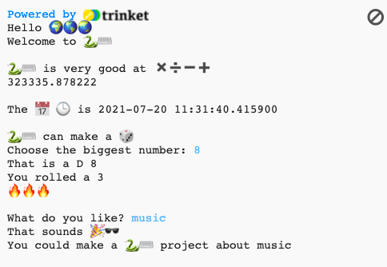

## المقدمة

اكتشف ما يمكن أن تفعله لغة برمجة Python من خلال كتابة مشروع تفاعلي يستخدم الرموز او الاشكال التعبيرية.

** الرموز التعبيرية (ايموجي)** عبارة عن صور صغيرة ملونة تُستخدم لإضافة معنى إضافي للرسائل. ايموجي تعني "كلمة مصورة" باللغة اليابانية.

سوف تقوم بما يلي:
+ طباعة نص باستخدام print</0()>، بما في ذلك الرموز التعبيرية، والحصول على مدخلات من المستخدم باستخدام <code>input</0()></li>
<li>تخزين النص والأرقام في <strong x-id="1">متغيرات</strong></li>
<li>استخدم <strong x-id="1">الدوال (functions)</strong> لتنظيم التعليمات البرمجية الخاصة بك</li>
</ul>

--- no-print ---

--- task ---

<h3 spaces-before="0">جربها</h3>

  
اقرأ المخرجات ثم انقر فوق <kbd>Enter</kbd> في لوحة المفاتيح للمتابعة. 
اكتب إجاباتك على الأسئلة. هل يمكنك أن ترى كيف يتم استخدام إجاباتك؟

  <iframe src="https://trinket.io/embed/python/a54e164ac2?outputOnly=true&start=result" width="600" height="500" frameborder="0" marginwidth="0" marginheight="0" allowfullscreen>
  </iframe>
  

--- /task ---

--- /no-print ---

--- print-only ---

--- /print-only ---

