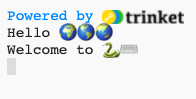
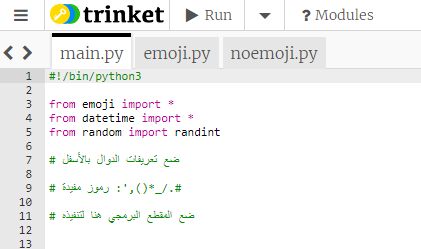
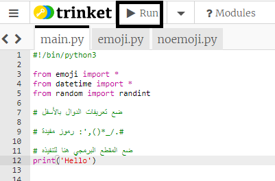
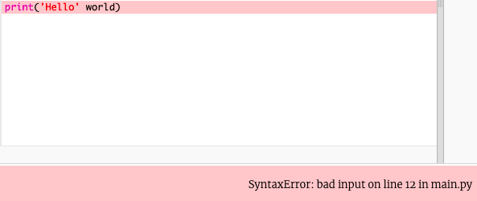
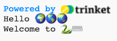

## قل مرحبا

من المعتاد كتابة برنامج لإخراج عبارة "Hello world!" عندما تتعلم لغة برمجة جديدة.

{:width="200px"}

--- task ---

فتح مشروع البداية [Hello 🌍🌎🌏](https://trinket.io/python/683f0efa91){:target="_blank"}. سيتم فتح Trinket في علامة تبويب متصفح أخرى.

--- /task ---

يخبر السطر `#!/bin/python3` أنك تستخدم Python 3 (أحدث إصدار). تخبر أسطر `import` Python أنك ستستخدم رمزًا لم تكتبه.

في Python، تقوم `()print` بإخراج نص (كلمات أو أرقام) على الشاشة.

الأسطر التي تبدأ بالرمز `#` عبارة عن تعليقات، فهي تشرح المقطع البرمجي للبشر وتتجاهلها لغة Python اي لا تنفذ.

--- task ---

جد السطر `# ضع المقطع البرمجي هنا لتشغيله`.

انقر أسفل ذلك السطر. الوميض `|` هو المؤشر ويظهر المكان الذي ستكتب فيه.

اكتب المقطع البرمجي `()print` لطباعة مرحبًا:

--- code ---
---
language: python
filename: main.py
line_numbers: true
line_number_start: 11
line_highlights: 12
---

#ضع المقطع البرمجي هنا لتشغيله
print('Hello')

--- /code ---

--- collapse ---
---
title: كتابة أحرف خاصة على لوحة مفاتيح المملكة المتحدة أو الولايات المتحدة
---

على لوحة مفاتيح المملكة المتحدة أو الولايات المتحدة، الأقواس المستديرة الأيسر `(` والأيمن `)` موجودة على مفاتيح <kbd>9</kbd> و <kbd>0</kbd>. لكتابة قوس دائري أيسر ، اضغط باستمرار على مفتاح <kbd>Shift</kbd> (بجوار <kbd>Z</kbd>) ثم اضغط على <kbd>9</kbd>. يوجد الاقتباس الفردي `'` في نفس الصف للحرف <kbd>L</kbd>، قبل مفتاح <kbd>Enter</kbd> مباشرةً. الفاصلة `,` موجودة بجوار الحرف <kbd>M</kbd>.

--- /collapse ---

--- /task ---

--- task ---

**اختبار:** انقر فوق الزر **Run** لتشغيل التعليمات البرمجية الخاصة بك. في Trinket ، سيظهر الإخراج على اليمين:

**تتبع الخطأ:** إذا حصلت على خطأ، فتحقق من المقطع البرمجي بعناية. في هذا المثال ، علامات الاقتباس المفردة حول `Hello` مفقودة ، لذا فإن Python لا تعرف أنه من المفترض أن تكون نصًا.

--- /task ---

في Python ، يتم استخدام **المتغير** لتخزين النصوص أو الأرقام. المتغيرات تسهل على البشر قراءة التعليمات البرمجية. يمكنك استخدام نفس المتغير في العديد من الأماكن في التعليمات البرمجية الخاصة بك.

لقد قمنا بتضمين بعض المتغيرات التي تخزن أحرف الرموز التعبيرية.

--- task ---

في Trinket ، انقر فوق علامة التبويب **emoji.py**. ابحث عن المتغير `world`، والذي يخزن النص "🌍🌍🌍".

--- /task --- 

--- task ---

يمكنك طباعة أكثر من عنصر واحد في وقت واحد عن طريق تضمين فاصلة `,` بين العناصر داخل دالة `()print`. الدالة `()print` ستضيف مسافة بين كل عنصر.

انقر فوق علامة التبويب **main.py** للعودة إلى المقطع البرمجي `()print`.

قم بتغيير المقطع البرمجي الخاص بك ليقوم ايضا بطباعة `()print` محتويات المتغير `world`:

--- code ---
---
language: python 
filename: main.py 
line_numbers: true 
line_number_start: 11
line_highlights: 12
---

#ضع المقطع البرمجي هنا لتشغيله
print('Hello', world)

--- /code ---

**نصيحة:** `"Hello"` عبارة عن سلسلة نصية لأنها تحتوي على علامات اقتباس مفردة حولها ، في حين أن `world` عبارة عن متغير لذلك ستتم طباعة القيمة المخزنة فيه.

--- /task ---

--- task ---

**اختبار:** قم بتشغيل المقطع البرمجي الخاص بك لرؤية النتيجة:

يمكن أن تبدو الرموز التعبيرية مختلفة على أجهزة الكمبيوتر المختلفة ، لذلك قد لا تبدو رموزك نفسها تمامًا.

**تتبع الخطأ:** تأكد من أنك أضفت فاصلة بين العناصر في دالة `()print` وأنك كتبت `world` بشكل صحيح.

يفتقد هذا المثال الفاصلة `,`. إنها صغيرة ولكنها مهمة جدًا!

--- collapse ---
---
title: لا أرى الرموز التعبيرية
---

تسمح لك معظم أجهزة الكمبيوتر باستخدام الرموز التعبيرية الملونة. ومع ذلك ، إذا لم تتمكن من استخدام الرموز التعبيرية ، فيمكنك استخدام "الرموز" بدلاً من ذلك ، كما فعلنا قبل اختراع الرموز التعبيرية!

قم بتغيير سطر `* from emoji import` إلى:

--- code ---
---
language: python 
filename: main.py 
line_numbers: true 
line_number_start: 3
line_highlights: 3
---

from noemoji import *

--- /code ---

--- /collapse ---

--- /task ---

--- task ---

أضف سطرًا آخر إلى التعليمات البرمجية الخاصة بك لطباعة `()print` نصوص ورموز تعبيرية اخرى:

--- code ---
---
language: python 
filename: main.py 
line_numbers: true 
line_number_start: 12
line_highlights: 13
---

print('Hello', world)    
print('Welcome to', python)

--- /code ---

**نصيحة:** يتم تمييز الرمز الذي تريد كتابته بلون أفتح. يساعدك المقطع البرمجي الذي لم يتم تمييزه في العثور على المكان الذي تريد إضافة الرمز الجديد إليه.

--- /task ---

--- task ---

**اختبار:** انقر **run**.

**نصيحة:** من الجيد تشغيل المقطع البرمجي الخاص بك بعد كل تغيير حتى تتمكن من حل المشكلات بسرعة.

**تتبع الخطأ:** تحقق بعناية من وجود الأقواس وعلامات التنصيص والفاصلات والتهجئة الصحيحة. تحتاج Python أن تكون دقيقًا حقًا.

--- /task ---

إذا كان لديك حساب Trinket ، فيمكنك النقر فوق الزر **Remix** لحفظ نسخة في مكتبة `My Trinkets`.

إذا لم يكن لديك حساب Trinket ، فلا يزال بإمكانك العودة إلى مشروعك في المستقبل على نفس الكمبيوتر باستخدام رابط مشروع البداية.

--- save ---
