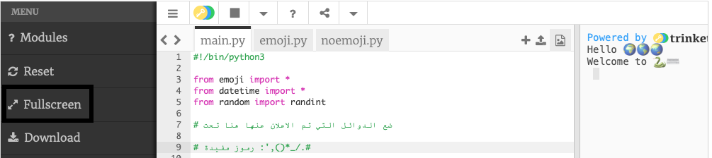

## نواتج الجمع والتواريخ

لغة Python رائعة في التعامل مع الأرقام والتواريخ.

! [منطقة الإخراج مع خمسة أسطر مطبوعة تعرض المجموع الجديد ومخرجات التاريخ الحالي.](images/sums_dates.png){:width="300px"}

في Python يمكنك استخدام العمليات الحسابية لعمليات الجمع:

| + | الجمع |   
| - | الطرح |   
| * | الضرب |   
| / | القسمة |   
| ** | الأس |

--- task ---

أضف سطرين آخرين للدالة `()print` في المقطع البرمجي الخاص بك بما في ذلك المجموع ليحلها Python:

--- code ---
---
language: python filename: main.py line_numbers: true line_number_start: 12
line_highlights: 14-15
---

print('Hello', world)   
print('Welcome to', python)   
print(python, 'is very good at', sums)   
print(230 * 5782 ** 2 / 23781)

--- /code ---

--- /task ---

--- task ---

**اختبار:** قم بتشغيل التعليمات البرمجية الخاصة بك. هل قام Python بحساب المجموع بشكل صحيح؟ امزح فقط! تقوم Python بإجراء العمليات الحسابية الصعبة نيابةً عنك، لذلك لا تحتاج إلى حلها.

--- /task ---

استخدمت عالمة الحاسوب اليابانية ** Emma Haruka Iwao ** جهاز كمبيوتر لحساب قيمة Pi (*π*) حتى 31 تريليون رقم. هذه الإجابة طويلة جدًا لدرجة أن الأمر سيستغرق أكثر من 300000 سنة فقط لقولها! 

--- task ---

حاول تغيير المجموع الذي تفعله Python إلى مجموع معقد!

يمكنك أيضًا استخدام الأقواس إذا كنت تريد التحكم في ترتيب المجموع الذي تحسبه Python: `print ((2 + 4) * (5 + 3))`.

--- /task ---

--- task ---

**اختبار:** قم بتشغيل المقطع الخاص بك واجعل Python يحسب مجموعك.

**تتبع الخطأ:** تأكد من أن مجموعك يحتوي على قوس دائري أيسر وأيمن حوله `(2 * 45)`. إذا كنت تستخدم أقواسًا إضافية للتحكم في الترتيب، فتأكد أن لديك قوسًا أيمنًا لمطابقة كل قوس أيسر.

--- /task ---

--- task ---

If you have asked Python to calculate a really big sum, you might find the answer goes across multiple lines in the output area.

**Tip:** Click on the **hamburger menu** (the icon with three lines) in the top-left of your Trinket editor. Then click on the **Fullscreen** button to view your project in fullscreen mode.

To exit fullscreen mode, click on the **Fullscreen** button again or press <kbd>Esc</kbd> on your keyboard.

--- /task ---

The line `from datetime import *` at the top of the **main.py** tab includes a library with helpful functions for getting the current date and time.

One of the great things about Python is all the **libraries** of code that are available to use. A Python library allows you to easily use code that other people have written. There are libraries for drawing charts and graphs, making art, doing calculations, and lots more.

--- task ---

Add another line to your code to `print` some more text and the emoji variables `calendar` and `clock`.

Get the current date and time by using the `now()` function from the `datetime` library:

--- code ---
---
language: python filename: main.py line_numbers: true line_number_start: 14
line_highlights: 16-17
---

print (python، 'is very good at'، sums)    
print (230 * 5782 ** 2/23781) # اطبع نتيجة الجمع     
print ('The'، calendar، clock، 'is'، datetime .now ()) # طباعة بالرموز التعبيرية

--- /code ---

**نصيحة:** لست بحاجة إلى كتابة التعليقات ، فهي موجودة فقط لمساعدتك على فهم المقطع البرمجي. فقط اكتب الجزء قبل `#`.

--- /task ---

--- task ---

**اختبار:** قم بتشغيل المقطع البرمجي عدة مرات لمشاهدة تحديث التاريخ والوقت.

**Debug:** Check that you have a fullstop `.` between `datetime` and `now`. Check all the punctuation carefully.

--- /task ---

--- save ---
