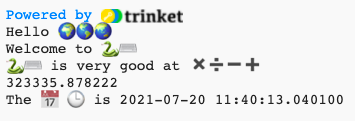

## نواتج الجمع والتواريخ

لغة Python رائعة في التعامل مع الأرقام والتواريخ.

{:width="300px"} 

في Python يمكنك استخدام العمليات الحسابية لعمليات الجمع:

| + | الجمع |   
| - | الطرح |   
| * | الضرب |   
| / | القسمة |   
| ** | الأس |

### Create a calculation

--- task ---

أضف سطرين آخرين للدالة `()print` في المقطع البرمجي الخاص بك بما في ذلك المجموع ليحلها Python:

**Tip:** To get a `*` symbol press <kbd>Shift</kbd> and <kbd>8</kbd> at the same time.

--- code ---
---
language: python filename: main.py line_numbers: true line_number_start: 14
line_highlights: 14-15
---

print('Hello', world)   
print('Welcome to', python)   
print(python, 'is very good at', sums)   
print(230 * 5782 ** 2 / 23781)

--- /code ---

**نصيحة:** لست بحاجة إلى كتابة التعليقات ، فهي موجودة فقط لمساعدتك على فهم المقطع البرمجي. فقط اكتب الجزء قبل `#`.

--- /task ---

--- task ---

**اختبار:** قم بتشغيل التعليمات البرمجية الخاصة بك. هل قام Python بحساب المجموع بشكل صحيح؟ امزح فقط! تقوم Python بإجراء العمليات الحسابية الصعبة نيابةً عنك، لذلك لا تحتاج إلى حلها.

**Debug:**

--- collapse ---
---
title: I have a syntax error
---

Make sure that you have added a comma `,` between the items in `print()` and that you have spelled `python` correctly.

--- /collapse ---

--- /task ---

استخدمت عالمة الحاسوب اليابانية **Emma Haruka Iwao** جهاز كمبيوتر لحساب قيمة Pi (*π*) حتى 31 تريليون رقم. هذه الإجابة طويلة جدًا لدرجة أن الأمر سيستغرق أكثر من 300000 سنة فقط لقولها! 

--- task ---

حاول تغيير المجموع الذي تفعله Python إلى مجموع معقد!

يمكنك أيضًا استخدام الأقواس إذا كنت تريد التحكم في ترتيب المجموع الذي تحسبه Python: `print ((2 + 4) * (5 + 3))`.

--- /task ---

--- task ---

**اختبار:** قم بتشغيل المقطع الخاص بك واجعل Python يحسب مجموعك.

**تتبع الخطأ:**تأكد من أن مجموعك يحتوي على قوس دائري أيسر وأيمن حوله `(2* 45)`. إذا كنت تستخدم أقواسًا إضافية للتحكم في الترتيب، فتأكد أن لديك قوسًا أيمنًا لمطابقة كل قوس أيسر.

--- /task ---

--- task ---

On the code editor, you might find the text too big or too small to read. You can easily change these settings to suit your preference.

ثم انقر فوق الزر **Fullscreen** لعرض مشروعك في وضع ملء الشاشة. **نصيحة:** انقر فوق قائمة **hamburger** (أيقونة بها ثلاثة أسطر) في أعلى يسار محرر Trinket.

You can also switch between colour modes, click on the **Light & Dark** buttons to see the changes.

--- /task ---

يشتمل السطر `from datetime import *` في أعلى علامة التبويب **main.py** على مكتبة بها دوال مفيدة للحصول على التاريخ والوقت الحاليين.

أحد الأشياء الرائعة في Python أن جميع **المكتبات** من التعليمات البرمجية متاحة للاستخدام. تتيح لك مكتبة Python استخدام التعليمات البرمجية التي كتبها أشخاص آخرون بسهولة. توجد مكتبات لرسم المخططات والرسوم البيانية وصنع الاشكال الفنية وإجراء العمليات الحسابية وغير ذلك الكثير.

--- task ---

أضف سطرًا آخر إلى المقطع الخاص بك لطباعة `print` نص إضافي ومتغيرات الرموز التعبيرية `calendar` و `clock`.

احصل على التاريخ والوقت الحاليين باستخدام الدالة `()now` من مكتبة `datetime`:

--- code ---
---
language: python filename: main.py line_numbers: true line_number_start: 12
line_highlights: 16-17
---

print(python، 'is very good at'، sums)    
print(230 *5782** 2/23781) # اطبع نتيجة الجمع     
print('The'، calendar، clock، 'is'، datetime .now ()) # طباعة بالرموز التعبيرية

--- /code ---

**Tip:** You don't need to type the comments, they are just there to help you understand the code. Just type the part before the `#`.

--- /task ---

--- task ---

**اختبار:** قم بتشغيل المقطع البرمجي عدة مرات لمشاهدة تحديث التاريخ والوقت.

**تتبع الخطأ:** تأكد من أن لديك نقطة فاصلة `.` بين `datetime` و `now`. تحقق من جميع علامات الترقيم بعناية.

--- /task ---

--- save ---
