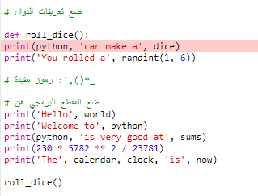

## ارم نرداً

يمكن للغة Python إنشاء أرقام عشوائية لعمل نرد رقمي.

! [منطقة الإخراج ذات الأسطر الإضافية لتطلب من المستخدم إدخال أكبر رقم لنرده والاستجابة بالرقم العشوائي.](images/roll_dice.png){:width="300px"}

في Python، **تستدعي** دالة **() function** لتنفيذ عمل. لقد استخدمت دالة `()print` سابقا لإخراج النص.

يمكنك **تعريف** **دالة** جديدة لتجميع التعليمات البرمجية معًا بحيث يمكنك تسميتها وإعادة استخدامها.

--- task ---

يجب تعريف الدوال أولاً قبل أن تتمكن من استدعائها. ابحث عن التعليق بالقرب من أعلى علامة التبويب **main.py** التي تنص على `# ضع تعريفات الدوال بالأسفل`.

حدد دالة جديدة تسمى `() roll_dice` التي تستخدم دالة `() randint` ، من مكتبة `random`، لتوليد "عدد صحيح" عشوائي (عدد طبيعي) من 1 إلى 6 وإخراجها إلى الشاشة.

--- code ---
---
language: python filename: main.py line_numbers: true line_number_start: 7
line_highlights: 9-12
---

# ضع تعريفات الدوال بالأسفل

def roll_dice(): # لا تنس النقطتين في نهاية هذا السطر   
print(python, 'can make a', dice)   
print('You rolled a', randint(1, 6))

--- /code ---

الأسطر الموجودة أسفل `:() def roll_dice` تحوي **مسافة بادئة**. للقيام بذلك ، استخدم المفتاح <kbd>Tab</kbd> على لوحة المفاتيح (عادةً أعلى من <kbd>CAPSLOCK</kbd> على لوحة المفاتيح). تخبر المسافة البادئة لغة Python أن الأسطر ذات المسافة البادئة هي جزء من الدالة.

**نصيحة:** يتم استخدام الشرطة السفلية `_` بين الكلمات في أسماء المتغيرات والدوال في Python لتسهيل قراءتها. لا يمكنك استخدام مسافة فارغة (space).

--- collapse ---
---
title: كتابة أحرف خاصة على لوحة مفاتيح المملكة المتحدة أو الولايات المتحدة
---

في لوحة مفاتيح المملكة المتحدة أو الولايات المتحدة ، تكون النقطتان `:` على نفس المفتاح مثل الفاصلة المنقوطة ، بجوار المفتاح <kbd>L</kbd>: اضغط مع الاستمرار على <kbd>Shift</kbd> واضغط على <kbd>;</kbd> لكتابة `:`. الشرطة السفلية `_` موجودة على نفس مفتاح اشارة الناقص `-`، بجوار الرقم <kbd>0</kbd>، اضغط مع الاستمرار على مفتاح <kbd>Shift</kbd> واضغط على المفتاح <kbd>-</kbd> لطباعة الـ `_`.

--- /collapse ---

--- /task ---

--- task ---

**اختبار:** إذا قمت بتشغيل المقطع البرمجي الخاص بك الآن ، فلن يقوم برمي النرد. هذا لأنك عرّفت الدالة `()roll_dice`، لكنك لم تستدعها بعد.

--- /task ---

--- task ---

لاستخدام الدالة، تحتاج إلى استدعائها في الكود. انتقل إلى نهاية المقطع البرمجي وأضف سطرًا جديدًا لاستدعاء الدالة `()roll_dice`:

--- code ---
---
language: python filename: main.py line_numbers: true line_number_start: 20
line_highlights: 22
---

print('The', calendar, clock, 'is', datetime.now())

roll_dice() #استدعي دالة ال roll_dice

--- /code ---

--- /task ---

--- task ---

**اختبار:** قم بتنفيذ مشروعك عدة مرات لرؤية رمية النرد العشوائية في كل مرة.

**تتبع الخطأ:** تأكد من وجود شرطة سفلية `_` بين كلمتي roll و dice لاسم الدالة. تأكد من وجود نقطتين `:` في نهاية السطر.

**تتبع الخطأ:** تحقق من أن الأسطر الموجودة أسفل `()def roll_dice` تحتوي مسافة بادئة. من الشائع حقًا وجود هذا الخطأ في Python، لذا تأكد من التحقق.

--- /task ---

تشمل استخدامات الأرقام العشوائية التشفير وعلوم البيانات وإضافة مجموعة متنوعة إلى الألعاب وفنون الحاسوب. تنشئ أجهزة الحاسوب ** أرقامًا عشوائية ** باستخدام خوارزمية. For numbers that are really random, you need an unpredictable input from the real world.

--- task ---

The `fire` variable stores a 🔥 emoji. The code `print(fire * 3)` outputs three fire emoji '🔥🔥🔥'. You need to output the correct number of emoji to match the number rolled.

--- collapse ---
---
title: What would happen if you use `print(fire * randint(1, 6))`?
---

You would get a new random number that is usually different from your first random number.

--- /collapse ---

Hmm, how can you make sure you use the same random number?

Change your code to save the value returned by `randint()` in a variable called `roll` and then use that variable to print out the number rolled with the matching number of 🔥 emoji.

--- code ---
---
language: python filename: main.py line_numbers: true line_number_start: 7
line_highlights: 11 - 13
---

# Put function definitions under here

def roll_dice():    
print(python, 'can make a', dice)    
roll = randint(1, 6) #Generate a random number between 1 and 6    
print('You rolled a', roll) #Print the value of the roll variable     
print(fire * roll) #Repeat the fire emoji to match the dice roll

--- /code ---

You can use `star` or `heart` instead of `fire` if you prefer.

The symbol `*` means multiply so `fire * roll` multiples the text in the `fire` variable ('🔥') by the number contained in the `roll` variable.

--- /task ---

--- task ---

**Test:** Test your project a few times. Make sure you understand how the code works.

**Tip:** Variables are useful when you need to use the same value multiple times in your code. Giving variables a sensible name also makes your code easier to understand.

--- /task ---

Upgrade your dice so that the user can choose the maximum number.

Lots of games use many-sided dice. In the physical world, dice are made from regular geometric shapes. Common dice include D6, D12, and D20. On a computer, you can generate a random number to make a fair dice with any number of sides.

--- task ---

تطرح دالة `()input ` سؤالاً على المستخدم ثم تُعيد الإجابة.

Add code to ask the user for the biggest number on their dice and then save the result in a variable called `max` and `print` the number chosen into the output area:

--- code ---
---
language: python filename: main.py line_numbers: true line_number_start: 7
line_highlights: 11-12
---

# ضع تعريفات الدوال هنا

def roll_dice():   
print(python, 'can make a', dice)   
max = input('How many sides?:') #انتظر الادخال من المستخدم    
print('That\'s a D', max) #تستخدم الرقم الذي ادخله المستخدم    
roll = randint(1, 6)    
print('You rolled a', roll)    
print(fire * roll)

--- /code ---

لطباعة علامة اقتباس أحادية `'` في كلمة انكليزي مثل ` That's `، ضع خط مائل للخلف `\` قبلها حتى تعرف Python أنها جزء من النص.

--- /task ---

--- task ---

غيّر رمز المتغير `roll` لاستخدام `max` كقيمة قصوى لـ `randint` عندما يُنشئ رقمًا عشوائيًا.

عندما تحصل على المدخلات من المستخدم، فإن لغة Python تعاملها كنص. لكن ، `randint` يحتاج إلى "عدد صحيح" (عدد صحيح موجب). تعمل دالة `int` على تحويل القيمة المدخلة باستخدام دالة input من المستخدم إلى عدد صحيح.

--- code ---
---
language: python filename: main.py line_numbers: true line_number_start: 7
line_highlights: 13
---

# ضع تعريفات الدوال هنا

def roll_dice():   
print(python, 'can make a', dice)   
max = input('How many sides?:') #انتظر الادخال من المستخدم   
print('That\'s a D', max) #تستخدم الرقم الذي ادخله المستخدم   
roll = randint(1, int(max)) #دالة randint تحتاج أن تكون أكبر قيمة هي عدد صحيح 'integer'   
print('You rolled a', roll)   
print(fire * roll)

--- /code ---

--- /task ---

--- task ---

**اختبار:** قم بتشغيل مشروعك. عندما يصل البرنامج إلى سطر `input` سينتظر منك إدخال رد قبل المتابعة. حاول مرة أخرى بادخال رقم مختلف لدالة `input`.

--- /task ---

--- save ---
