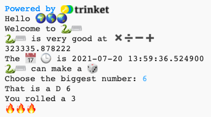

## Roll a dice 🎲

Create a function for rolling a dice using random numbers. 
  
In Python:
  - **functions**, defined with `def`, are like 'my blocks' in Scratch,
  - `randint` is like 'random' in Scratch, and
  - `input` is like 'ask' in Scratch.

{:width="300px"} 

في Python، **تستدعي** دالة **() function** لتنفيذ عمل. لقد استخدمت دالة `()print` سابقا لإخراج النص.

يمكنك **تعريف** **دالة** جديدة لتجميع التعليمات البرمجية معًا بحيث يمكنك تسميتها وإعادة استخدامها.

### Define your function

--- task ---

يجب تعريف الدوال أولاً قبل أن تتمكن من استدعائها. ابحث عن التعليق بالقرب من أعلى علامة التبويب **main.py** التي تنص على `# ضع تعريفات الدوال بالأسفل`.

حدد دالة جديدة تسمى `()roll_dice` التي تستخدم دالة `()randint` ، من مكتبة `random`، لتوليد "عدد صحيح" عشوائي (عدد طبيعي) من 1 إلى 6 وإخراجها إلى الشاشة.

--- code ---
---
language: python filename: main.py line_numbers: true line_number_start: 7
line_highlights: 9-12
---

# Function definitions
def roll_dice(): # لا تنس النقطتين في نهاية هذا السطر   
print(python, 'can make a', dice)   
print('You rolled a', randint(1, 6))

--- /code ---

الأسطر الموجودة أسفل `:()def roll_dice` تحوي **مسافة بادئة**. للقيام بذلك ، استخدم المفتاح <kbd>Tab</kbd> على لوحة المفاتيح (عادةً أعلى من <kbd>CAPSLOCK</kbd> على لوحة المفاتيح). تخبر المسافة البادئة لغة Python أن الأسطر ذات المسافة البادئة هي جزء من الدالة.

**نصيحة:** يتم استخدام الشرطة السفلية `_` بين الكلمات في أسماء المتغيرات والدوال في Python لتسهيل قراءتها. لا يمكنك استخدام مسافة فارغة (space).

--- collapse ---
---
title: كتابة أحرف خاصة على لوحة مفاتيح المملكة المتحدة أو الولايات المتحدة
---

في لوحة مفاتيح المملكة المتحدة أو الولايات المتحدة ، تكون النقطتان `:` على نفس المفتاح مثل الفاصلة المنقوطة ، بجوار المفتاح <kbd>L</kbd>: اضغط مع الاستمرار على <kbd>Shift</kbd> واضغط على <kbd>;</kbd> لكتابة `:`. الشرطة السفلية `_` موجودة على نفس مفتاح اشارة الناقص `-`، بجوار الرقم <kbd>0</kbd>، اضغط مع الاستمرار على مفتاح <kbd>Shift</kbd> واضغط على المفتاح <kbd>-</kbd> لطباعة الـ `_`.

--- /collapse ---

--- /task ---

--- task ---

**اختبار:** إذا قمت بتشغيل المقطع البرمجي الخاص بك الآن ، فلن يقوم برمي النرد. هذا لأنك عرّفت الدالة `()roll_dice`، لكنك لم تستدعها بعد.

**Debug:**

--- collapse ---
---
title: I have a syntax error
---

- **تتبع الخطأ:** تأكد من وجود شرطة سفلية `_` بين كلمتي roll و dice لاسم الدالة.

- تأكد من وجود نقطتين `:` في نهاية السطر.

- **تتبع الخطأ:** تحقق من أن الأسطر الموجودة أسفل `()def roll_dice` تحتوي مسافة بادئة. من الشائع حقًا وجود هذا الخطأ في Python، لذا تأكد من التحقق.

--- /collapse ---

--- /task ---

### Call your function

--- task ---

لاستخدام الدالة، تحتاج إلى استدعائها في الكود. انتقل إلى نهاية المقطع البرمجي وأضف سطرًا جديدًا لاستدعاء الدالة `()roll_dice`:

--- code ---
---
language: python filename: main.py line_numbers: true line_number_start: 20
line_highlights: 22
---

print('The', calendar, clock, 'is', datetime.now())

roll_dice() #استدعي دالة ال roll_dice

--- /code ---

--- /task ---

--- task ---

**اختبار:** قم بتنفيذ مشروعك عدة مرات لرؤية رمية النرد العشوائية في كل مرة.

--- /task ---

تشمل استخدامات الأرقام العشوائية التشفير وعلوم البيانات وإضافة مجموعة متنوعة إلى الألعاب وفنون الحاسوب. تنشئ أجهزة الحاسوب **أرقامًا عشوائية** باستخدام خوارزمية. بالنسبة للارقام التي تكون عشوائية بصورة كبيرة، ستحتاج الى مدخلات غير متوقعة من العالم الخارجي.

### Use 🔥🔥🔥 for the number rolled

--- task ---

يخزن المتغير `fire` رمز تعبيري 🔥. المخرجات من النص البرمجي `print(fire * 3)` ستكون بشكل ثلاثة رموز تعبيريّة عن النار "🔥🔥🔥". تحتاج إلى إخراج العدد الصحيح من الرموز التعبيرية لمطابقة الرقم الذي تم رميه من النرد.

قم بتغيير المقطع البرمجي الخاص بك لحفظ القيمة التي تم إرجاعها بواسطة `()randint` في متغير يسمى `roll` ثم استخدم هذا المتغير لطباعة الرقم الذي تم تسجيله مع الرقم المطابق للايموجي 🔥. Use that variable to print out the number rolled with the matching number of 🔥 emojis.

--- code ---
---
language: python filename: main.py line_numbers: true line_number_start: 7
line_highlights: 11 - 13
---

# Function definitions
def roll_dice():    
print(python، 'can make a'، dice)    
roll = randint (1، 6) #قم بإنشاء رقم عشوائي بين 1 و 6    
print('You rolled a'، roll) #اطبع قيمة رمية النرد المتغيرة     
print(fire * roll) #كرر ايموجي النار ليتناسب مع رمية النرد

--- /code ---

يمكنك استخدام `نجمة star` أو `قلب heart` بدلاً من `نار fire` إذا كنت تفضل ذلك.

--- /task ---

--- task ---

**اختبار:** اختبر مشروعك عدة مرات. تأكد من فهمك لكيفية عمل المقطع البرمجي.

--- /task ---

### Choose the number of sides on the dice

قم بترقية النرد الخاص بك بحيث يمكن للمستخدم اختيار العدد الاكبر.

تستخدم الكثير من الألعاب النرد متعدد الجوانب. في العالم المادي ، يتكون النرد من أشكال هندسية منتظمة. تشمل النردات الشائعة D6 و D12 و D20. على جهاز الحاسوب ، يمكنك إنشاء رقم عشوائي لعمل نرد مناسب مع عدد من الجوانب.

--- task ---

تطرح دالة `()input` سؤالاً على المستخدم ثم تُعيد الإجابة.

أضف تعليمات برمجية لمطالبة المستخدم بأكبر رقم على نرده ثم احفظ النتيجة في متغير يسمى `max` و `اطبع` الرقم المختار في منطقة الإخراج:

غيّر رمز المتغير `roll` لاستخدام `max` كقيمة قصوى لـ `randint` عندما يُنشئ رقمًا عشوائيًا.

عندما تحصل على المدخلات من المستخدم، فإن لغة Python تعاملها كنص. لكن ، `randint` يحتاج إلى "عدد صحيح" (عدد صحيح موجب). تعمل دالة `int` على تحويل القيمة المدخلة باستخدام دالة input من المستخدم إلى عدد صحيح.

--- code ---
---
language: python filename: main.py line_numbers: true line_number_start: 7
line_highlights: 11-12
---

# Function definitions

def roll_dice():   
print(python, 'can make a', dice)   
max = input('How many sides?:') #انتظر الادخال من المستخدم    
print('That\'s a D', max) #تستخدم الرقم الذي ادخله المستخدم    
roll = randint(1, 6)    
print('You rolled a', roll)    
print(fire * roll)

--- /code ---

لطباعة علامة اقتباس أحادية `'` في كلمة انكليزي مثل `That's`، ضع خط مائل للخلف `\` قبلها حتى تعرف Python أنها جزء من النص.

--- /task ---

--- task ---

**اختبار:** قم بتشغيل مشروعك. عندما يصل البرنامج إلى سطر `input` سينتظر منك إدخال رد قبل المتابعة. Type your response and then press <kbd>Enter</kbd>, this will allow the program to collect your response. حاول مرة أخرى بادخال رقم مختلف لدالة `input`.

--- /task ---

--- save ---
