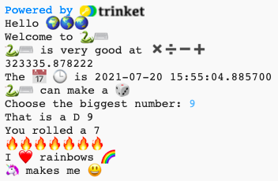

## بداية الجملة

إخراج المزيد من الجمل من مشروعك.

{:width="300px"}

--- task ---

إضافة المزيد من اسطر`print` إلى التعليمات البرمجية الخاصة بك. فيما يلي بعض بدايات الجمل التي يمكنك استخدامها:

--- code ---
---
language: python
filename: main.py
---

print('I', heart, '...')   
print('... makes me', happy)   
print('I\'d like to make ... with', python)

--- /code ---

**نصيحة: تضيف** `print` مسافة بين كل عنصر تطبعه.

**نصيحة:** إذا كنت بحاجة إلى طباعة علامة اقتباس أحادية `'` ، أنت بحاجة إلى وضع خط مائل `\` قبلها حتى تعرف Python أنها جزء من النص.

--- /task ---

غالبًا ما يستخدم  رمز القلب الأصفر لاظهار الصداقة والسعادة.

--- task ---

ما هي الرسالة التي ترسلها إلى صديق لإسعادهم؟ أي رمز تعبيري ستختار؟

انقر فوق علامة التبويب **emoji.py** في Trinket لرؤية متغيرات الرموز التعبيرية التي يمكنك استخدامها. انقر مرة أخرى على علامة التبويب **main.py** لإضافة التعليمات البرمجية الخاصة بك.

يمكنك إضافة المزيد من متغيرات الرموز التعبيرية إلى **emoji.py**. استخدم [قائمة الرموز التعبيرية emoji](https://unicode.org/emoji/charts/full-emoji-list.html){:target="_blank"} للعثور على ماتريد.

--- /task ---

--- save ---
