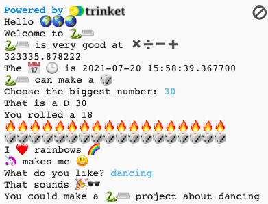

## قم بترقية مشروعك

أضف المزيد إلى مشروعك. هناك المزيد من الرموز التعبيرية للاختيار من بينها.
  

{:width="300px"} 

يمكنك:
+ استخدام `print` مع نصوص ورموز تعبيرية مختلفة
+ استخدام `input` للحصول على القيم من المستخدم وتخزينها كمتغيرات، ثم قم بإجراء عمليات الجمع باستخدام المتغيرات
+ اكتب المزيد من الدوال لتنظيم التعليمات البرمجية الخاصة بك
+ استخدم `#` لإضافة تعليقات إلى التعليمات البرمجية الخاصة بك

انقر فوق **emoji.py** لمعرفة متغيرات الرموز التعبيرية التي يمكنك استخدامها. Copy the ones you choose and save them to a variable or add them directly to your code.

**Tip:** To add emojis, find the comment # Emojis to copy and paste into your code. Copy the emojis you want to use then paste them into your code.

📅🕒🎨🎮🔬🎉🕶️🎲🦄🚀💯⭐💛 😃😜❤️📚⚽🎾👟♻️🌳🔥✨🥺🌈

[[[choose-an-emoji]]]

إليك مثال على دالة تسأل عن الهوايات:

--- code ---
---
language: python
filename: main.py
---

# ضع مقطعاً برمجياً هنا لتشغيله
def hobbies():   
hobby = input('What do you like?')   
print('That sounds', fun)   
print('You could make a', python, 'project about', hobby)

--- /code ---

**نصيحة:** لا تنس أنك ستحتاج إلى تعريف واستدعاء الدالة.

يمكنك استخدام `input` لجعل مشروعك ينتظر حتى يقوم المستخدم بالنقر فوق <kbd>Enter</kbd> في أي وقت في هذا المشروع.

--- code ---
---
language: python
filename: main.py
---

roll_dice()

input() # انتظر حتى يقوم المستخدم بالنقر فوق مفتاح Enter الموجود في لوحة المفاتيح

hobbies()

--- /code ---

--- collapse ---
---
title: مشروع مكتمل
---

يمكنك عرض [المشروع المكتمل هنا](https://trinket.io/embed/python/da030a5843){:target="_blank"}.

--- /collapse ---

--- save ---
