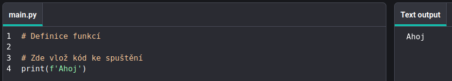

## Tisk ahoj

V Pythonu `print()`{:.language-python} vypíše na obrazovku řetězce (slova nebo čísla).

--- task ---

Otevři [startovací projekt Ahoj 🌍🌎🌏](https://editor.raspberrypi.org/en/projects/hello-world-starter){:target="_blank"}. Editor kódu se otevře v nové záložce prohlížeče.

--- /task ---

--- task ---

Zde najdete řádek `# Vložte kód ke spuštění`{:.language-python} .

Klikněte pod tímto řádkem. Blikající `|` je kurzor a ukazuje, kam budete psát.

--- /task ---

--- task ---

Zadejte kód pro `print()`{:.language-python} Dobrý den na obrazovce:

--- code ---
---
language: python line_numbers: true line_number_start: 17
line_highlights: 18
---
# Put code to run under here.
print(f'Hello')

--- /code ---

--- /task ---

--- task ---

**Test:** Kliknutím na tlačítko **Spustit** spustíte svůj kód. Toto byste měli vidět při spuštění kódu:

--- /task ---

Proměnná **** se používá k uložení hodnot, jako je text nebo čísla. Zahrnuli jsme některé proměnné, které ukládají znaky emoji.

--- task ---

Změňte svůj kód také na `print()`{:.language-python} obsah proměnné `world`{:.language-python} . Můžete to udělat přidáním názvu proměnné do složených závorek `{}`{:.language-python}

--- code ---
---
language: python line_numbers: true
line_number_start: 17
---
# Put code to run under here
print(f'Hello {world}')

--- /code ---

Znak `f`{:.language-python} uvnitř tisku umožňuje snadno tisknout proměnné spolu s řetězci textu.

--- /task ---

--- task ---

**Test:** Spusťte svůj kód a uvidíte výsledek:

--- /task ---

--- task ---

**Přidejte do svého kódu** další řádek pro `print()`{:.language-python} další text a emotikony:

--- code ---
---
language: python line_numbers: true line_number_start: 17
line_highlights: 19
---
# Put code to run under here
print(f'Hello {world}') print(f'Welcome to {python}')

--- /code ---

--- /task ---

--- task ---

**Test:** Klikni na tlačítko **Run** (Spustit).

**Tip:** Je dobrý nápad spustit kód po každé změně, abyste mohli rychle opravit problémy.

--- /task ---

