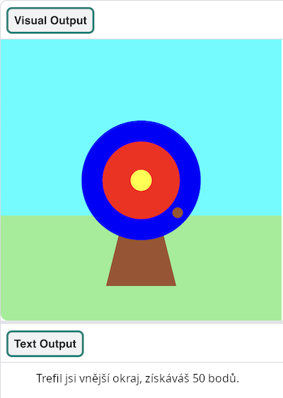

## Co můžeš dělat nyní?

Pokud postupuješ po cestě [Představení Pythonu](https://projects.raspberrypi.org/cs-CZ/raspberrypi/python-intro), můžeš přejít k projektu [Lukostřelba](https://projects.raspberrypi.org/cs-CZ/projects/target-practice). V tomto projektu si nakreslíš terč a poté vytvoříš kód pro lukostřelbu. Zde budeš střílet šípy, a získávat body.

--- print-only ---

{:width="640px"}

--- /print-only ---

--- no-print ---

Kliknutím na tlačítko **Run** (Spustit) zobrazíš příklad tohoto projektu.

<iframe src="https://editor.raspberrypi.org/cs-CZ/embed/viewer/target-practice-solution" width="600" height="600" frameborder="0" marginwidth="0" marginheight="0" allowfullscreen>
</iframe>

--- /no-print ---

Nebo proč nezkusit jiné [Python](https://projects.raspberrypi.org/en/projects?software%5B%5D=python) projekty.

***

Tento projekt byl přeložen dobrovolníky:

Miroslav Kuba

Díky dobrovolníkům můžeme dát lidem po celém světě šanci se učit ve svém vlastním jazyce. Můžete nám pomoci oslovit více lidí dobrovolným překládáním - více informací na [rpf.io/translate](https://rpf.io/translate).

