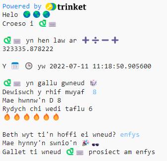

## Cyflwyniad

Dewch i wybod beth gall iaith raglenni Python ei wneud drwy ysgrifennu prosiect rhyngweithiol sy'n defnyddio emoji.

Ystyr **Emoji** yw delweddau lliwgar, bach sy'n cael eu defnyddio i ychwanegu ystyr ychwanegol at negeseuon. Ystyr emoji yw 'gair llun' yn Japaneg.

Byddwch chi'n:
+ defnyddio `print()` i brintio testun, gan gynnwys emoji, ac `input()` i gael mewnbwn gan y defnyddiwr
+ Storio testun a rhifau mewn **newidynnau**
+ Defnyddio **swyddogaethau** i roi trefn ar eich cod

--- no-print ---

--- task ---

### Rhowch gynnig arni

  
Darllenwch yr allbwn a tharo <kbd>Cyflwyno</kbd> i fwrw ymlaen. 
Teipiwch eich atebion i'r cwestiynau. Ydych chi'n gallu gweld sut mae eich atebion yn cael eu defnyddio?

  <iframe src="https://trinket.io/embed/python/a54e164ac2?outputOnly=true&start=result" width="600" height="500" frameborder="0" marginwidth="0" marginheight="0" allowfullscreen>
  </iframe>
  

--- /task ---

--- /no-print ---

--- print-only ---

--- /print-only ---
