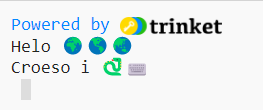
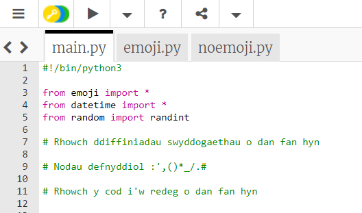
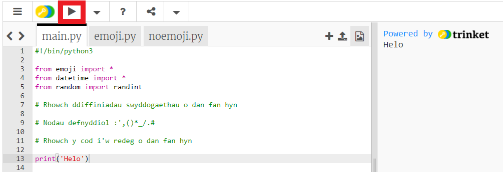
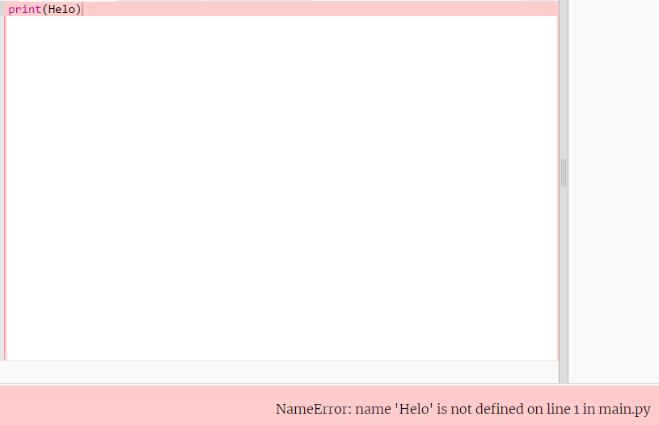
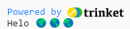
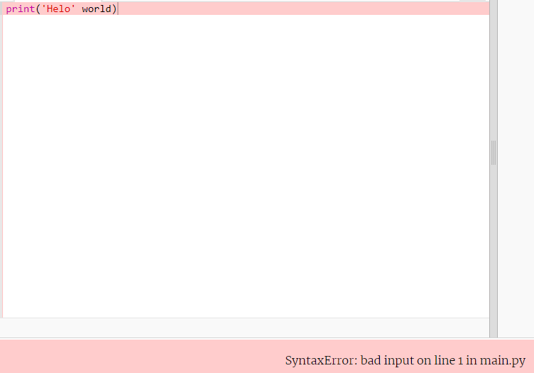
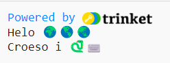

## Dweud helo

Mae'n draddodiadol ysgrifennu rhaglen i allbynnu 'Helo fyd!' pan fyddwch yn dysgu iaith raglennu newydd.

{:width="200px"}

--- task ---

Agor y [prosiect dechreuol Helo 🌍🌎🌏](https://trinket.io/python/13f08c7f8a){:target="_blank"}. Bydd Trinket yn agor mewn tab arall yn y porwr.

--- /task ---

Mae'r llinell `#!/bin/python3` yn rhoi gwybod i Trinket eich bod yn defnyddio Python 3 (y fersiwn ddiweddaraf). Mae'r llinellau `import` yn rhoi gwybod i Python y byddwch yn defnyddio cod nad ydych chi wedi'i ysgrifennu.

Yn Python, mae `print()` yn allbynnu testun (geiriau neu rifau) i'r sgrin.

Sylwadau yw llinellau sy'n dechrau gyda `#`, maen nhw'n esbonio'r cod i bobl ac yn cael eu hanwybyddu gan Python.

--- task ---

Dewch o hyd i'r llinell `# Rhowch y cod i'w redeg o dan fan hyn`.

Cliciwch o dan y llinell honno. Y cyrchwr yw'r `|` sy'n fflachio, a bydd yn dangos lle byddwch chi'n teipio.

Teipiwch y cod, gyda `print()`, i ddangos helo:

--- code ---
---
language: python 
filename: main.py 
line_numbers: true 
line_number_start: 11
line_highlights: 12
---

#Rhowch y cod i'w redeg o dan fan hyn
print('Helo')

--- /code ---

--- collapse ---
---
title: Teipio nodau arbennig ar fysellfwrdd y DU neu UDA
---

Ar fysellfwrdd y DU neu UDA, mae'r cromfachau chwith `(` a dde `)` ar y bysellau <kbd>9</kbd> a <kbd>0</kbd>. I deipio cromfach chwith, daliwch y fysell <kbd>Shift</kbd> (wrth ymyl <kbd>Z</kbd>) a tharo <kbd>9</kbd>. Mae'r dyfynod sengl `'` ar yr un rhes â'r fysell <kbd>L</kbd> ddim yn bell o'r fysell <kbd>Enter</kbd>. Mae'r coma `,` wrth ymyl <kbd>M</kbd>.

--- /collapse ---

--- /task ---

--- task ---

**Profi:** Cliciwch y botwm **Run** i redeg eich cod. Yn Trinket, bydd yr allbwn yn ymddangos ar y dde:

**Difa chwilod:** Os ydych chi'n cael gwall, gwnewch yn fanwl siŵr bod eich cod yn gywir. Yn yr enghraifft hon, mae'r dyfynodau sengl o amgylch `Helo` ar goll felly dydy Python ddim yn gwybod mai testun sydd i fod yno.

--- /task ---

Yn Python, mae **newidyn** yn cael ei ddefnyddio i storio testun neu rifau. Mae newidynnau yn ei gwneud hi'n haws i bobl ddarllen cod. Fe allwch chi ddefnyddio'r un newidyn fwy nag unwaith yn eich cod.

Rydyn ni wedi cynnwys rhai newidynnau sy'n storio nodau emoji.

--- task ---

Yn Trinket, cliciwch y tab **emoji.py**. Dewch o hyd i'r newidyn `byd`, sy'n storio'r testun '🌍🌍🌍'.

--- /task --- 

--- task ---

Fe allwch chi brintio, gan ddefnyddio `print()`, fwy nag un eitem ar y tro drwy roi coma `,` rhwng yr eitemau. Bydd `print()` yn ychwanegu bwlch rhwng bob eitem.

Cliciwch y tab **main.py** i ddychwelyd i'ch cod `print()`.

Newidiwch eich cod i brintio cynnwys y newidyn `byd` hefyd:

--- code ---
---
language: python 
filename: main.py 
line_numbers: true 
line_number_start: 11
line_highlights: 12
---

#Rhowch y cod i'w redeg o dan fan hyn
print('Helo', byd)

--- /code ---

**Cyngor:** Llinyn testun yw `'Helo'` oherwydd bod dyfynodau sengl o'i hamgylch, ond mae `byd` yn newidyn felly bydd y gwerth sydd wedi'i storio ynddo yn cael ei brintio.

--- /task ---

--- task ---

**Profi:** Rhedwch eich cod i weld y canlyniad:

Mae emoji'n gallu edrych yn wahanol ar wahanol gyfrifiaduron, felly efallai na fydd eich un chi yn edrych union yr un fath.

**Difa chwilod:** Gwnewch yn siŵr eich bod wedi ychwanegu coma rhwng yr eitemau yn `print()` ac wedi sillafu `byd` yn gywir.

Mae'r coma `,` ar goll yn yr enghraifft hon. Mae'n fach ond yn bwysig iawn!

--- collapse ---
---
title: Wela' i ddim yr emoji
---

Mae'r rhan fwyaf o gyfrifiaduron yn gadael i chi ddefnyddio emoji lliw. Ond os nad ydych chi'n gallu defnyddio emoji, fe allwch chi ddefnyddio 'gwenogluniau' ('emoticons') yn lle, fel yr oedden ni'n ei wneud cyn dyfeisiad emoji!

Newidiwch y llinell `from emoji import *` i:

--- code ---
---
language: python 
filename: main.py 
line_numbers: true 
line_number_start: 3
line_highlights: 3
---

from noemoji import *

--- /code ---

--- /collapse ---

--- /task ---

--- task ---

Ychwanegwch linell arall at eich cod i brintio mwy o destun ac emoji:

--- code ---
---
language: python 
filename: main.py 
line_numbers: true 
line_number_start: 12
line_highlights: 13
---

print('Helo', byd)    
print('Croeso i', python)

--- /code ---

**Cyngor:** Mae'r cod sydd angen i chi ei deipio wedi'i amlygu mewn lliw goleuach. Mae cod heb ei amlygu yn eich helpu i weld lle mae angen i chi ychwanegu'r cod newydd.

--- /task ---

--- task ---

**Profi:** Cliciwch **run**.

**Cyngor:** Mae'n syniad da rhedeg eich cod ar ôl pob newid er mwyn gallu datrys problemau'n gyflym.

**Difa chwilod:** Gwnewch yn siŵr bod gennych chi gromfachau, dyfynodau, comas a sillafu cywir. Mae angen bod yn fanwl gywir yn Python.

--- /task ---

Os oes gennych chi gyfrif Trinket, fe allwch chi glicio'r botwm **Remix** i gadw copi yn eich llyfrgell `My Trinkets`.

Os nad oes gennych chi gyfrif Trinket, mae'n dal yn bosib i chi ddychwelyd i'ch prosiect yn y dyfodol ar yr un cyfrifiadur drwy ddefnyddio'r ddolen prosiect dechreuol.

--- save ---
