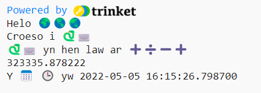
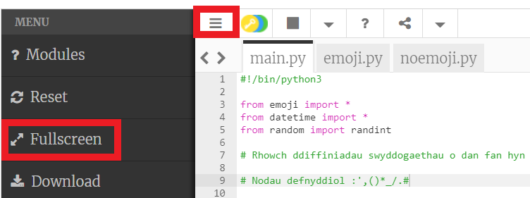

## Symiau a dyddiadau

Mae Python yn hen law ar weithio gyda rhifau a dyddiadau.

{:width="300px"}

Yn Python, fe allwch chi ddefnyddio gweithredwyr mathemateg i wneud symiau:

| + | adio |   
| - | tynnu |   
| * | lluosi |   
| / | rhannu |   
| ** | i bŵer |

--- task ---

Ychwanegwch ddwy linell `print()` arall at eich cod, gan gynnwys sym i Python ei gwneud:

--- code ---
---
language: python filename: main.py line_numbers: true line_number_start: 12
line_highlights: 14-15
---

print('Helo', byd)   
print('Croeso i', python)   
print('mae', python, 'yn hen law ar', symiau)   
print(230 * 5782 ** 2 / 23781)

--- /code ---

--- /task ---

--- task ---

**Profi:** Rhedwch eich cod. Ydy Python wedi gwneud y sym yn gywir? Jôc! Mae Python yn gwneud y mathemateg anodd i chi felly does dim rhaid i chi ei gwneud.

--- /task ---

Fe wnaeth **Emma Haruka Iwao**, cyfrifiadurwr o Japan, ddefnyddio cyfrifiadur i gyfrifo gwerth Pi (*π*) i 31 triliwn digid. Mae'r ateb mor hir, byddai'n cymryd dros 300,000 o flynyddoedd i'w ddweud! 

--- task ---

Rhowch gynnig ar newid y sym er mwyn i Python wneud un cymhleth!

Fe allwch chi hefyd ddefnyddio cromfachau os hoffech chi reoli ym mha drefn mae Python yn gwneud y sym: `print( (2 + 4) * (5 + 3) )`.

--- /task ---

--- task ---

**Profi:** Rhedwch eich cod i wneud i Python gyfrifo eich sym.

**Difa chwilod:** Gwnewch yn siŵr bod cromfach chwith a dde o amgylch eich sym `( 2 * 45 )`. Os ydych chi'n defnyddio cromfachau ychwanegol i reoli'r drefn, cofiwch fod angen cromfach dde i gyfateb i bob cromfach chwith.

--- /task ---

--- task ---

Os ydych chi wedi gofyn i Python gyfrifo sym enfawr, efallai fe welwch chi fod yr ateb yn mynd ar draws mwy nag un llinell yn yr ardal allbwn.

**Cyngor:** Cliciwch y **ddewislen byrger** (yr eicon tair llinell) yng nghornel chwith uchaf eich golygydd Trinket. Wedyn cliciwch y botwm **Fullscreen** i weld eich prosiect yn y modd sgrin lawn.

I adael y modd sgrin lawn, cliciwch y botwm **Fullscreen** eto neu bwyso <kbd>Esc</kbd> ar eich bysellfwrdd.

--- /task ---

Mae'r llinell `from datetime import *` ar frig y tab **main.py** yn cynnwys llyfrgell gyda swyddogaethau defnyddiol i gael y dyddiad a'r amser cyfredol.

Un o'r pethau gwych am Python yw'r holl **lyfrgellau** cod sydd ar gael. Mae llyfrgell Python yn gadael i chi ddefnyddio cod mae pobl eraill wedi'i ysgrifennu yn hawdd. Mae llyfrgelloedd ar gyfer llunio siartiau a graffiau, gwneud celf, cyfrifiadau, a llawer mwy.

--- task ---

Ychwanegwch linell arall at eich cod i brintio mwy o destun a'r newidynnau emoji `calendr` a `cloc`.

Fe allwch chi gael y dyddiad a'r amser cyfredol drwy ddefnyddio'r swyddogaeth `nawr()` o'r llyfrgell `datetime`:

--- code ---
---
language: python filename: main.py line_numbers: true line_number_start: 14
line_highlights: 16-17
---

print('mae', python, 'yn hen law ar', symiau)    
print(230 * 5782 ** 2 / 23781) #Printio canlyniad y sym     
print('Y', calendr, cloc, 'yw', datetime.now()) #Printio gydag emoji

--- /code ---

**Cyngor:** Does dim rhaid i chi deipio'r sylwadau, maen nhw dim ond yno i'ch helpu i ddeall y cod. Dim ond y rhan cyn `#` mae angen i chi ei deipio.

--- /task ---

--- task ---

**Profi:** Rhedwch eich cod cwpl o weithiau i weld y dyddiad a'r amser yn diweddaru.

**Difa chwilod:** Gwnewch yn siŵr bod atalnod llawn `.` rhwng `datetime` a `now`. Gwiriwch yr holl atalnodi'n ofalus.

--- /task ---

--- save ---
