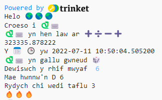

## Taflu dis

Mae Python yn gallu cynhyrchu rhifau ar hap i wneud dis digidol.

{:width="300px"}

Yn Python, rydych chi'n **galw** **swyddogaeth()** i gyflawni gweithred. Rydych chi eisoes wedi defnyddio'r swyddogaeth `print()` i allbynnu testun.

Fe allwch chi **ddiffinio** **swyddogaeth** newydd i grwpio cod gyda'i gilydd er mwyn gallu ei henwi a'i hailddefnyddio.

--- task ---

Rhaid diffinio swyddogaethau cyn eu galw. 'Drychwch am y sylw ger brig y tab **main.py** sy'n dweud `#Rhowch ddiffiniadau swyddogaethau o dan fan hyn`.

Diffiniwch swyddogaeth newydd o'r enw `taflu_dis()` sy'n defnyddio'r swyddogaeth `randint()` o'r llyfrgell `random` i gynhyrchu cyfanrif ar hap rhwng 1 a 6, a'i allbynnu ar y sgrin.

--- code ---
---
language: python filename: main.py line_numbers: true line_number_start: 7
line_highlights: 9-12
---

# Rhowch ddiffiniadau swyddogaethau o dan fan hyn

def taflu_dis(): #Cofiwch y colon ar ddiwedd y llinell hon   
print('mae', python, 'yn gallu gwneud', dis)   
print('Rydych chi wedi taflu', randint(1, 6))

--- /code ---

Mae'r llinellau o dan `def taflu_dis():` wedi'u **mewnoli**. I wneud hyn, defnyddiwch y nod <kbd>Tab</kbd> ar eich bysellfwrdd (uwchben <kbd>CAPSLOCK</kbd> fel arfer). Mae mewnoli cod yn dweud wrth Python bod y llinellau wedi'u mewnoli yn rhan o'r swyddogaeth.

**Cyngor:** Mae'r tanlinell `_` yn cael ei defnyddio rhwng geiriau mewn enwau newidynnau a swyddogaethau yn Python i'w gwneud yn haws eu darllen. Chewch chi ddim defnyddio bwlch.

--- collapse ---
---
title: Teipio nodau arbennig ar fysellfwrdd y DU neu UDA
---

Ar fysellfwrdd y DU neu UDA, mae'r colon `:` ar yr un fysell â'r hanner colon, wrth ymyl y fysell <kbd>L</kbd>: daliwch <kbd>Shift</kbd> a tharo <kbd>;</kbd> i deipio `:`. Mae'r tanlinell `_` ar yr un fysell â `-`, wrth ymyl <kbd>0</kbd>, daliwch <kbd>Shift</kbd> a tharo <kbd>-</kbd> i deipio `_`.

--- /collapse ---

--- /task ---

--- task ---

**Profi:** Os byddwch yn 'rhedeg' eich cod nawr, ni fydd yn taflu dis. Mae hynny oherwydd eich bod wedi diffinio'r swyddogaeth `taflu_dis()`, ond heb ei galw eto.

--- /task ---

--- task ---

I ddefnyddio swyddogaeth, mae angen i chi ei galw yn y cod. Ewch i ddiwedd eich cod ac ychwanegu llinell newydd i alw'r swyddogaeth `taflu_dis()`:

--- code ---
---
language: python filename: main.py line_numbers: true line_number_start: 20
line_highlights: 22
---

print('Y', calendr, cloc, 'yw', datetime.now())

taflu_dis() #Galw'r swyddogaeth taflu dis

--- /code ---

--- /task ---

--- task ---

**Profi:** Rhedwch eich prosiect nifer o weithiau i weld y tafliad dis ar hap bob tro.

**Difa chwilod:** Gwnewch yn siŵr bod tanlinell `_` rhwng taflu a dis yn enw'r swyddogaeth. Gwnewch yn siŵr bod colon `:` ar ddiwedd y llinell.

**Difa chwlilod:** Gwnewch yn siŵr bod y llinellau o dan `def taflu_dis()` wedi'u mewnoli. Mae'n gyffredin iawn cael hyn yn anghywir yn Python, felly cofiwch wirio.

--- /task ---

Mae'r defnydd o rifau ar hap yn cynnwys cryptograffeg, gwyddor data, ac ychwanegu amrywiaeth at gemau a chelf cyfrifiadurol. Mae cyfrifiaduron yn defnyddio algorithm i gynhyrchu **rhifau ar hap**. Ar gyfer rhifau sydd wir yn rhai ar hap, rhaid cael mewnbwn nad oes modd ei ragfynegi o'r byd go iawn.

--- task ---

Mae'r newidyn `fflam` yn cynnwys yr emoji 🔥. Mae'r cod `print(fflam * 3)` yn allbynnu tri emoji '🔥🔥🔥'. Rhaid i chi allbynnu nifer cywir yr emoji i gyfateb i'r rhif sy'n cael ei daflu.

--- collapse ---
---
title: Beth fyddai'n digwydd pe baech chi'n defnyddio `print(fflam * randint(1, 6))`?
---

Byddech chi'n cael rhif ar hap newydd sydd fel arfer yn wahanol i'ch rhif ar hap cyntaf.

--- /collapse ---

Hmm, sut mae gwneud yn siŵr eich bod yn defnyddio'r un rhif ar hap?

Newidiwch eich cod i gadw'r gwerth sy'n cael ei ddychwelyd gan `randint()` mewn newidyn o'r enw `taflu` ac yna defnyddio'r newidyn hwnnw i brintio'r rhif sy'n cael ei rolio gyda nifer yr emoji 🔥 sy'n cyfateb.

--- code ---
---
language: python filename: main.py line_numbers: true line_number_start: 7
line_highlights: 11 - 13
---

# Rhowch ddiffiniadau swyddogaethau o dan fan hyn

def taflu_dis():    
print('mae', python, 'yn gallu gwneud', dis)    
taflu = randint(1, 6) #Cynhyrchu rhif ar hap rhwng 1 a 6    
print('Rydych chi wedi taflu', taflu) #Printio gwerth y newidyn taflu     
print(fflam * taflu) #Ailadrodd yr emoji fflam i gyfateb i'r tafliad dis

--- /code ---

Fe allwch chi ddefnyddio `seren` neu `calon` yn lle `fflam` os yw'n well gennych chi.

Mae'r symbol `*` yn golygu lluosi felly mae `fflam * tafliad` yn lluosi'r testun yn y newidyn `fflam` ('🔥') gyda'r nifer yn y newidyn `tafliad`.

--- /task ---

--- task ---

**Profi:** Profwch eich prosiect ambell waith. Gwnewch yn siŵr eich bod yn deall sut mae'r cod yn gweithio.

**Cyngor:** Mae newidynnau'n ddefnyddiol pan fydd angen i chi ddefnyddio'r un gwerth fwy nag unwaith yn eich cod. Mae rhoi enw synhwyrol i'ch newidynnau yn gwneud eich cod yn haws ei ddeall hefyd.

--- /task ---

Uwchraddiwch eich dis er mwyn i'r defnyddiwr allu dewis y rhif mwyaf.

Mae llawer o gemau'n defnyddio dis â nifer o ochrau. Yn y byd go iawn, mae dis wedi'i wneud o siâp geometrig rheolaidd. Mae'r mathau cyffredin o ddis yn cynnwys D6, D12 a D20. Ar gyfrifiadur, fe allwch chi gynhyrchu rhif ar hap i wneud dis teg ag unrhyw nifer o ochrau.

--- task ---

Mae'r swyddogaeth `input()` yn gofyn cwestiwn i'r defnyddiwr, ac yn dychwelyd eu hateb.

Ychwanegwch god i ofyn i'r defnyddiwr am y rhif mwyaf ar ei ddis ac yna cadw'r canlyniad mewn newidyn o'r enw `mwyaf` a phrintio'r rhif sy'n cael ei ddewis yn yr ardal allbwn:

--- code ---
---
language: python filename: main.py line_numbers: true line_number_start: 7
line_highlights: 11-12
---

# Rhowch ddiffiniadau swyddogaethau o dan fan hyn

def taflu_dis():   
print('mae', python, 'yn gallu gwneud', dis)   
mwyaf = input('Sawl ochr?:') #Aros am fewnbwn gan y defnyddiwr    
print('Mae hwnnw\'n D', mwyaf) #Defnyddio'r rhif mae'r defnyddiwr yn ei roi    
tafliad = randint(1, 6)    
print('Rydych chi wedi taflu', tafliad)    
print(fflam * tafliad)

--- /code ---

I brintio collnod `'` mewn gair fel `hwnnw'n`, rhowch ôl-slaes `\` o'i flaen er mwyn i Python wybod ei fod yn rhan o'r testun.

--- /task ---

--- task ---

Newidiwch cod eich newidyn `tafliad` a defnyddio `mwyaf` fel y gwerth mwyaf ar gyfer `randint` pan fydd yn cynhyrchu rhif ar hap.

Pan ydych chi'n cael mewnbwn gan y defnyddiwr, mae Python yn ei drin fel testun. Ond mae angen cyfanrif ar `randint`. Mae'r swyddogaeth `int` yn troi mewnbwn y defnyddiwr yn gyfanrif.

--- code ---
---
language: python filename: main.py line_numbers: true line_number_start: 7
line_highlights: 13
---

# Rhowch ddiffiniadau swyddogaethau o dan fan hyn

def taflu_dis():   
print('mae', python, 'yn gallu gwneud', dis)   
mwyaf = input('Sawl ochr?:') #Aros am fewnbwn gan y defnyddiwr   
print('Mae hwnnw\'n D', mwyaf) #Defnyddio'r rhif mae'r defnyddiwr yn ei roi   
tafliad = randint(1, int(mwyaf)) #Mae randint angen i mwyaf fod yn gyfanrif   
print('Rydych chi wedi taflu', tafliad)   
print(fflam * tafliad)

--- /code ---

--- /task ---

--- task ---

**Profi:** Rhedwch eich prosiect. Pan fydd y rhaglen yn cyrraedd y llinell `input`, bydd yn aros i chi roi ymateb cyn parhau. Rhowch gynnig arall arni gyda rhif `input` gwahanol.

--- /task ---

--- save ---
