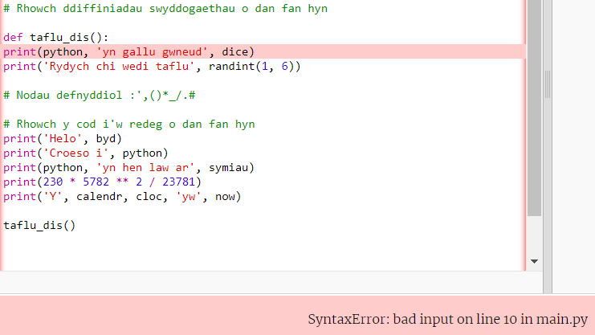

## Roll a dice 🎲

Create a function for rolling a dice using random numbers. 
  
In Python:
  - **functions**, defined with `def`, are like 'my blocks' in Scratch,
  - `randint` is like 'random' in Scratch, and
  - `input` is like 'ask' in Scratch.

{:width="300px"} 

Yn Python, rydych chi'n **galw** **swyddogaeth()** i gyflawni gweithred. Rydych chi eisoes wedi defnyddio'r swyddogaeth `print()` i allbynnu testun.

Fe allwch chi **ddiffinio** **swyddogaeth** newydd i grwpio cod gyda'i gilydd er mwyn gallu ei henwi a'i hailddefnyddio.

### Define your function

--- task ---

Rhaid diffinio swyddogaethau cyn eu galw. Look for the comment in the **main.py** file that says `# Function definitions`.

Define a new function called `roll_dice()` that uses the `randint()` function from the `random` library, to generate a random 'integer' (whole number) from 1 to 6 and output it to the screen.

--- code ---
---
language: python filename: main.py line_numbers: true line_number_start: 15
line_highlights: 16-17
---

# Function definitions
def roll_dice():  # Don't forget the colon at the end of this line   
print('You rolled a', randint(1, 6))  # randint(1, 6) is used to give a number between 1 and 6.

--- /code ---

The line under `def roll_dice():` is **indented**. I wneud hyn, defnyddiwch y nod <kbd>Tab</kbd> ar eich bysellfwrdd (uwchben <kbd>CAPSLOCK</kbd> fel arfer). Mae mewnoli cod yn dweud wrth Python bod y llinellau wedi'u mewnoli yn rhan o'r swyddogaeth.

**Tip:** The underscore `_` is used between words in variable and function names in Python to make them easier to read. Chewch chi ddim defnyddio bwlch.

--- collapse ---
---
title: Teipio nodau arbennig ar fysellfwrdd y DU neu UDA
---

Ar fysellfwrdd y DU neu UDA, mae'r colon `:` ar yr un fysell â'r hanner colon, wrth ymyl y fysell <kbd>L</kbd>: daliwch <kbd>Shift</kbd> a tharo <kbd>;</kbd> i deipio `:`. Mae'r tanlinell `_` ar yr un fysell â `-`, wrth ymyl <kbd>0</kbd>, daliwch <kbd>Shift</kbd> a tharo <kbd>-</kbd> i deipio `_`.

--- /collapse ---

--- /task ---

--- task ---

**Profi:** Os byddwch yn 'rhedeg' eich cod nawr, ni fydd yn taflu dis. Mae hynny oherwydd eich bod wedi diffinio'r swyddogaeth `taflu_dis()`, ond heb ei galw eto.

**Debug:**

--- collapse ---
---
title: I have a syntax error
---

- Make sure you have an underscore `_` between roll and dice to make the function name.

- Make sure you have a colon `:` at the end of the line.

- Check that the line under `def roll_dice()` is indented. It's really common to get this wrong in Python, so make sure to check.

--- /collapse ---

--- /task ---

### Call your function

--- task ---

To use a function, you need to **call** it in the code. Go to the end of your code and add a new line to call the `roll_dice()` function:

--- code ---
---
language: python filename: main.py line_numbers: true line_number_start: 25
line_highlights: 27
---

print('The date and time is', datetime.now())

roll_dice()  # Call the roll dice function

--- /code ---

--- /task ---

--- task ---

**Test:** Run your project several times to see the random dice roll each time.

--- /task ---

Uses of random numbers include cryptography, data science, and adding variety into games and computer art. Computers generate **random numbers** using an algorithm. For numbers that are really random, you need an unpredictable input from the real world.

### Use 🔥🔥🔥 for the number rolled

--- task ---

Your function can use the 🔥 emoji variable. The code `print(fire * 3)` outputs three fire emojis '🔥🔥🔥'. You need to output the correct number of emojis to match the random number rolled by the dice.

Change your code to save the value returned by `randint()` in a variable called `roll`. Use that variable to print out the number rolled with the matching number of 🔥 emojis.

--- code ---
---
language: python filename: main.py line_numbers: true line_number_start: 15
line_highlights: 17-18
---

# Function definitions
def roll_dice(): roll = randint(1, 6)  # Generate a random number between 1 and 6 and store it in the variable 'roll' print('You rolled a', roll, fire * roll)  # Repeat the fire emoji to match the random dice roll

--- /code ---

**Tip** You can use `star` or `heart` instead of `fire` if you prefer, by creating your own emoji variables.

--- /task ---

--- task ---

**Test:** Test your project a few times. Make sure you understand how the code works.

--- /task ---

### Choose the number of sides on the dice

Upgrade your dice so that the user can choose the maximum number.

Lots of games use many-sided dice. In the physical world, dice are made from regular geometric shapes. Common dice include D6, D12, and D20. On a computer, you can generate a random number to make a fair dice with any number of sides.

--- task ---

The `input()` function asks the user a question and then returns their answer.

**Add** code to ask the user for the biggest number on their dice and then save the result in a variable called `max` and `print` the number chosen into the output area:

Change your `roll` variable code to use `max` as the maximum value for `randint` when it generates a random number.

When you get input from the user, Python treats it as text. But, `randint` needs an 'integer' (a positive whole number). The `int` function turns the user input into an integer.

--- code ---
---
language: python filename: main.py line_numbers: true line_number_start: 15
line_highlights: 18-20
---

# Function definitions

def roll_dice():   
max = input('How many sides?:')  # Wait for input from the user    
print('That\'s a D', max)  # Use the number the user entered    
roll = randint(1, int(max))  # Use max to determine the number of sides the dice has print('You rolled a', roll, fire * roll)

--- /code ---

To print an apostrophe `'` in a word like `That's`, put a backslash `\` before it so Python knows it's part of the text.

--- /task ---

--- task ---

**Test:** Run your project. When the program reaches the `input` line, it will wait for you to enter a response before continuing. Type your response and then press <kbd>Enter</kbd>, this will allow the program to collect your response. Try it again with a different `input` number.

--- /task ---

--- save ---
