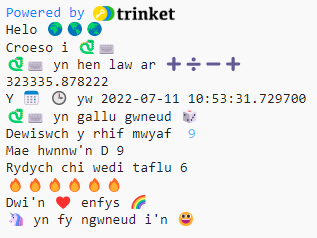

## Dechrau brawddeg

Allbynnu mwy o frawddegau o'ch prosiect.

{:width="300px"}

--- task ---

Ychwanegwch fwy o linellau `print` at eich cod. Dyma rai frawddegau enghreifftiol gallech chi eu defnyddio:

--- code ---
---
language: python
filename: main.py
---

print('Dwi\n', calon, '...')   
print('Mae', '... yn fy ngwneud i\'n', hapus)   
print('Hoffwn i wneud ... gyda', python)

--- /code ---

**Cyngor:** Mae `print` yn ychwanegu bwlch rhwng bob eitem rydych chi'n ei phrintio.

**Cyngor:** Os oes angen i chi brintio collnod, `'` rhaid i chi roi ôl-slaes `\` o'i flaen er mwyn i Python wybod ei fod yn rhan o'r testun.

--- /task ---

Mae'r emoji calon felen yn cael ei defnyddio i ddangos cyfeillgarwch a hapusrwydd yn aml.

--- task ---

Pa neges fyddech chi'n ei hanfon at ffrind i godi eu calon? Pa emoji fyddech chi'n ei ddewis?

Cliciwch y tab **emoji.py** yn Trinket i weld y newidynnau emoji gallwch chi eu defnyddio. Cliciwch yn ôl i'r tab **main.py** i ychwanegu at eich cod.

Fe allwch chi ychwanegu mwy o newidynnau emoji at **emoji.py**. Defnyddiwch y [rhestr emoji](https://unicode.org/emoji/charts/full-emoji-list.html){:target="_blank"} hon i ddod o hyd i rai.

--- /task ---

--- save ---
