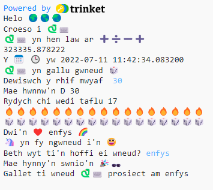

## Uwchraddio eich prosiect

Ychwanegu mwy at eich prosiect. Mae mwy o emoji i ddewis o'u plith.
  

{:width="300px"}

Gallech chi wneud y canlynol:
+ Defnyddio `print` gyda gwahanol destun ac emoji
+ Defnyddio `input` i gael gwerthoedd gan y defnyddiwr a'u storio fel newidynnau, ac wedyn gwneud symiau gyda'r newidynnau
+ Ysgrifennu mwy o swyddogaethau i roi trefn ar eich cod
+ Defnyddio `#` i ychwanegu sylwadau at eich cod

Cliciwch **emoji.py** i weld pa newidynnau emoji gallwch chi eu defnyddio. Cliciwch yn ôl i **main.py** i ychwanegu at eich cod.

Dyma enghraifft o swyddogaeth sy'n holi am ddiddordebau:

--- code ---
---
language: python
filename: main.py
---

#Rhowch y cod i'w redeg o dan fan hyn
def diddordebau():   
  diddordeb = input('Beth wyt ti\'n hoffi ei wneud?')   
  print('Mae hynny\'n swnio\'n', hwyl)   
  print('Gallet ti wneud prosiect', python, 'am', diddordeb)

--- /code ---

**Cyngor:** Cofiwch fod angen galw eich swyddogaeth ar ôl ei diffinio.

Fe allwch chi ddefnyddio `input` i wneud eich prosiect aros i'r defnyddiwr daro <kbd>Enter</kbd> ar unrhyw bwynt yn y prosiect hwn.

--- code ---
---
language: python
filename: main.py
---

taflu_dis()

input() #Aros i'r defnyddiwr daro Enter

diddordebau()

--- /code ---

--- collapse ---
---
title: Prosiect gorffenedig
---

Gallwch chi weld y [prosiect gorffenedig yma](https://trinket.io/embed/python/7cbddc178c){:target="_blank"}.

--- /collapse ---

--- save ---
