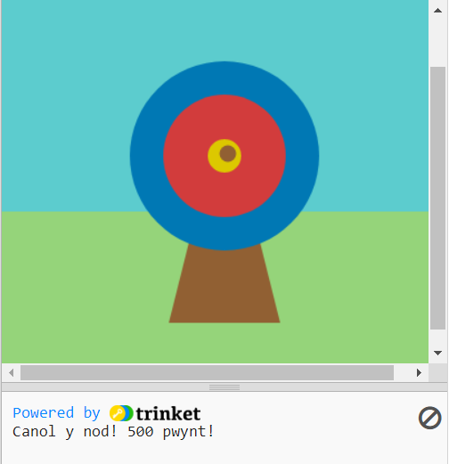

## Beth nesaf?

Os ydych chi'n dilyn y llwybr [Cyflwyniad i Python](https://projects.raspberrypi.org/en/raspberrypi/python-intro), fe allwch chi symud ymlaen i'r prosiect [Ymarfer saethu](https://projects.raspberrypi.org/en/projects/target-practice). Yn y prosiect hwn, byddwch chi'n llunio targed ac yna'n gwneud gêm saethyddiaeth lle mae'n rhaid saethu i sgorio pwyntiau.

--- print-only ---

--- /print-only ---

--- no-print ---

<iframe src="https://trinket.io/embed/python/f686c82d8a?outputOnly=true&start=result" width="600" height="500" frameborder="0" marginwidth="0" marginheight="0" allowfullscreen>
</iframe>

--- /no-print ---

Os hoffech chi gael mwy o hwyl yn archwilio Python, gallech chi roi cynnig ar unrhyw rai o'r [prosiectau hyn](https://projects.raspberrypi.org/en/projects?software%5B%5D=python).
