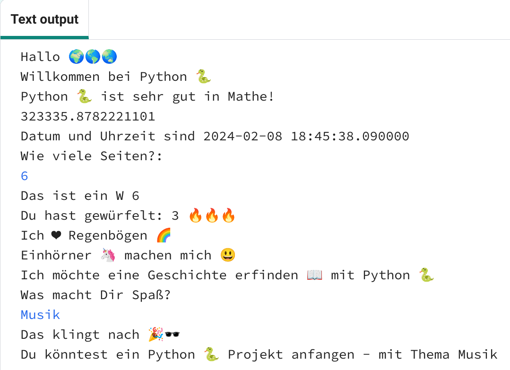

  <a class="c-survey-banner__link" href="https://form.raspberrypi.org/f/code-editor-feedback" target="_blank">Nimm an unserer Umfrage teil</a> um unseren Code-Editor zu verbessern!

## Das wirst Du machen

Finde heraus, was die Programmiersprache Python 🐍 alles kann, indem Du ein interaktives Projekt schreibst, das Emojis 🙌 🙌🏼 🙌🏽 🙌🏾 🙌🏿 verwendet.

**Emojis** sind kleine bunte Bilder 🥰, die verwendet werden, um Nachrichten mit mehr Bedeutung zu versehen. Emoji bedeutet auf Japanisch „Bildwort“.

Du wirst:

+ mit `print()` Text, einschließlich Emojis 🚀 darstellen, und mit `input()` ⌨️ vom Benutzer Eingaben erhalten
+ Text und Zahlen in **Variablen** abspeichern
+ **Funktionen** verwenden, um Deinen Code zu organisieren

--- no-print ---

### Spielen ▶️

--- task ---

  

Klicke auf die Schaltfläche **Ausführen** und lies die Ausgabe.

  Wenn Du dazu aufgefordert wirst, gib eine Zahl ein und drücke <kbd>Enter</kbd>. 

Siehst Du, wie die Antworten verwendet werden?

<iframe src="https://editor.raspberrypi.org/en/embed/viewer/hello-world-solution" width="600" height="600" frameborder="0" marginwidth="0" marginheight="0" allowfullscreen>
</iframe>

--- /task ---

--- /no-print ---

--- print-only ---

{:width="640px"}

--- /print-only --- 