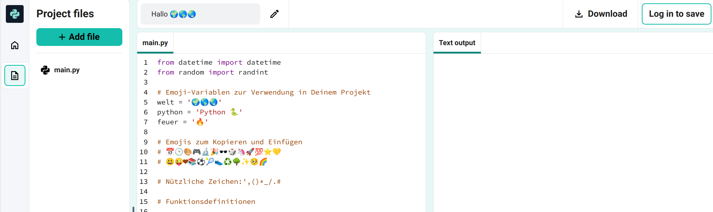
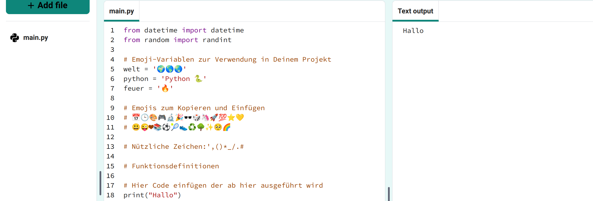
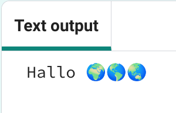
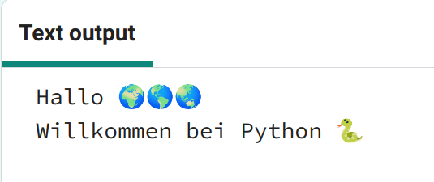

## Hallo ausgeben

In Python, `print()`{:.language-python} outputs strings (words or numbers) to the screen.

--- task ---

Öffne das [Hallo 🌍🌎🌏 Starterprojekt](https://editor.raspberrypi.org/en/projects/hello-world-starter){:target="_blank"}. Der Code-Editor wird in einem anderen Tab im Browser geöffnet.

 --- /task ---

--- task ---

Find the `# Put code to run below here`{:.language-python} line.

Klicke unterhalb dieser Zeile. Das blinkende `|` ist der Cursor und zeigt an, wo Du tippen wirst.

--- /task ---

--- task ---

Type the code to `print()`{:.language-python} Hello to the screen:

--- code ---
---
language: python line_numbers: true line_number_start: 17
line_highlights: 18
---
# Put code to run under here.
print(f'Hello') --- /code ---

--- /task ---

--- task ---

**Test:** Klicke auf den **Ausführen** Knopf, um Deinen Code auszuführen. This is what you should see when you run your code:

--- /task ---

A **variable** is used to store values such as text or numbers. Wir haben einige Variablen eingefügt, die Emoji-Zeichen speichern.

--- task ---

Change your code to also `print()`{:.language-python} the contents of the `world`{:.language-python} variable. You can do this by adding the variable name in curly brackets `{}`{:.language-python}

--- code ---
---
language: python line_numbers: true
line_number_start: 17
---
# Füge hier den Code ein, der ausgeführt werden soll
print(f'Hello {world}') --- /code ---

The `f`{:.language-python} character inside the print lets you easily print variables along with strings of text.

--- /task ---

--- task ---

**Test:** Führe Deinen Code aus, um das Ergebnis zu sehen:

--- /task ---

--- task ---

**Add** another line to your code to `print()`{:.language-python} more text and emojis:

--- code ---
---
language: python line_numbers: true line_number_start: 17
line_highlights: 19
---
# Put code to run under here
print(f'Hello {world}') print(f'Welcome to {python}') --- /code ---

--- /task ---

--- task ---

**Test:** Klick auf **Ausführen**.

**Tipp:** Es ist eine gute Idee, Deinen Code nach jeder Änderung auszuführen, damit Du Probleme schnell beheben kannst.

--- /task ---

