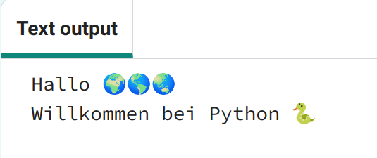
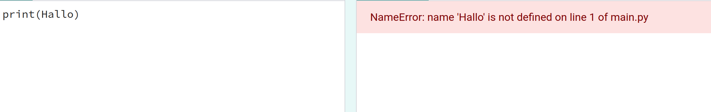
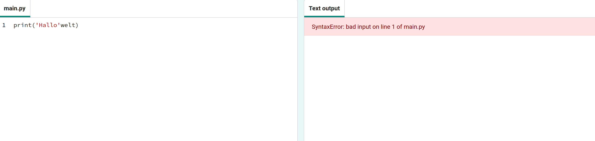

## Sag Hallo

<div style="display: flex; flex-wrap: wrap">
<div style="flex-basis: 200px; flex-grow: 1; margin-right: 15px;">
Es ist Tradition, ein Programm zu schreiben, das „Hallo Welt!“ ausgibt wenn Du eine neue Programmiersprache lernst.
</div>
<div>

{:width="200px"}

</div>
</div>

--- task ---

Öffne das [Hallo 🌍🌎🌏 Starterprojekt](https://editor.raspberrypi.org/en/projects/hello-world-starter){:target="_blank"}. Der Code Editor wird in einem anderen Tab im Browser geöffnet.


Wenn Du ein Raspberry Pi Konto hast, kannst Du auf **Speichern** klicken, um eine Kopie in Deinen **Projekten**zu speichern.

--- /task ---

--- collapse ---

---
title: Arbeitest Du auf einem Raspberry Pi?
---

Wenn Du auf einem Raspberry Pi mit Chromium arbeitest, werden die Emojis möglicherweise nicht angezeigt. Du musst eine Schriftart (font) installieren, die diese unterstützt.

Öffne ein Terminal und gib Folgendes ein:

```bash
sudo apt install fonts-noto-color-emoji
```

Starte Chromium neu und dann solltest Du die Farb-Emojis sehen.

--- /collapse ---

### Hallo ausgeben

<p style="border-left: solid; border-width:10px; border-color: #0faeb0; background-color: aliceblue; padding: 10px;">
Zeilen, die mit einem „#“ beginnen, sind <span style="color: #0faeb0">**Kommentare**</span>. Sie erklären, was der Code tun wird. Kommentare werden von Python ignoriert.
</p>

Die `import` Zeilen am Anfang des Codes teilen Python mit, dass Du Code verwenden wirst, den Du selbst nicht geschrieben hast.

In Python gibt `print()` Text (Wörter oder Zahlen) auf dem Bildschirm aus.

--- task ---

Suchen die Zeile mit `# Hier Code einfügen der ab hier ausgeführt wird`.

Klicke unterhalb dieser Zeile. Das blinkende `|` ist der Cursor und zeigt an, wo Du tippen wirst.

--- /task ---

--- task ---

Gib den Code ein, um mittels `print()` Hallo auf den Bildschirm auszugeben:

**Tipp:** Wenn Du eine öffnende Klammer `(` oder ein öffnendes Apostroph `'` eingibst, fügt der Code Editor automatisch eine schließende Klammer `)` oder ein schließendes Apostroph`'` hinzu:

--- code ---
---
language: python filename: main.py line_numbers: true line_number_start: 17
line_highlights: 18
---

# Hier Code einfügen der ab hier ausgeführt wird
print('Hallo')

--- /code ---

--- collapse ---
---
title: Sonderzeichen auf einer deutschen Tastatur eingeben
---

Auf einer deutschen Tastatur befinden sich die linken `(` und die rechten `)` runden Klammern auf den <kbd>8</kbd> und <kbd>9</kbd> Tasten. Um eine linke runde Klammer zu tippen, halte die <kbd>Umschalt</kbd> Taste gedrückt (neben dem <kbd>Y</kbd>) und tippe dann die <kbd>8</kbd>. Das einfache Anführungszeichen `'` befindet sich in derselben Zeile wie die Taste <kbd>L</kbd>, direkt vor der <kbd>Enter</kbd> Taste. Das Komma `,` ist neben dem <kbd>M</kbd>.

--- /collapse ---

--- /task ---

--- task ---

**Test:** Klicke auf den **Ausführen** Knopf, um Deinen Code auszuführen. Im Code Editor erscheint rechts die Ausgabe:


**Fehlersuche:** Wenn Du eine Fehlermeldung erhältst, überprüfe Deinen Code sorgfältig. In diesem Beispiel fehlen die einfachen Anführungszeichen um `Hallo`, sodass Python nicht weiß, dass es sich um Text handeln soll.



--- /task ---

## 🌍🌎🌏 ausgeben

In Python wird eine **-Variable** zum Speichern von Werten wie Text oder Zahlen verwendet. Variablen erleichtern Menschen das Lesen von Code. Du kannst dieselbe Variable an vielen Stellen in Deinem Code verwenden. Wählst Du einen passenden Namen für eine Variable, machst Du es Dir leichter zu erinnern wofür sie da ist.

Wir haben einige Variablen eingefügt, die Emoji Zeichen speichern.

--- task ---

Scrolle im Code Editor zu den Zeilen, in denen die Emojis in zwei verschiedenen Variablen gespeichert sind. Suche die Variable `welt`, die den Text „🌍🌍🌍“ speichert. (Anmerkung: in Python werden Variablen mit Kleinbuchstaben angefangen).

--- /task ---

--- task ---

Du kannst mit `print()` mehr als ein Element ausgeben, indem Du zwischen den Elementen ein Komma `,` einfügst. `print()` fügt zwischen jedem Element ein Leerzeichen ein.

Ändere Deinen Code so, dass `print()` auch den Inhalt der `welt` Variablen ausgibt:

--- code ---
---
language: python filename: main.py line_numbers: true line_number_start: 17
line_highlights: 18
---

# Hier Code einfügen der ab hier ausgeführt wird
print('Hallo', welt)

--- /code ---

**Tipp:** `'Hallo'` ist Text, da das Wort in einfache Anführungszeichen gesetzt ist, während `welt` eine Variable ist, sodass der darin gespeicherte Wert ausgegeben wird.

--- /task ---

--- task ---

**Test:** Führe Deinen Code aus, um das Ergebnis zu sehen:


**Tipp:** Emojis können auf verschiedenen Computern unterschiedlich aussehen, Deines sieht möglicherweise nicht genau so aus.

**Fehlersuche:** Achte darauf, dass Du in dem Aufruf von `print()` ein Komma zwischen den Elementen gesetzt hast und `welt` richtig geschrieben ist.

In diesem Beispiel fehlt das Komma `,`. Es ist klein, aber sehr wichtig!



--- /task ---

--- task ---

**Füge** eine weitere Zeile zu Deinem Code hinzu, um mit `print()` mehr Text und Emojis auszugeben:

--- code ---
---
language: python filename: main.py line_numbers: true line_number_start: 18
line_highlights: 19
---

print('Hello', world)    
print('Welcome to', python)

--- /code ---

**Tipp:** Der Code, den Du eingeben musst, ist mit einer helleren Farbe hervorgehoben. Nicht hervorgehobener Code hilft Dir dabei, herauszufinden, wo Du den neuen Code hinzufügen musst.

--- /task ---

--- task ---

**Test:** Klick auf **Ausführen**.


**Tipp:** Es ist eine gute Idee, Deinen Code nach jeder Änderung auszuführen, damit Du Probleme schnell beheben kannst.

**Fehlersuche:** Überprüfe sorgfältig alle Klammern, Anführungszeichen, Kommas und korrekte Schreibweise. Python möchte, dass Du wirklich präzise arbeitest.

--- /task ---

Wenn Du ein Raspberry Pi Konto hast, kannst Du auf **Speichern** klicken, um eine Kopie in Deinen Projekten zu speichern.

--- save ---
