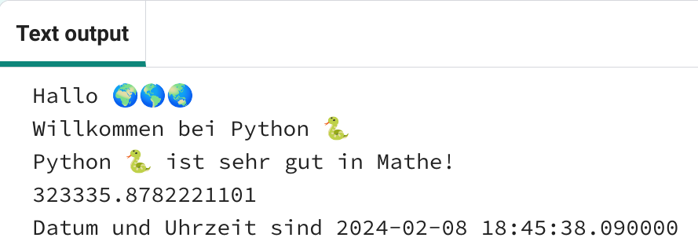
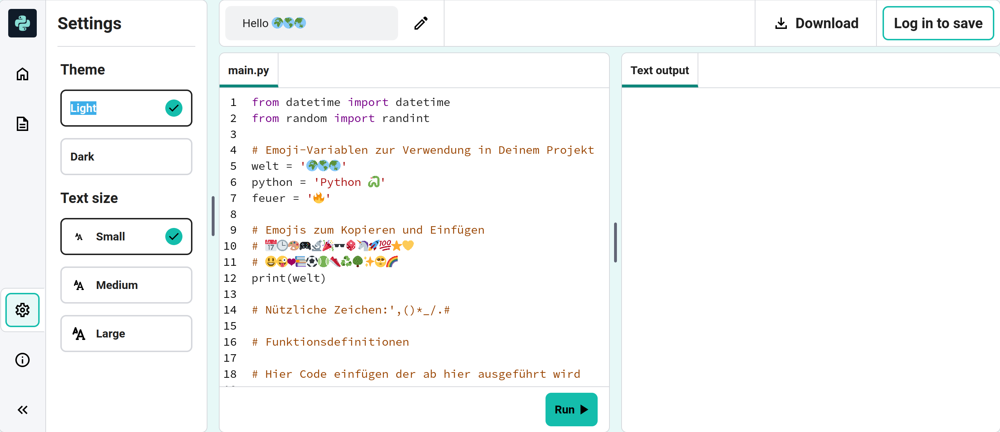

## Rechnen und Daten

Python eignet sich hervorragend für die Arbeit mit Zahlen und Datumsangaben.

{:width="300px"} 

In Python kannst Du mathematische Operatoren verwenden, um Rechenergebnisse zu erzeugen:

| + | addieren |   
| - | subtrahieren |   
| * | multiplizieren |   
| / | dividieren |   
| ** | Exponent |

### Erstelle eine Berechnung

--- task ---

Füge Deinem Code zwei weitere Zeilen mit `print()` Ausdrücken hinzu, einschließlich einer Summe, die Python berechnen kann:

**Tipp:** Um das `*` Symbol zu erhalten, halte <kbd>Umschalten</kbd> gedrückt und klicke das <kbd>+</kbd> (neben der Enter Taste).

--- code ---
---
language: python filename: main.py line_numbers: true line_number_start: 18
line_highlights: 20-21
---

print('Hallo', welt)   
print('Willkommen bei', python)   
print(python, 'ist sehr gut in Mathe!')   
print(230 * 5782 ** 2 / 23781)  # Gib das Ergebnis der Rechnung aus

--- /code ---

**Tipp:** Du musst die Kommentare nicht eingeben. Sie dienen nur dazu, Dir das Verständnis des Codes zu erleichtern. Gib einfach den Code vor dem `#` ein.

--- /task ---

--- task ---

**Test:** Führe Deinen Code aus. Hat Python richtig gerechnet? Nur ein Scherz! Python erledigt die schwierigen Berechnungen für Dich, sodass Du nicht selbst rechnen musst.

**Fehlersuche:**

--- collapse ---
---
title: Ich habe einen Syntaxfehler
---

Achte darauf, dass Du in dem Aufruf von `print()` ein Komma `,` zwischen den Elementen gesetzt hast und `python` richtig geschrieben ist.

--- /collapse ---

--- /task ---

Die japanische Informatikerin **Emma Haruka Iwao** berechnete mit einem Computer den Wert von Pi (*π*) auf 31 Billionen Stellen. Diese Antwort ist so lang, dass es über 300.000 Jahre dauern würde, sie nur auszusprechen! 

--- task ---

Versuche mal, die Rechnung, die Python macht, komplizierter zu machen!

Du kannst auch Klammern verwenden, wenn Du die Reihenfolge steuern möchten, in der Python das Ergebnis berechnet: `print( (2 + 4) * (5 + 3) )`.

--- /task ---

--- task ---

**Test:** Führe Deinen Code aus und lass Python das Ergebnis berechnen.

**Fehlersuche:** Achte darauf, dass Dein Rechnungsausdruck linke und rechte runde Klammer hat `( 2 * 45 )`. Wenn Du zusätzliche Klammern verwendest, um die Reihenfolge zu kontrollieren, achte darauf, dass Du für jede linke Klammer eine rechte passende rechte Klammer setzt.

--- /task ---

--- task ---

Im Code Editor ist der Text möglicherweise zu groß oder zu klein zum Lesen. Du kannst diese Einstellungen ganz einfach nach Belieben ändern.

**Tipp:** Klick auf das **Einstellungen Menü**  links in Deinem Code Editor. Klick dann auf eine der **Textgröße** Schaltflächen, um die Größe des Texts zu ändern.

You can also switch between colour modes, click on the **Light & Dark** buttons to see the changes.

--- /task ---

Die Zeile `from datetime import *` oben auf dem **main.py** Tab enthält eine Bibliothek mit hilfreichen Funktionen zum Abrufen des aktuellen Datums und der aktuellen Uhrzeit.

Eines der großartigen Dinge an Python sind die vielen **Bibliotheken**, die man verwenden kann. Eine Python Bibliothek erlaubt es, Code zu verwenden, den andere geschrieben haben. Es gibt Bibliotheken zum Zeichnen von Diagrammen und Grafiken, zum Erstellen von Kunstwerken, zum Durchführen von Berechnungen und vielem mehr.

--- task ---

Füge Deinem Code eine weitere Zeile hinzu, um mit `print` das aktuelle Datum und die aktuelle Uhrzeit auszugeben.

Ruf das aktuelle Datum und die aktuelle Uhrzeit ab, indem Du die Funktion `now()` aus der Bibliothek `datetime` verwendest:

--- code ---
---
language: python filename: main.py line_numbers: true line_number_start: 20
line_highlights: 22
---

print(python, 'is very good at maths!')    
print(230 * 5782 ** 2 / 23781)  # Print the result of the sum     
print('The date and time is', datetime.now())  # Print the current date and time

--- /code ---

**Tipp:** Du musst die Kommentare nicht eingeben. Sie dienen nur dazu, Dir das Verständnis des Codes zu erleichtern. Gib einfach den Code vor dem `#` ein.

--- /task ---

--- task ---

**Test:** Führe Deinen Code ein paar Mal aus, um die Zeitaktualisierung zu sehen.

**Fehlersuche:** Achte darauf, dass Du einen Punkt `.` zwischen `datetime` und `now` stehen hast. Überprüfe alle Satzzeichen sorgfältig.

--- /task ---

--- save ---
