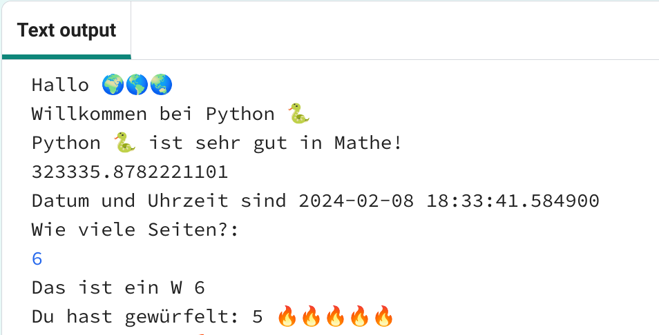
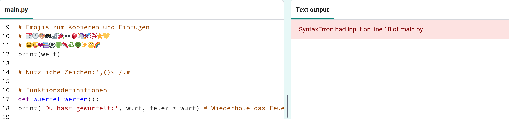

## Wirf einen Würfel 🎲

Erstelle eine Funktion zum Würfeln mithilfe von Zufallszahlen. 
  
In Python:
  - sind **Funktionen**, definiert durch `def`, wie „Meine Blöcke“ in Scratch,
  - `randint` ist wie 'Zufallszahl' in Scratch, und
  - `input` ist wie 'Frage' in Scratch.

{:width="300px"} 

In Python kannst Du eine **funktion()** **aufrufen**, um eine Aktion auszuführen. Du hast bereits die Funktion `print()` zum Ausgeben von Text verwendet.

Du kannst eine neue **Funktion** **definieren**, um Code zu gruppieren, sodass Du ihn benennen und wiederverwenden kannst.

### Definiere Deine Funktion

--- task ---

Funktionen müssen definiert werden, bevor Du sie aufrufen kannst. Finde in der Datei **main.py** den Kommentar `# Funktionsdefinitionen`.

Definiere eine neue Funktion namens `würfel_werfen()`, welche die Funktion `randint()` aus der Bibliothek `random` verwendet, um eine zufällige ganze Zahl (engl.: „integer“) von 1 bis 6 zu erzeugen und auf dem Bildschirm auszugeben.

--- code ---
---
language: python filename: main.py line_numbers: true line_number_start: 15
line_highlights: 16-17
---

# Funktionsdefinitionen
def würfel_werfen(): # Vergiss nicht den Doppelpunkt am Ende dieser Zeile   
print('Das hast Du gewürfelt:', randint(1, 6)) # randint(1, 6) wird verwendet, um eine Zahl zwischen 1 und 6 zu erzeugen.

--- /code ---

Die Zeile unter `def würfel_werfen():` ist **eingerückt**. Verwende dazu die <kbd>Tab</kbd> Taste auf Deiner Tastatur (normalerweise über der <kbd>Feststelltaste</kbd> auf der Tastatur). Durch das Einrücken von Code wird Python mitgeteilt, dass die eingerückten Zeilen Teil der Funktion sind.

**Tipp:** Der Unterstrich `_` wird in Python zwischen Wörtern in Variablen- und Funktionsnamen verwendet, um sie leichter lesbar zu machen. Leerzeichen darfst Du dafür nicht verwenden.

--- collapse ---
---
title: Sonderzeichen auf einer deutschen Tastatur eingeben
---

Auf der deutschen Tastatur findest Du den Doppelpunkt `:` auf derselben Taste wie der Punkt. Die Taste befindet sich unterhalb der <kbd>L</kbd> Taste. Halte die <kbd>Umschalt</kbd> Taste gedrückt und tippe dann <kbd>.</kbd> um ein `:` zu schreiben. Der Unterstrich `_` ist auf der gleichen Taste wie `-`, neben der rechten <kbd>Umschalttaste</kbd>. Halte <kbd>Umschalten</kbd> gedrückt und tippe <kbd>-</kbd> um ein `_` zu schreiben.

--- /collapse ---

--- /task ---

--- task ---

**Test:** Wenn Du jetzt Deinen Code ausführst, wird nicht gewürfelt. Das liegt daran, dass Du Deine Funktion `würfel_werfen()` zwar definiert hast, sie aber noch nicht aufgerufen hast.

**Fehlersuche:**

--- collapse ---
---
title: Ich habe einen Syntaxfehler
---

- Achte darauf, dass im Funktionsnamen zwischen „würfel“ und „werfen“ ein Unterstrich `_` steht.

- Achte darauf, dass am Ende der Zeile ein Doppelpunkt `:` steht.

- Überprüfe, ob die Zeile unter `def würfel_werfen():` eingerückt ist. Das ist ein wirklich häufig gemachter Fehler in Python. Sieh also nochmal nach.

--- /collapse ---

--- /task ---

### Ruf Deine Funktion auf

--- task ---

Um eine Funktion zu verwenden, musst Du sie im Code **aufrufen**. Geh bis zum Ende Deines Codes und füg eine neue Zeile hinzu, um die Funktion `würfel_werfen()` aufzurufen:

--- code ---
---
language: python filename: main.py line_numbers: true line_number_start: 25
line_highlights: 27
---

print('Datum und die Uhrzeit sind', datetime.now())

würfel_werfen() # Rufe die würfeln Funktion auf

--- /code ---

--- /task ---

--- task ---

**Test:** Führe Dein Projekt mehrmals aus, um zufällige Würfelwürfe zu sehen.

--- /task ---

Zu den Einsatzmöglichkeiten von Zufallszahlen gehören Kryptographie, Datenwissenschaft und um Abwechslung in Spielen und Computerkunst zu erzeugen. Computer erzeugen mithilfe eines Algorithmus **Zufallszahlen**. Für Zahlen, die wirklich zufällig sind, benötigst Du eine unvorhersehbare Eingabe aus der realen Welt.

### Verwende 🔥🔥🔥 für die gewürfelte Zahl

--- task ---

Deine Funktion kann die Emoji-Variable 🔥 verwenden. Der Code `print(feuer * 3)` gibt drei Feuer-Emojis „🔥🔥🔥“ aus. Du musst die richtige Anzahl an Emojis ausgeben, um gewürfelten Zufallszahl zu entsprechen.

Ändere Deinen Code, um den von `randint()` zurückgegebenen Wert in einer Variablen namens `wurf`zu speichern. Verwende diese Variable, um die gewürfelte Zahl mit der entsprechenden Anzahl an 🔥-Emojis auszudrucken.

--- code ---
---
language: python filename: main.py line_numbers: true line_number_start: 15
line_highlights: 17-18
---

# Funktionsdefinitionen
def würfel_werfen(): wurf = randint(1, 6) # Erzeuge eine Zufallszahl zwischen 1 und 6 und speichere sie in der Variable 'wurf' print('Das hast Du gewürfelt:', wurf, feuer * wurf) # Wiederhole das Feuer-Emoji so oft wie es der gewürfelten Zahl entspricht

--- /code ---

**Tipp** Erstelle Deine eigenen Emoji Variablen `stern` oder `herz` und nutze diese anstelle von `feuer`.

--- /task ---

--- task ---

**Test:** Teste Dein Projekt ein paar Mal. Achte darauf, dass Du verstehst, wie der Code funktioniert.

--- /task ---

### Wähle die Anzahl der Würfelseiten

Werte Deinen Würfel auf, sodass der Benutzer die maximale Anzahl auswählen kann.

Viele Spiele verwenden Würfel mit vielen Seiten. In der echten Welt bestehen Würfel aus regelmäßigen geometrischen Formen. Zu den üblichen Würfeln gehören W6, W12 und W20. Auf einem Computer kannst Du eine Zufallszahl generieren, um einen fairen Würfel mit beliebig vielen Seiten zu erstellen.

--- task ---

Die Funktion `input()` stellt dem Benutzer eine Frage und gibt dann seine Antwort zurück.

**Fügen Code hinzu**, um den Benutzer nach der größten Zahl auf seinen Würfeln zu fragen. Speichere das Ergebnis in einer Variable namens `max` und benutze `print` um die gewählte Zahl in dem Ausgabebereich darzustellen:

Ändere Deine Codezeile die `wurf` definiert, um `max` als Maximalwert für `randint` zu verwenden, wenn eine Zufallszahl generiert wird.

Wenn Du Eingaben vom Benutzer erhältst, behandelt Python diese als Text. Aber `randint` benötigt eine ganze Zahl (engl.: „integer“), die zudem auch nicht negativ sein darf. Die Funktion `int` wandelt die Benutzereingabe in eine ganze Zahl um.

--- code ---
---
language: python filename: main.py line_numbers: true line_number_start: 15
line_highlights: 18-20
---

# Funktionsdefinitionen

def würfel_werfen():   
max = input('Wie viele Seiten?:')  # Warte auf Eingabe vom Benutzer    
print('Das ist ein W', max)  # Nutze die Zahl die vom Benutzer eingegeben wurde    
wurf = randint(1, int(max))  # Benutze max als Anzahl Seiten des Würfels print('Du hast gewürfelt:', wurf, feuer * wurf)

--- /code ---

`Tipp:` Wenn Du ein Apostroph <1>'</1> oder Anführungszeichen <1>"</1> ausgeben möchtest, musst Du davor einen Backslash <1>\</1> einfügen, sodass Python weiß, dass es Teil des Textes ist.

--- /task ---

--- task ---

**Test:** Führe Deinen Code aus. Wenn das Programm die Eingabezeile `input` erreicht, wartet es darauf, dass Du eine Antwort eingibst, bevor es fortfährt. Gib Deine Antwort ein und drücke dann <kbd>Enter</kbd>. So kann das Programm Deine Antwort erhalten. Versuche es noch einmal mit einer anderen Zahl.

--- /task ---

--- save ---
