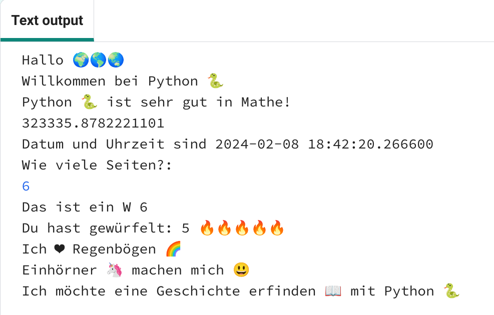

## Satzanfang

Gebe weitere Sätze aus Deinem Projekt aus.

{:width="300px"} 

--- task ---

Füge Deinem Code weitere `print` Zeilen hinzu. Hier sind einige Satzanfänge, die Du verwenden kannst:

--- code ---
---
language: python filename: main.py line_numbers: true line_number_start: 29
line_highlights: 30-32
---

würfel_werfen()  # rufe die würfeln Funktion auf print('Ich ❤️ ...')   
print('... macht mich 😃')   
print('Als nächstes mache ich ... mit', python)

--- /code ---

**Tipp:** Bei jeder Verwendung von `print` wird eine Zeile dazwischen hinzugefügt.

**Tipp:** Wenn Du ein Apostroph `'` oder Anführungszeichen `"` ausgeben möchtest, musst Du davor einen Backslash <1>\</1> einfügen, sodass Python weiß, dass es Teil des Textes ist.

**Tipp:** Füge am Anfang einer Zeile ein `#` hinzu, um daraus einen Kommentar zu machen.

--- /task ---

Das Emoji gelbes Herz 💛 wird oft verwendet, um Freundschaft und Glück zu zeigen.

--- task ---

Welche Nachricht würdest Du Freunden senden, um sie aufzuheitern? Welches Emoji würdest Du wählen?

Scroll im Code Editor zum Abschnitt **Emoji**, um die Emojis und Beispielvariablen anzuzeigen, die Du verwenden kannst. Kopiere alle die Du möchtest und speichere sie in einer Variable oder füge sie direkt Deinem Code hinzu.

Du kannst dem Abschnitt **Emoji** weitere Emojis hinzufügen. Verwende diese [Emoji Liste](https://unicode.org/emoji/charts/full-emoji-list.html){:target="_blank"}, um ein paar auszusuchen.

🎊 🙌 🙌🏼 🙌🏽 🙌🏾 🙌🏿 😃 🕒 🎨 🎮 🔬 🎉 🕶️ 🎲 😊 🦄 🚀 💯 ⭐ 💛 ❤️ 📚 ⚽ 🏏 🏀 🥋 🏆 ✨ 🥺 🌈 🔥 ♻️ 🌳 👩‍🦽👩🏼‍🦽👩🏽‍🦽👩🏾‍🦽👩🏿‍🦽🧘 🧘🏼 🧘🏽 🧘🏾 🧘🏿 🙋 🙋🏼 🙋🏽 🙋🏾 🙋🏿

[[[choose-an-emoji]]]

--- /task ---

--- save ---
