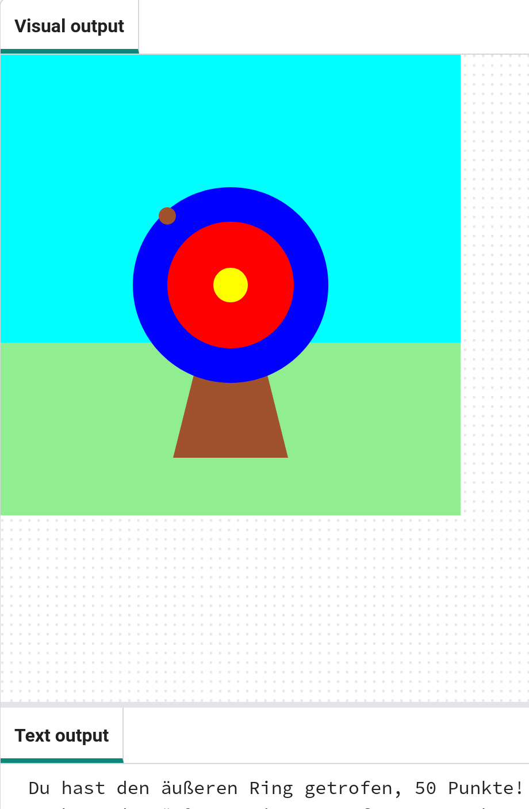

## Wie geht es weiter?

Wenn Du dem Pfad [Einführung in Python](https://projects.raspberrypi.org/en/raspberrypi/python-intro) folgst, könntest Du mit dem Projekt [Zielübungen](https://projects.raspberrypi.org/en/projects/target-practice) fortfahren. In diesem Projekt zeichnest Du ein Ziel und erstellst dann ein Bogenschießspiel, bei dem Du Pfeile abschießt, um Punkte zu erzielen.

--- print-only ---

{:width="640px"}

--- /print-only ---

--- no-print ---

Klick auf die Schaltfläche **Ausführen**, um ein Beispiel dieses Projekts anzuzeigen.

<iframe src="https://editor.raspberrypi.org/en/embed/viewer/target-practice-solution" width="600" height="600" frameborder="0" marginwidth="0" marginheight="0" allowfullscreen>
</iframe>

--- /no-print ---

Wenn du mehr Spaß beim Erkunden von Python haben willst, dann könntest du einige [dieser Projekte](https://projects.raspberrypi.org/en/projects?software%5B%5D=python) ausprobieren.
