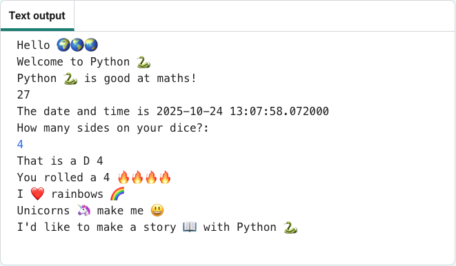

## Εισαγωγή

Μάθε τι μπορεί να κάνει η γλώσσα προγραμματισμού Python γράφοντας ένα διαδραστικό έργο που χρησιμοποιεί emoji.

Τα **Emoji** είναι μικρές πολύχρωμες εικόνες που χρησιμοποιούνται για να προσθέσουν επιπλέον νόημα στα μηνύματα. Το Emoji σημαίνει «εικονική λέξη» στα Ιαπωνικά.

Θα χρειαστεί να:
+ Να εμφανίσεις κείμενο με την χρήση της συνάρτησης `print()`, συμπεριλαμβανομένων των emoji, και να λάβεις είσοδο από τον χρήστη με την χρήση της συνάρτησης `input()`
+ Να αποθηκεύσεις κείμενο και αριθμούς σε **μεταβλητές**
+ Να χρησιμοποιήσεις **συναρτήσεις** για να οργανώσεις τον κώδικά σου

--- no-print ---

--- task ---

### Δοκίμασέ το

  
Διάβασε την έξοδο και μετά πάτησε <kbd>Enter</kbd> για να συνεχίσεις. 
Πληκτρολόγησε τις απαντήσεις σου στις ερωτήσεις. Μπορείς να δεις πώς χρησιμοποιούνται οι απαντήσεις σου;

  <iframe src="https://trinket.io/embed/python/a54e164ac2?outputOnly=true&start=result" width="600" height="500" frameborder="0" marginwidth="0" marginheight="0" allowfullscreen>
  </iframe>
  

--- /task ---

--- /no-print ---

--- print-only ---

--- /print-only ---
