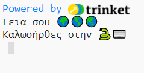
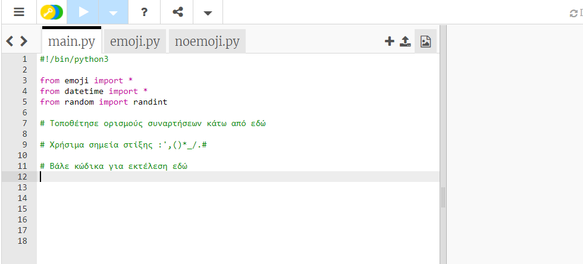
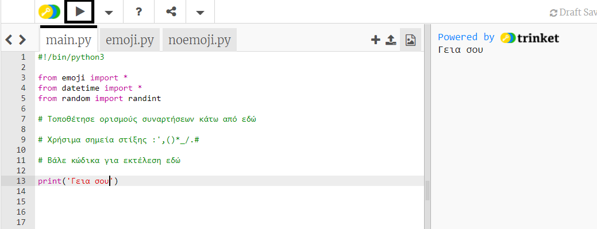
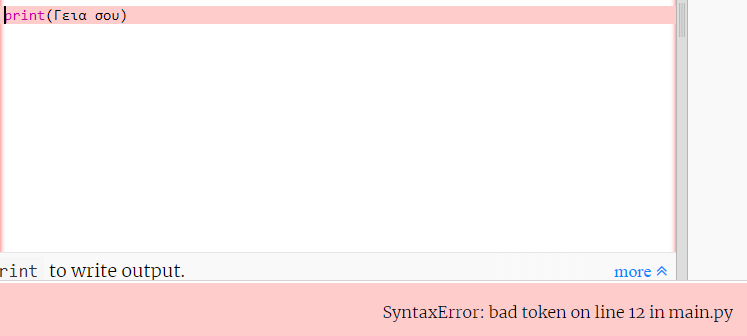
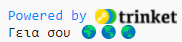
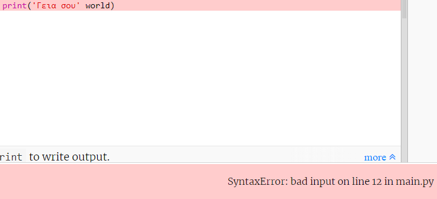
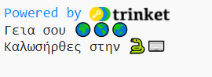

## Πες γεια

Είναι παράδοση να γράφεις ένα πρόγραμμα για να εμφανίσεις τις λέξεις "Hello world (Γεια σου κόσμε)!" όταν μαθαίνεις μια νέα γλώσσα προγραμματισμού.

{:width="200px"}

--- task ---

Άνοιξε το [αρχικό έργο Γεια σου κόσμε](https://trinket.io/python/e6734901f5){:target="_blank"}. Το Trinket θα ανοίξει σε νέα καρτέλα του φυλλομετρητή.

--- /task ---

Η γραμμή `#!/bin/python3` λέει απλά στο Trinket ότι χρησιμοποιούμε την Python 3 (τελευταία έκδοση). Οι γραμμές `import` λένε στην Python ότι πρόκειται να χρησιμοποιήσεις κώδικα που δεν έγραψες.

Στην Python, η συνάρτηση `print()` εξάγει κείμενο (λέξεις ή αριθμούς) στην οθόνη.

Οι γραμμές που ξεκινούν με `#` είναι σχόλια, εξηγούν τον κώδικα στους ανθρώπους και αγνοούνται από την Python.

--- task ---

Βρες τη γραμμή `# Τοποθέτησε κώδικα για εκτέλεση κάτω από εδώ`.

Κάνε κλικ κάτω από αυτή τη γραμμή. Το `|` που αναβοσβήνει είναι ο δείκτης και δείχνει πού θα πληκτρολογήσεις.

Πληκτρολόγησε τον κώδικα για να εμφανίσεις με τη βοήθεια της `print()` το γεια:

--- code ---
---
language: python 
filename: main.py 
line_numbers: true 
line_number_start: 11
line_highlights: 12
---

#Βάλε κώδικα για εκτέλεση εδώ
print('Γεια')

--- /code ---

--- collapse ---
---
title: Πληκτρολογώντας ειδικούς χαρακτήρες σε πληκτρολόγιο Η.Β. ή ΗΠΑ
---

Σε ένα πληκτρολόγιο Η.Β. ή ΗΠΑ, η αριστερή `(` και η δεξιά `)` παρένθεση βρίσκονται στα πλήκτρα <kbd>9</kbd> και <kbd>0</kbd>. Για να πληκτρολογήσεις μια αριστερή παρένθεση, κράτησε πατημένο το πλήκτρο <kbd>Shift</kbd> (δίπλα στο <kbd>Z</kbd>) και μετά πάτησε <kbd>9</kbd>. Το μονό εισαγωγικό `'` βρίσκεται στην ίδια σειρά με το πλήκτρο <kbd>L</kbd>, ακριβώς πριν από το πλήκτρο <kbd>Enter</kbd>. Το κόμμα `,` είναι δίπλα στο <kbd>M</kbd>.

--- /collapse ---

--- /task ---

--- task ---

**Δοκιμή**: Κάνε κλικ στο **Run** για να τρέξει ο κώδικάς σου. Στο Trinket, η έξοδος θα εμφανιστεί στα δεξιά:

**Εντοπισμός σφαλμάτων:** Εάν λάβεις ένα σφάλμα, έλεγξε τον κώδικά σου πολύ προσεκτικά. Σε αυτό το παράδειγμα, τα μονά εισαγωγικά γύρω από το `Γεια` λείπουν, επομένως η Python δεν γνωρίζει ότι υποτίθεται ότι είναι κείμενο.

--- /task ---

Στην Python, μία **μεταβλητή** χρησιμοποιείται για την αποθήκευση κειμένου ή αριθμών. Οι μεταβλητές διευκολύνουν τους ανθρώπους να διαβάζουν κώδικα. Μπορείς να χρησιμοποιήσεις την ίδια μεταβλητή σε πολλά σημεία στον κώδικά σου.

Έχουμε συμπεριλάβει ορισμένες μεταβλητές που αποθηκεύουν χαρακτήρες emoji.

--- task ---

Στο Trinket σου, κάνε κλικ στην καρτέλα **emoji.py**. Βρες τη μεταβλητή `world`, η οποία αποθηκεύει το κείμενο "🌍🌍🌍".

--- /task --- 

--- task ---

Μπορείς να εκτυπώσεις με τη βοήθεια της `print()` περισσότερα από ένα στοιχεία κάθε φορά, συμπεριλαμβάνοντας κόμμα `,` μεταξύ των στοιχείων. Η `print()` θα προσθέσει ένα κενό ανάμεσα στα στοιχεία.

Κάνε κλικ στην καρτέλα **main.py** για να επιστρέψεις στον κώδικα σου με την `print()`.

Άλλαξε τον κωδικά σου για να εμφανίσεις με την `print()` τα περιεχόμενα της μεταβλητής `world`:

--- code ---
---
language: python 
filename: main.py 
line_numbers: true 
line_number_start: 11
line_highlights: 12
---

#Βάλε κώδικα για εκτέλεση εδώ
print('Γεια', world)

--- /code ---

**Συμβουλή:** `Το 'Γεια'` είναι μια συμβολοσειρά κειμένου επειδή έχει μονά εισαγωγικά γύρω της, ενώ το `world` είναι μια μεταβλητή, επομένως θα εμφανιστεί τιμή που είναι αποθηκευμένη σε αυτήν.

--- /task ---

--- task ---

**Δοκιμή:** Εκτέλεσε τον κωδικά σου για να δεις το αποτέλεσμα:

Το emoji μπορεί να δείχνει διαφορετικό σε διαφορετικούς υπολογιστές, επομένως το δικό σου μπορεί να μην είναι ακριβώς το ίδιο.

**Εντοπισμός σφαλμάτων:** Βεβαιώσου ότι έχεις προσθέσει κόμμα μεταξύ των στοιχείων στο `print()` και ότι έχεις γράψει σωστά το `world`.

Από αυτό το παράδειγμα λείπει το κόμμα `,`. Είναι μικρό αλλά πολύ σημαντικό!

--- collapse ---
---
title: Δεν βλέπω το emoji
---

Οι περισσότεροι υπολογιστές σου επιτρέπουν να χρησιμοποιείς έγχρωμα emoji. Ωστόσο, εάν δεν μπορείς να χρησιμοποιήσεις emoji, τότε μπορείς να χρησιμοποιήσεις τα 'emoticon' αντ' αυτών, όπως κάναμε πριν εφευρεθούν τα emoji!

Άλλαξε τη γραμμή `from emoji import *` σε:

--- code ---
---
language: python 
filename: main.py 
line_numbers: true 
line_number_start: 3
line_highlights: 3
---

from noemoji import *

--- /code ---

--- /collapse ---

--- /task ---

--- task ---

Πρόσθεσε άλλη μια γραμμή στον κώδικά σου για να εκτυπώσεις με την `print()` περισσότερο κείμενο και emoji:

--- code ---
---
language: python 
filename: main.py 
line_numbers: true 
line_number_start: 12
line_highlights: 13
---

print('Γεια', world)    
print('Καλωσήρθες στην', python)

--- /code ---

**Συμβουλή:** Ο κώδικας που πρέπει να πληκτρολογήσεις επισημαίνεται με πιο ανοιχτό χρώμα. Ο κώδικας που δεν επισημαίνεται σε βοηθά να βρεις πού πρέπει να προσθέσεις τον νέο κώδικα.

--- /task ---

--- task ---

**Δοκιμή:** Κάνε κλικ στο **run**.

**Συμβουλή:** Είναι καλή ιδέα να εκτελείς τον κώδικά σου μετά από κάθε αλλαγή, ώστε να μπορείς να διορθώνεις αμέσως τα προβλήματα.

**Εντοπισμός σφαλμάτων:** Έλεγξε προσεκτικά για παρενθέσεις, εισαγωγικά, κόμματα και σωστή ορθογραφία. Με την Python χρειάζεται να είσαι πολύ ακριβής.

--- /task ---

Εάν έχεις λογαριασμό Trinket, μπορείς να κάνεις κλικ στο κουμπί **Remix** για να αποθηκεύσεις ένα αντίγραφο στη βιβλιοθήκη `My Trinkets`.

Εάν δεν διαθέτεις λογαριασμό Trinket, μπορείς να επιστρέψεις στο έργο σου στο μέλλον στον ίδιο υπολογιστή χρησιμοποιώντας τον σύνδεσμο του έργου έναρξης.

--- save ---
