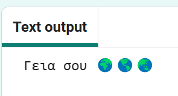
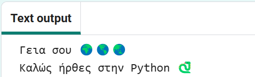

## Εμφάνισε γεια σου

Στην Python, η εντολή `print()`{:.language-python} εξάγει συμβολοσειρές (λέξεις ή αριθμούς) στην οθόνη.

--- task ---

Άνοιξε το έργο [Hello 🌍🌎🌏 starter project](https://editor.raspberrypi.org/en/projects/hello-world-starter){:target="_blank"}. Ο code editor θα ανοίξει σε μια άλλη καρτέλα του προγράμματος περιήγησης.

--- /task ---

--- task ---

Βρες τη γραμμή `# Τοποθέτησε τον κώδικα που θα εκτελεστεί εδώ`{:.language-python}.

Κάνε κλικ κάτω από αυτή τη γραμμή. Το `|` που αναβοσβήνει είναι ο δείκτης και δείχνει πού θα πληκτρολογήσεις.

--- /task ---

--- task ---

Πληκτρολόγησε τον κώδικα για `print()`{:.language-python} Γεια σου στην οθόνη:

--- code ---
---
language: python line_numbers: true line_number_start: 20
line_highlights: 21
---
# Put code to run under here.
print(f'Hello')

--- /code ---

--- /task ---

--- task ---

**Δοκιμή:** Κάνε κλικ στο **Run** για να τρέξει ο κώδικάς σου.

Θα πρέπει να δεις `Γεια σου` στην περιοχή εξόδου κειμένου (Text output area).

--- /task ---

Μια **μεταβλητή** χρησιμοποιείται για την αποθήκευση τιμών όπως κείμενο ή αριθμοί. Έχουμε συμπεριλάβει κάποιες μεταβλητές που αποθηκεύουν χαρακτήρες emoji.

--- task ---

'Αλλαξε τον κώδικά σου για να `print()`{:.language-python} και τα περιεχόμενα της μεταβλητής `world`{:.language-python}. Μπορείς να το κάνεις αυτό προσθέτοντας το όνομα της μεταβλητής σε άγκιστρα`{}`{:.language-python}

--- code ---
---
language: python line_numbers: true
line_number_start: 20
---
# Βάλε κώδικα για εκτέλεση εδώ
print(f'Hello {world}')

--- /code ---

Ο χαρακτήρας `f`{:.language-python} μέσα στην εντολή print, σου επιτρέπει να εμφανίζεις εύκολα μεταβλητές μαζί με συμβολοσειρές κειμένου.

--- /task ---

--- task ---

**Δοκιμή:** Εκτέλεσε τον κώδικά σου για να δεις το αποτέλεσμα:

--- /task ---

--- task ---

**Πρόσθεσε** άλλη μια γραμμή στον κώδικά σου για να `print()`{:.language-python} περισσότερο κείμενο και emoji:

--- code ---
---
language: python line_numbers: true line_number_start: 20
line_highlights: 22
---
# Put code to run under here
print(f'Hello {world}') print(f'Welcome to {python}')

--- /code ---

--- /task ---

--- task ---

**Δοκιμή:** Κάνε κλικ στο **Run**.

**Συμβουλή:** Είναι καλή ιδέα να εκτελείς τον κώδικά σου μετά από κάθε αλλαγή, ώστε να μπορείς να διορθώνεις αμέσως τα προβλήματα.

--- /task ---

