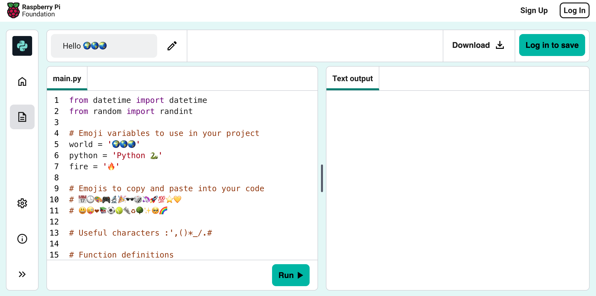
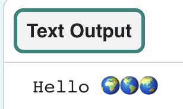
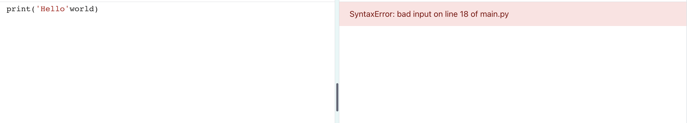

## Πες γεια

<div style="display: flex; flex-wrap: wrap">
<div style="flex-basis: 200px; flex-grow: 1; margin-right: 15px;">
Είναι παράδοση να γράφεις ένα πρόγραμμα για να εμφανίσεις τις λέξεις "Hello world (Γεια σου κόσμε)!" όταν μαθαίνεις μια νέα γλώσσα προγραμματισμού.
</div>
<div>

{:width="200px"}

</div>
</div>

--- task ---

Open the [Hello 🌍🌎🌏 starter project](https://staging-editor.raspberrypi.org/en/projects/hello-world-starter){:target="_blank"}. The code editor will open in another browser tab.



If you have a Raspberry Pi account, you can click on the **Save** button to save a copy to your **Projects**.

--- /task ---

--- collapse ---

---
line_highlights: 12
---

If you're working on a Raspberry Pi using Chromium, you may not see the emojis. You need to install a font that supports them.

Open a terminal and then type:

```bash
sudo apt install fonts-noto-color-emoji
```

Βρες τη γραμμή `# Τοποθέτησε κώδικα για εκτέλεση κάτω από εδώ`.

--- /collapse ---

### Print hello

<p style="border-left: solid; border-width:10px; border-color: #0faeb0; background-color: aliceblue; padding: 10px;">
Lines beginning with a `#` are <span style="color: #0faeb0">**comments**</span>. They explain what the code will do. Comments are ignored by Python.
</p>

The `import` lines at the start of the code tell Python that you are going to use code you didn't write.

language: python filename: main.py line_numbers: true line_number_start: 11

--- task ---

Find the `# Put code to run below here` line.

Click below that line. The flashing `|` is the cursor and shows where you will type.

--- /task ---

--- task ---

Type the code to `print()` Hello to the screen:

**Tip:** When you type an opening bracket `(` or opening apostrophe `'` the code editor will automatically add a closing bracket `)` or closing apostrophe`'`:

--- code ---
---
language: python filename: main.py line_numbers: true line_number_start: 17
line_highlights: 18
---

# Βάλε κώδικα για εκτέλεση εδώ
print('Hello')

--- /code ---

--- collapse ---
---
line_highlights: 12
---

On a UK or US keyboard, the left `(` and right `)` round brackets are on the <kbd>9</kbd> and <kbd>0</kbd> keys. To type a left round bracket, hold down the <kbd>Shift</kbd> key (next to <kbd>Z</kbd>) and then tap <kbd>9</kbd>. The single quote `'` is on the same row as the <kbd>L</kbd> key, just before the <kbd>Enter</kbd> key. The comma `,` is next to the <kbd>M</kbd>.

--- /collapse ---

--- /task ---

--- task ---

**Test:** Click on the **Run** button to run your code. In the code editor, the output will appear on the right:


**Debug:** If you get an error then check your code really carefully. In this example, the single quotes around `Hello` are missing so Python doesn't know it is supposed to be text.


--- /task ---

## title: Δεν βλέπω το emoji

In Python, a **variable** is used to store values such as text or numbers. Variables make it easier for humans to read code. You can use the same variable in lots of places in your code. Choosing a sensible name for a variable makes it easier for you to remember what it is for.

language: python filename: main.py line_numbers: true line_number_start: 11

--- task ---

In your code editor, scroll to the lines with the emojis stored into two different variables. Find the variable `world`, which stores the text '🌍🌍🌍'.

--- /task ---

--- task ---

You can `print()` more than one item at a time by including a comma `,` in between the items. `print()` will add a space between each item.

**Δοκιμή:** Εκτέλεσε τον κωδικά σου για να δεις το αποτέλεσμα:

--- code ---
---
Το emoji μπορεί να δείχνει διαφορετικό σε διαφορετικούς υπολογιστές, επομένως το δικό σου μπορεί να μην είναι ακριβώς το ίδιο.
line_highlights: 3
---

# Βάλε κώδικα για εκτέλεση εδώ
**Εντοπισμός σφαλμάτων:** Βεβαιώσου ότι έχεις προσθέσει κόμμα μεταξύ των στοιχείων στο `print()` και ότι έχεις γράψει σωστά το `world`.

--- /code ---

**Tip:** `'Hello'` is a text string because it has single quotes around it, whereas `world` is a variable so the value stored in it will be printed.

--- /task ---

--- task ---

Άλλαξε τη γραμμή `from emoji import *` σε:



language: python filename: main.py line_numbers: true line_number_start: 3

from noemoji import *

This example is missing the comma `,`. It's small but very important!



--- /task ---

--- task ---

Πρόσθεσε άλλη μια γραμμή στον κώδικά σου για να εκτυπώσεις με την `print()` περισσότερο κείμενο και emoji:

--- code ---
---
language: python filename: main.py line_numbers: true line_number_start: 12
line_highlights: 13
---

print('Γεια', world)    
print('Καλωσήρθες στην', python)

--- /code ---

**Συμβουλή:** Ο κώδικας που πρέπει να πληκτρολογήσεις επισημαίνεται με πιο ανοιχτό χρώμα. Ο κώδικας που δεν επισημαίνεται σε βοηθά να βρεις πού πρέπει να προσθέσεις τον νέο κώδικα.

--- /task ---

--- task ---

**Δοκιμή:** Κάνε κλικ στο **run**.


**Συμβουλή:** Είναι καλή ιδέα να εκτελείς τον κώδικά σου μετά από κάθε αλλαγή, ώστε να μπορείς να διορθώνεις αμέσως τα προβλήματα.

**Εντοπισμός σφαλμάτων:** Έλεγξε προσεκτικά για παρενθέσεις, εισαγωγικά, κόμματα και σωστή ορθογραφία. Με την Python χρειάζεται να είσαι πολύ ακριβής.

--- /task ---

Εάν έχεις λογαριασμό Trinket, μπορείς να κάνεις κλικ στο κουμπί **Remix** για να αποθηκεύσεις ένα αντίγραφο στη βιβλιοθήκη `My Trinkets`.

--- save ---
