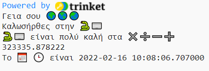
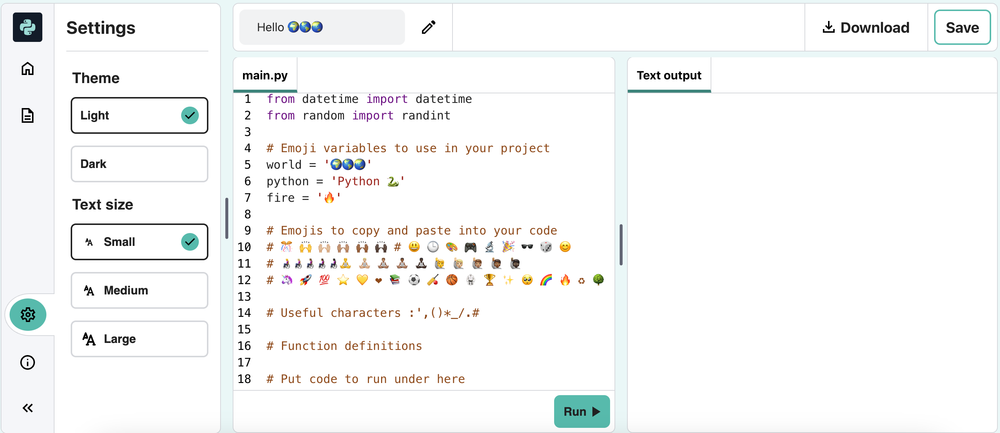

## Αθροίσματα και ημερομηνίες

Η Python είναι εξαιρετική στην επεξεργασία αριθμών και ημερομηνιών.

{:width="300px"}

Στην Python μπορείς να χρησιμοποιήσεις μαθηματικούς τελεστές για να κάνεις πράξεις:

| + | πρόσθεση |   
| - | αφαίρεση |   
| * | πολλαπλασιασμός |   
| / | διαίρεση |   
| ** | ύψωση σε δύναμη |

--- task ---

Πρόσθεσε ακόμη δύο γραμμές `print()` στον κώδικά σου, συμπεριλαμβανομένης μιας πράξης που θα υπολογίσει η Python:

--- code ---
---
language: python filename: main.py line_numbers: true line_number_start: 12
line_highlights: 14-15
---

print('Γεια σου', world)   
print('Καλώς ήρθες στην ', python)   
print(python, 'είναι πολύ καλή στα', sums)   
print(230 * 5782 ** 2 / 23781)

--- /code ---

--- /task ---

--- task ---

**Δοκιμή:** Εκτέλεσε τον κώδικά σου. Η Python υπολόγισε σωστά την πράξη; Αστειευόμαστε! Η Python κάνει τις δύσκολες πράξεις για εσένα, ώστε να μην χρειάζεται να τις πραγματοποιείς.

--- /task ---

Η Ιαπωνέζα επιστήμονας υπολογιστών **Emma Haruka Iwao** χρησιμοποίησε έναν υπολογιστή για να υπολογίσει την τιμή του Pi (*π*) με 31 τρισεκατομμύρια ψηφία. Αυτή η απάντηση είναι τόσο μεγάλη που θα χρειαζόταν πάνω από 300.000 χρόνια μόνο για να την πεις! 

--- task ---

Δοκίμασε να αλλάξεις την πράξη που πραγματοποιεί η Python σε μία περίπλοκη!

Μπορείς επίσης να χρησιμοποιήσεις παρενθέσεις αν θέλεις για να ελέγξεις τη σειρά με την οποία η Python πραγματοποιεί την πράξη: `print( (2 + 4) * (5 + 3) )`.

--- /task ---

--- task ---

**Δοκιμή:** Εκτέλεσε τον κώδικά σου και άσε την Python να πραγματοποιήσει την πράξη σου.

**Εντοπισμός σφαλμάτων:** Βεβαιώσου ότι η παράσταση της πράξης σου έχει μια αριστερή και δεξιά παρένθεση γύρω της `( 2 * 45 )`. Εάν χρησιμοποιείς επιπλέον παρενθέσεις για τον έλεγχο της σειράς των πράξεων, φρόντισε σε κάθε αριστερή παρένθεση να ταιριάζει μια δεξιά.

--- /task ---

--- task ---

Εάν έχεις ζητήσει από την Python να υπολογίσει ένα πολύ μεγάλο νούμερο, μπορεί να βρεις ότι η απάντηση καταλαμβάνει πολλές γραμμές στην περιοχή εξόδου.

**Συμβουλή:** Κάνε κλικ στο **μενού χάμπουργκερ** (το εικονίδιο με τις τρεις γραμμές) στο επάνω αριστερό μέρος του προγράμματος επεξεργασίας Trinket. Στη συνέχεια, κάνε κλικ στο κουμπί **Πλήρης οθόνη** για να προβάλεις το έργο σου σε λειτουργία πλήρους οθόνης.

Για έξοδο από τη λειτουργία πλήρους οθόνης, κάνε ξανά κλικ στο κουμπί **Πλήρης οθόνη** ή πάτησε <kbd>Esc</kbd> στο πληκτρολόγιό σου.

--- /task ---

Η γραμμή `from datetime import *` στην κορυφή της καρτέλας **main.py** περιλαμβάνει μια βιβλιοθήκη με χρήσιμες λειτουργίες για τη λήψη της τρέχουσας ημερομηνίας και ώρας.

Ένα από τα σπουδαία πράγματα σχετικά με την Python είναι όλες οι **βιβλιοθήκες** κώδικα που είναι διαθέσιμες για χρήση. Μια βιβλιοθήκη Python σου επιτρέπει να χρησιμοποιείς εύκολα κώδικα που έχουν γράψει άλλοι άνθρωποι. Υπάρχουν βιβλιοθήκες για να σχεδιάζεις γραφήματα, να δημιουργείς τέχνη, να κάνεις υπολογισμούς και πολλά άλλα.

--- task ---

Πρόσθεσε μια ακόμα γραμμή στον κώδικά σου για να `εμφανίσεις` λίγο παραπάνω κείμενο και τις μεταβλητές emoji `calendar` και `clock`.

Λάβε την τρέχουσα ημερομηνία και ώρα χρησιμοποιώντας τη συνάρτηση `now()` από τη βιβλιοθήκη `datetime`:

--- code ---
---
language: python filename: main.py line_numbers: true line_number_start: 14
line_highlights: 16-17
---

print(python, 'είναι πολύ καλή στα', sums)    
print(230 * 5782 ** 2 / 23781) #Τυπώνει το αποτέλεσμα της πράξης     
print('Το', calendar, clock, 'είναι', datetime.now()) #Εμφανίζει με emoji

--- /code ---

**Συμβουλή:** Δεν χρειάζεται να πληκτρολογήσεις τα σχόλια, είναι απλώς εκεί για να σε βοηθήσουν να κατανοήσεις τον κώδικα. Απλώς πληκτρολόγησε το μέρος της εντολής πριν από το `#`.

--- /task ---

--- task ---

**Δοκιμή:** Εκτέλεσε τον κώδικά σου μερικές φορές για να δεις την ενημέρωση της ημερομηνίας και της ώρας.

**Εντοπισμός σφαλμάτων:** Έλεγξε ότι έχεις μία τελεία `.` μεταξύ `datetime` και `now`. Έλεγξε προσεκτικά όλα τα σημεία στίξης.

--- /task ---

--- save ---
