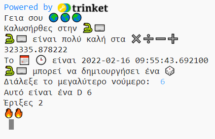

## Ρίξε ένα ζάρι

Create a function for rolling a dice using random numbers. 
  
In Python:
  - **functions**, defined with `def`, are like 'my blocks' in Scratch,
  - `randint` is like 'random' in Scratch, and
  - `input` is like 'ask' in Scratch.

{:width="300px"} 

Στην Python **καλείς** μία **συνάρτηση()** για να εκτελέσεις μια ενέργεια. Έχεις ήδη χρησιμοποιήσει τη συνάρτηση `print()` για να εμφανίσεις κείμενο.

Μπορείς να **ορίσεις** μια νέα **συνάρτηση** για να ομαδοποιήσεις τον κώδικα ώστε να μπορείς να τον ονομάσεις και να τον επαναχρησιμοποιήσεις.

### Define your function

--- task ---

Οι συναρτήσεις πρέπει να οριστούν για να μπορέσεις να τις καλέσεις. Look for the comment in the **main.py** file that says `# Function definitions`.

Όρισε μια νέα συνάρτηση που ονομάζεται `roll_dice()` που χρησιμοποιεί τη συνάρτηση `randint()`, από τη βιβλιοθήκη `random`, για να δημιουργήσει έναν τυχαίο «ακέραιο» αριθμό από το 1 έως το 6 και να τον εμφανίσει στην οθόνη.

--- code ---
---
language: python filename: main.py line_numbers: true line_number_start: 7
line_highlights: 9-12
---

# Τοποθέτησε ορισμούς συναρτήσεων κάτω από εδώ
def roll_dice(): #Μην ξεχνάς την άνω και κάτω τελεία στο τέλος αυτής της γραμμής   
print(python, 'μπορεί να δημιουργήσει ένα', dice)   
print('Έριξες ', randint(1, 6))

--- /code ---

The line under `def roll_dice():` is **indented**. Για να το κάνεις αυτό, χρησιμοποίσε τον χαρακτήρα <kbd>Tab</kbd> στο πληκτρολόγιό σου (συνήθως πάνω από το <kbd>CAPSLOCK</kbd> στο πληκτρολόγιο). Η τοποθέτηση του κώδικα σε εσοχή ενημερώνει την Python ότι οι γραμμές με την εσοχή αποτελούν μέρος της συνάρτησης.

**Tip:** The underscore `_` is used between words in variable and function names in Python to make them easier to read. Δεν μπορείς να χρησιμοποιήσεις το κενό χαρακτήρα γι' αυτές τις περιπτώσεις.

--- collapse ---
---
title: Χρήση ειδικών χαρακτήρων σε πληκτρολόγιο Η.Β. ή ΗΠΑ
---

Σε ένα πληκτρολόγιο Η. Β. ή ΗΠΑ, η άνω και κάτω τελεία `:` βρίσκεται στο ίδιο πλήκτρο με το ερωτηματικό, δίπλα στο πλήκτρο <kbd>L</kbd>: κράτησε πατημένο το <kbd>Shift</kbd> και πάτησε <kbd>;</kbd> για να εμφανίσεις ένα `:`. Η κάτω παύλα `_` βρίσκεται στο ίδιο πλήκτρο με την `-`, δίπλα στο <kbd>0</kbd>, κράτησε πατημένο το <kbd>Shift</kbd> και πάτησε <kbd>-</kbd> για να εμφανίσεις `_`.

--- /collapse ---

--- /task ---

--- task ---

**Δοκιμή:** Εάν «τρέξεις» τον κώδικά σου τώρα, δεν θα ρίξει ζάρι. Αυτό οφείλεται στο γεγονός ότι έχεις ορίσει τη συνάρτησή `roll_dice()`, αλλά δεν την έχεις καλέσει ακόμα.

**Debug:**

--- collapse ---
---
line_highlights: 22
---

- Make sure you have an underscore `_` between roll and dice to make the function name.

- Make sure you have a colon `:` at the end of the line.

- Check that the line under `def roll_dice()` is indented. It's really common to get this wrong in Python, so make sure to check.

--- /collapse ---

--- /task ---

### Call your function

--- task ---

To use a function, you need to **call** it in the code. Go to the end of your code and add a new line to call the `roll_dice()` function:

--- code ---
---
language: python filename: main.py line_numbers: true line_number_start: 25
title: Τι θα συνέβαινε αν χρησιμοποιούσες `print(fire * randint(1, 6))`;
---

print('The date and time is', datetime.now())

**Δοκιμή:** Εκτέλεσε το έργο σου πολλές φορές για να βλέπεις την τυχαία ρίψη ζαριών κάθε φορά.

--- /code ---

--- /task ---

--- task ---

**Test:** Run your project several times to see the random dice roll each time.

--- /task ---

Uses of random numbers include cryptography, data science, and adding variety into games and computer art. Computers generate **random numbers** using an algorithm. For numbers that are really random, you need an unpredictable input from the real world.

### Use 🔥🔥🔥 for the number rolled

--- task ---

Your function can use the 🔥 emoji variable. The code `print(fire * 3)` outputs three fire emojis '🔥🔥🔥'. You need to output the correct number of emojis to match the random number rolled by the dice.

Change your code to save the value returned by `randint()` in a variable called `roll`. Use that variable to print out the number rolled with the matching number of 🔥 emojis.

--- code ---
---
Χμ, πώς μπορείς να βεβαιωθείς ότι χρησιμοποιείς τον ίδιο τυχαίο αριθμό;
line_highlights: 11 - 13
---

# Τοποθέτησε τους ορισμούς των συναρτήσεων κάτω από εδώ
Άλλαξε τον κωδικά σου για να αποθηκεύσεις την τιμή που επιστρέφεται από το `randint()` σε μια μεταβλητή που ονομάζεται `roll` και, στη συνέχεια, χρησιμοποίσε αυτήν τη μεταβλητή για να εμφανίσεις τον αριθμό που έφερε το ζάρι με το αντίστοιχο πλήθος 🔥 emoji.

--- /code ---

language: python filename: main.py line_numbers: true line_number_start: 7

--- /task ---

--- task ---

**Test:** Test your project a few times. Make sure you understand how the code works.

--- /task ---

### Choose the number of sides on the dice

Upgrade your dice so that the user can choose the maximum number.

Lots of games use many-sided dice. In the physical world, dice are made from regular geometric shapes. Common dice include D6, D12, and D20. On a computer, you can generate a random number to make a fair dice with any number of sides.

--- task ---

The `input()` function asks the user a question and then returns their answer.

**Add** code to ask the user for the biggest number on their dice and then save the result in a variable called `max` and `print` the number chosen into the output area:

Αναβάθμισε το ζάρι σου έτσι ώστε ο χρήστης να μπορεί να επιλέξει τον μέγιστο αριθμό.

When you get input from the user, Python treats it as text. But, `randint` needs an 'integer' (a positive whole number). The `int` function turns the user input into an integer.

--- code ---
---
Η συνάρτηση `input()` κάνει στον χρήστη μια ερώτηση και στη συνέχεια επιστρέφει την απάντησή του.
line_highlights: 11-12
---

# Τοποθέτησε ορισμούς συναρτήσεων κάτω από εδώ

Πρόσθεσε κώδικα για να ζητήσεις από τον χρήστη τον μεγαλύτερο αριθμό στο ζάρι του και, στη συνέχεια, αποθήκευσε το αποτέλεσμα σε μια μεταβλητή που ονομάζεται `max` και `εμφάνισε` τον αριθμό που έχει επιλεγεί στην περιοχή εξόδου:

--- /code ---

language: python filename: main.py line_numbers: true line_number_start: 7

--- /task ---

--- task ---

**Test:** Run your project. When the program reaches the `input` line, it will wait for you to enter a response before continuing. Type your response and then press <kbd>Enter</kbd>, this will allow the program to collect your response. Try it again with a different `input` number.

--- /task ---

--- save ---
