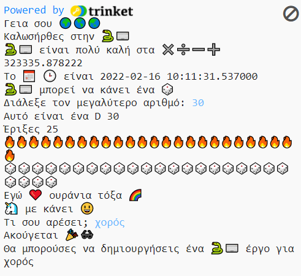

## Αναβάθμισε το έργο σου

Πρόσθεσε περισσότερα στο έργο σου. Υπάρχουν περισσότερα emoji για να διαλέξεις.
  

{:width="300px"}

Θα μπορούσες να:
+ Χρησιμοποιήσεις την εντολή `print` με διαφορετικό κείμενο και emoji
+ Χρησιμοποιήσεις την εντολή `input` για να λάβεις τιμές από τον χρήστη και να τις αποθηκεύσεις ως μεταβλητές και, στη συνέχεια, να κάνεις πράξεις με τις μεταβλητές
+ Δημιουργήσεις περισσότερες συναρτήσεις για να οργανώσεις τον κώδικά σου
+ Χρησιμοποιήσεις το `#` για να προσθέσεις σχόλια στον κώδικά σου

Κάνε κλικ στην καρτέλα **emoji.py** για να δεις τις μεταβλητές emoji που μπορείς να χρησιμοποιήσεις. Κάνε κλικ ξανά στην καρτέλα **main.py** για να τις προσθέσεις στον κώδικά σου.

Ακολουθεί ένα παράδειγμα συνάρτησης που ρωτά για χόμπι:

--- code ---
---
language: python
filename: main.py
---

#Βάλε κώδικα για εκτέλεση εδώ
def hobbies():   
  hobby = input('Τι σου αρέσει να κάνεις;')   
  print('Ακούγεται', fun)   
  print('Θα μπορούσες να κάνεις ένα', python, 'έργο για', hobby)

--- /code ---

**Συμβουλή:** Μην ξεχνάς ότι θα χρειαστεί να καλέσεις τη συνάρτησή σου καθώς και να την ορίσεις.

Μπορείς να χρησιμοποιήσεις την εντολή `input` για να κάνεις το έργο σου να περιμένει μέχρι ο χρήστης να πατήσει <kbd>Enter</kbd> σε οποιοδήποτε σημείο αυτού του έργου.

--- code ---
---
language: python
filename: main.py
---

roll_dice()

input() #Περίμενε μέχρι να πατήσει ο χρήστης Enter

hobbies()

--- /code ---

--- collapse ---
---
title: Ολοκληρωμένο έργο
---

Μπορείς να δεις [ολοκληρωμένο το έργο εδώ](https://trinket.io/embed/python/750a2ac96b){:target="_blank"}.

--- /collapse ---

--- save ---
