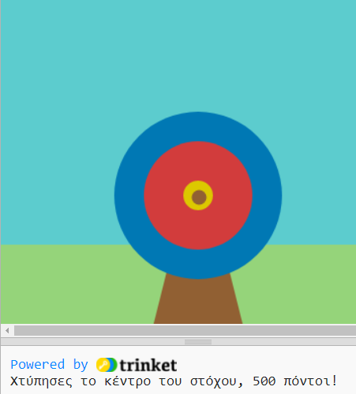

## Τι υπάρχει στη συνέχεια;

Εάν ακολουθείς το μονοπάτι [Εισαγωγή στην Python](https://projects.raspberrypi.org/el-GR/raspberrypi/python-intro), μπορείς να προχωρήσεις στο έργο [Εξάσκηση στόχου](https://projects.raspberrypi.org/el-GR/projects/target-practice). Σε αυτό το έργο, θα σχεδιάσεις έναν στόχο και στη συνέχεια θα δημιουργήσεις ένα παιχνίδι τοξοβολίας στο οποίο ρίχνεις βέλη και κερδίζεις πόντους.

--- print-only ---

--- /print-only ---

--- no-print ---

<iframe src="https://trinket.io/embed/python/f686c82d8a?outputOnly=true&start=result" width="600" height="500" frameborder="0" marginwidth="0" marginheight="0" allowfullscreen mark="crwd-mark">
</iframe>

--- /no-print ---

Αν θέλεις να διασκεδάσεις περισσότερο εξερευνώντας την Python, τότε μπορείς να δοκιμάσεις οποιοδήποτε από [αυτά τα έργα](https://projects.raspberrypi.org/el-GR/projects?software%5B%5D=python).

***
Το έργο αυτό μεταφράστηκε από τους εθελοντές:

Μάνος Ζεάκης
Σταυρούλα Μισθού

Χάρη στους εθελοντές, μπορούμε να δώσουμε σε ανθρώπους σε όλο τον κόσμο την ευκαιρία να μάθουν στη γλώσσα τους. Μπορείτε να μας βοηθήσετε να προσεγγίσουμε περισσότερους ανθρώπους μεταφράζοντας εθελοντικά - περισσότερες πληροφορίες στο [rpf.io/translate](https://rpf.io/translate).
