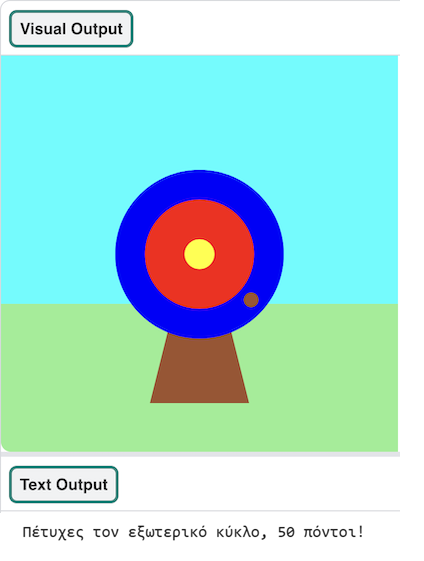

## Τι μπορείς να κάνεις τώρα;

Εάν ακολουθείς το μονοπάτι [Εισαγωγή στην Python](https://projects.raspberrypi.org/en/raspberrypi/python-intro), μπορείς να προχωρήσεις στο έργο [Εξάσκηση στόχου](https://projects.raspberrypi.org/en/projects/target-practice). Σε αυτό το έργο, θα σχεδιάσεις έναν στόχο και στη συνέχεια θα δημιουργήσεις ένα παιχνίδι τοξοβολίας στο οποίο ρίχνεις βέλη και κερδίζεις πόντους.

--- print-only ---

{:width="640px"}

--- /print-only ---

--- no-print ---

Κάνε κλικ στο κουμπί **Run** για να δεις ένα παράδειγμα αυτού του έργου.

<iframe src="https://editor.raspberrypi.org/en/embed/viewer/target-practice-solution" width="600" height="600" frameborder="0" marginwidth="0" marginheight="0" allowfullscreen>
</iframe>

--- /no-print ---

Ή, γιατί να μην δοκιμάσεις ένα άλλο έργο [Python](https://projects.raspberrypi.org/en/projects?software%5B%5D=python).

