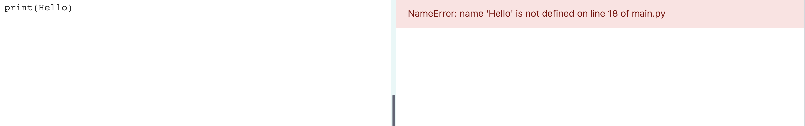

## Say hello

It's traditional to write a program to output 'Hello world!' when you learn a new programming language.

{:width="200px"}

--- task ---

Open the [Hello 🌍🌎🌏 starter project](https://trinket.io/library/trinkets/cb8194643f){:target="_blank"}. Trinket will open in another browser tab.

[[[python-offline]]]

--- /task ---

The line `#!/bin/python3` tells Trinket that you are using Python 3 (the latest version). The `import` lines tell Python that you are going to use code you didn't write.

One of the great things about Python is all the **libraries** of code that are available to use. A Python library allows you to easily use code that other people have written. There are libraries for drawing charts and graphs, making art, doing calculations and lots more.

In Python, `print` outputs text (words or numbers) to the screen.

Lines beginning with `#` are comments, they explain the code to humans and are ignored by Python.

--- task ---

Find the `# Put code to run below here` line.

Click below that line. The flashing `|` is the cursor and shows where you will type.

**Tip:** The code you need to type is highlighted in a lighter colour. Code that is not highlighted helps you find where you need to add the new code.

Type the code to `print` hello:

--- code ---
---
language: python
filename: main.py
line_numbers: true
line_number_start: 11
line_highlights: 12
---
# Put code to run under here
print('Hello')
--- /code ---

--- collapse ---

---
title: Typing special characters on a UK or US keyboard
---

On a UK or US keyboard, the left `(` and right `)` round brackets are on the '9' and '0' keys. To type a left round bracket, hold down the Shift key (next to 'Z') and then tap '9'.
The single quote `'` is on the same row as the 'L' key, just before the 'Enter' key.
The comma `,` is next to the 'M'.

--- /collapse ---

--- /task ---

--- task ---
**Test:** Click on the Run button to run your code. In Trinket, the output will appear on the right:

**Debug:** If you get an error then check your code really carefully. In this example, the single quotes around `Hello` are missing so Python doesn't know it is supposed to be text.

--- /task ---

In Python, a **variable** is used to store text or numbers. 

The `emoji.py` file contains variable definitions including: `world = '🌍🌎🌏'`.

`world` is a variable and it stores the text '🌍🌎🌏'. Emoji are special characters.

You can `print` more than one item at a time by including a comma ',' in between the items.

--- task ---
Change your code to also `print` the contents of the `world` variable:

--- code ---
---
language: python
filename: main.py
line_numbers: true
line_number_start: 11
line_highlights: 12
---
# Put code to run under here
print('Hello', world)
--- /code ---

--- /task ---

--- task ---
**Test:** Run your code to see the result:

Emoji can look different on different computers so your might not look quite the same.

**Debug:** Make sure that you have added a comma between the items in `print` and that you have spelled `world` correctly.

This example is missing the comma `,`. It's small but very important!

--- collapse ---

---
title: I don't see the emoji
---

Most computers allow you to use colour emoji. If you can't use emoji then you can use 'emoticons' instead, the way we did before emoji were invented!

Change the `from emoji import *` line to:

--- code ---
---
language: python
filename: main.py
line_numbers: true
line_number_start: 3
line_highlights: 3
---
from noemoji import *
--- /code ---

--- /collapse ---

--- /task ---

--- task ---
Add another line to your code to `print` more text and emoji:

--- code ---
---
language: python
filename: main.py
line_numbers: true
line_number_start: 11
line_highlights: 12
---
print('Hello', world)
print('Welcome to', python)
--- /code ---
--- /task ---

--- task ---
**Test:** Click run. 

**Tip:** It's a good idea to run your code after every change so you can fix problems quickly.

**Debug:** Check carefully for brackets, quotes, commas and correct spelling. Python needs you to be really accurate.

--- /task ---

You can come back to your project in future on the same computer using the starter project link.

--- save ---
