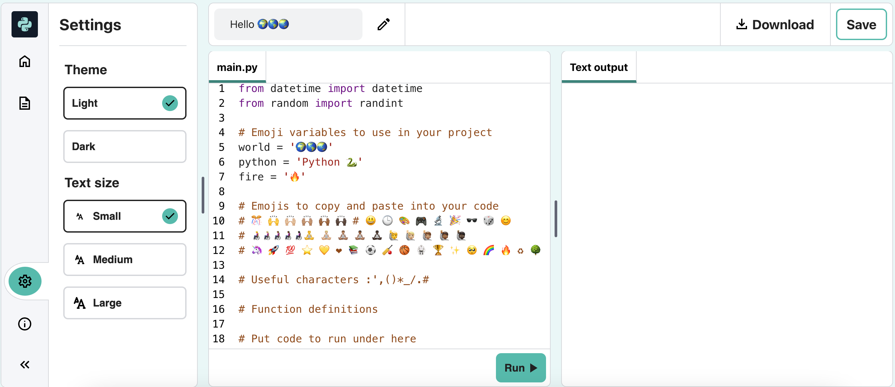

## Sums and dates

Python is great at working with numbers and dates.

{:width="300px"}

--- task ---

Add another two `print` lines to your code including a sum for Python to work out:

--- code ---
---
language: python
filename: main.py
line_numbers: true
line_number_start: 11
line_highlights: 13-14
---
print('Hello', world)
print('Welcome to', python)
print(python, 'is very good at', sums)
print(230 * 5782 ** 2 / 23781) 
--- /code ---

`*` means multiply. `** 2` means to the power 2, we usually say 'squared'. `/` means divide.

--- /task ---

--- task ---
**Test:** Run your code. Did Python calculate the sum correctly? Only joking! Python does the hard maths for you so you don't need to work it out.

--- /task ---

In Python you can use maths operators to do sums:

| + | add |
| - | subtract |
| * | multiply |
| / | divide |
| ** | to the power |

--- task ---

Try changing the sum that Python does to a complicated one!

You can also use brackets if you want to control the order that Python calculates the sum: `print( (2 + 4) * (5 + 3) )`

--- /task ---

--- task ---
**Test:** Run your code and get Python to calculate your sum.

**Debug:** Make sure your sum has a left and right round bracket around it `( 2 * 45)`. If you use extra brackets to control the order, make you have a right bracket to match every left bracket.

--- /task ---

--- task ---

If you have asked Python to calculate a really big sum, you might find the answer goes across multiple lines in the output area. 

**Tip:** Click on the **hamburger menu** (the icon with three lines) in the top-left of your Trinket editor. Then click on the `Fullscreen` button to view your project in fullscreen mode. 

To exit fullscreen mode, click on the `Fullscreen` button again or press <kbd>Esc</kbd> on your keyboard.

--- /task ---

Japanese computer scientist **Emma Haruka Iwao** used a computer to calculate the value of Pi(π) to 31 trillion digits. That answer is so big that it would take over 300,000 years just to say it! 

--- task ---

Add another two lines to your code. Use a variable called `now` to store the current date and time. Then `print` the answer with some text and emoji:

--- code ---
---
language: python
filename: main.py
line_numbers: true
line_number_start: 13
line_highlights: 15-16
---
print(python, 'is very good at', sums)
print(230 * 5782 ** 2 / 23781) # print the result of the sum
now = datetime.now() # get the current date and time
print('The', calendar, clock, 'is', now) # print with emoji 
--- /code ---

--- /task ---

--- task ---

**Test:** Run your code a couple of times to see the date and time update.

**Debug:** Check that you have a fullstop `.` between `datetime` and `now`. Check all the punctuation carefully.

--- /task ---

--- save ---