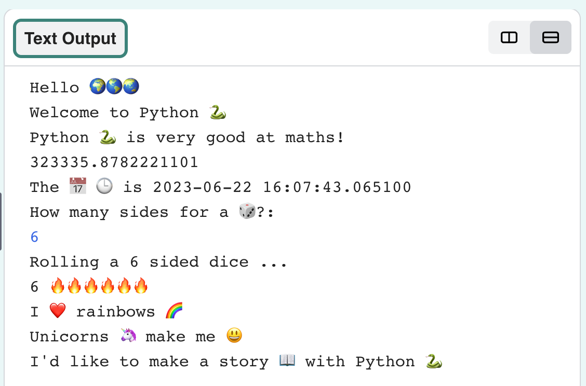

## Roll a dice

Create a function to add a randomly generated dice to your project. 

{:width="300px"}

In Python, **functions** are used to organise a block of code and give it a name. You have already used the `print` function to output text.

You can also define your own functions and then call them in your code.

You are going to define a function called `roll_dice` which will generate a random number.

--- task ---
Look for the comment near the top of `main.py` which says `# Put function definitions under here` and add a function definition underneath it:

--- code ---
---
language: python
filename: main.py
line_numbers: true
line_number_start: 7
line_highlights: 9-12
---
### Put function definitions under here

def roll_dice(): # Don't forget the colon at the end of this line.
  print(python, 'can make a', dice)
  roll = randint(1, 6) # Choose a random number between 1 and 6
  print('You rolled a', roll)
--- /code ---

The lines under `def roll_dice():` are **indented**. To do this, tap the 'Tab' character on your keyboard (usually above CAPSLOCK on the keyboard.) Indenting code tells Python that the indented lines are part of the function.

**Tip:** The underscore `_` in Python is used to between words in variable and function names in Python to make them easier to read. You can't use a space. 

--- collapse ---

---
title: Typing special characters on a UK or US keyboard
---

On a UK or US keyboard, the colon `:` is on the same key as the semicolon, next to the <kbd>L</kbd> key, hold <kbd>Shift</kbd> and tap <kbd>;<kbd> to type a `:`.
The underscore `_` is on the same key as the '-', next to the '0', hold <kbd>Shift</kbd> and tap '-' to type an `_`.

--- /collapse ---

--- /task ---

--- task ---

**Test:** If you ‘Run’ your code now it won't roll a dice. That’s because you have defined the `roll_dice` function, but not called it yet.

--- /task ---

The `from random import randint` line at the top of `main.py` allows you to use the `randint` function to generate random numbers. 

--- task ---

To use a function you need to call it in the code. Go to the end of your code and add a new line to call the `roll_dice` function:

--- code ---
---
language: python
filename: main.py
line_numbers: true
line_number_start: 15
line_highlights: 18
---
now = datetime.now() 
print('The', calendar, clock, 'is', now)

roll_dice() # Call the roll dice function
--- /code ---

--- /task ---

--- task ---

**Test:** Run your project several times to see the random dice roll each time. 

**Debug:** Make sure you have an underscore `_` between roll and dice to make the function name. Make sure you have a colon `:` at the end of the line.

**Debug:** Check that the lines under  `def roll_dice()` are indented. It's really common to get this wrong in Python so make sure to check.

--- /task ---

--- task ---

The `fire` variable stores a 🔥 emoji. 

Add a line of code at the end of your `roll_dice` function to `print` one 🔥 emoji for each number rolled: 
 
--- code ---
---
language: python
filename: main.py
line_numbers: true
line_number_start: 7
line_highlights: 13
---
### Put function definitions under here

def roll_dice():
  print(python, 'can make a', dice)
  roll = randint(1, 6) # generate a random number between 1 and 6
  print('You rolled a', roll) # print the value of the roll variable
  print(fire * roll) # repeat the fire text roll times
--- /code ---

You can use `star` or `heart` instead of `fire` if you prefer.

`*` means multiply so `fire * roll` multiples the text in the `fire` variable ('🔥') by the number containing in the `roll` variable.

--- /task ---

--- task ---

**Test:** Test your project a few times. Make sure you understand how the code works. 

--- /task ---

Upgrade your dice so that the user can choose the maximum number. 

Lots of games use many-sided dice. In the physical world, dice are made from regular geometric shapes. Common dice include D6, D12 and D20. On a computer, you can generate a random number to make a fair dice with any number of sides.

--- task ---

Create a variable called `max` to store a number `input` by the user. Then `print` the number chosen into the output area: 

--- code ---
---
language: python
filename: main.py
line_numbers: true
line_number_start: 7
line_highlights: 11-12
---
### Put function definitions under here

def roll_dice():
  print(python, 'can make a', dice)
  max = input('How many sides?:') # wait for input from the user
  print('That\'s a D', max) # use the number the user entered
  roll = randint(1, 6) 
  print('You rolled a', roll)
  print(fire * roll)
--- /code ---

To print an apostrophe `'` in a word like `That's`, put a backslash `\` before it so Python knows it's part of the text.

--- task ---
Now you need to use `max` as the maximum value for `randint` to use to generate a random number. 

When you get input from the user, Python treats it as text. But, `randint` needs an 'integer' (a positive whole number). The `int` function turns the user input into an integer.

--- code ---
---
language: python
filename: main.py
line_numbers: true
line_number_start: 7
line_highlights: 13
---
### Put function definitions under here

def roll_dice():
  print(python, 'can make a', dice)
  max = input('How many sides?:') # wait for input from the user
  print('That\'s a D', max) # use the number the user entered
  roll = randint(1, int(max)) # randint needs max to be an 'integer'
  print('You rolled a', roll)
  print(fire * roll)
--- /code ---

--- /task ---

--- /task ---

--- task ---

**Test:** Run your project. When the programe reaches the `input` line it will wait for you to enter a response before continuing. Try it again with a different a`input` number. 

--- /task ---

--- save ---
