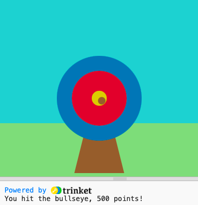

## What next?

If you are following the [Introduction to Python](https://projects.raspberrypi.org/en/raspberrypi/python-intro) pathway, you can move on to the [Target practice](https://projects.raspberrypi.org/en/projects/target-practice) project. In this project, you will draw a target then make an archery game that shoots arrows to score points. Click the **Run** button to view an example of this project.

--- print-only ---

--- /print-only ---

--- no-print ---

<iframe src="https://editor.raspberrypi.org/en/embed/viewer/target-practice-solution" width="490" height="700" frameborder="0" marginwidth="0" marginheight="0" allowfullscreen>
</iframe>

--- /no-print ---

If you want to have more fun exploring Python, then you could try out any of [these projects](https://projects.raspberrypi.org/en/projects?software%5B%5D=python).
