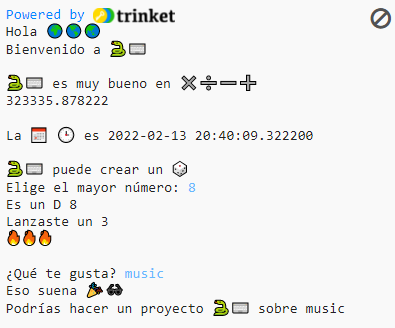

## Introducción

Descubre lo que el lenguaje de programación Python puede hacer escribiendo un proyecto interactivo que usa emojis.

Los **Emojis** son pequeñas imágenes coloridas que se usan para añadir un significado extra a los mensajes. Emoji significa 'palabra imagen' en japonés.

Vas a:
+ `print()` texto, incluyendo emojis, y recibir `input()` del usuario
+ Almacenar texto y números en **variables**
+ Usar **funciones** para organizar tu código

--- no-print ---

### Pruébalo

--- task ---

  
Lee la salida y presiona <kbd>Enter</kbd> para continuar. 
Escribe tus respuestas. ¿Puedes ver cómo se usan tus respuestas?

  <iframe src="https://trinket.io/embed/python/a54e164ac2?outputOnly=true&start=result" width="600" height="500" frameborder="0" marginwidth="0" marginheight="0" allowfullscreen>
  </iframe>
  

--- /task ---

--- /no-print ---

--- print-only ---

--- /print-only ---

