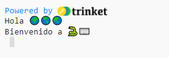
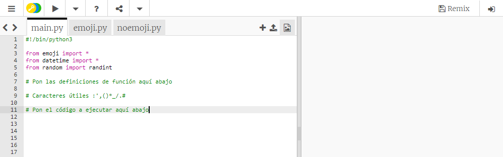
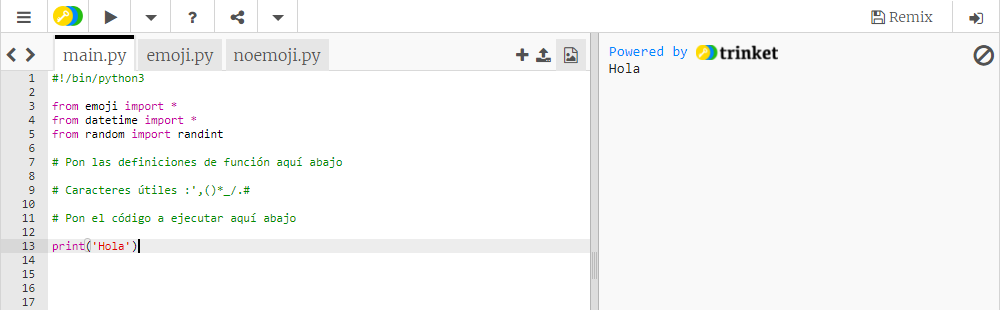
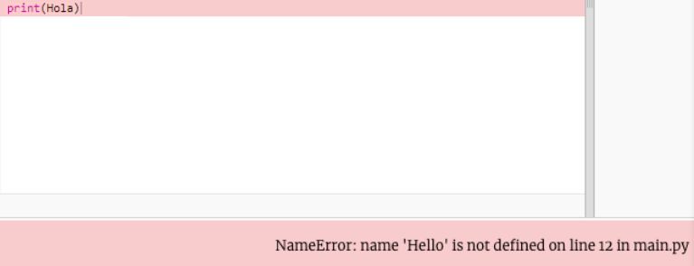
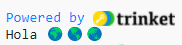
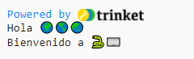

## Di hola

Es tradicional escribir un programa para generar '¡Hola mundo!' cuando aprendes un nuevo lenguaje de programación.

{:width="200px"}

--- task ---

Abre el [proyecto de iniciación Hola🌍🌎🌏](https://trinket.io/python/975f35023b){:target="_blank"}. Trinket se abrirá en otra pestaña del navegador.

--- /task ---

La línea `#!/bin/python3` le dice a Trinket que estás usando Python 3 (la última versión). Las líneas `import` le dicen a Python que vas a usar un código que no escribiste.

En Python, `print()` genera texto (palabras o números) en la pantalla.

Las líneas que comienzan con `#` son comentarios que explican el código a los humanos y que Python ignora.

--- task ---

Encuentra la línea `# Pon el código a ejecutar debajo de aquí `.

Haz clic debajo de esa línea. El `|` parpadeante es el puntero del ratón y muestra dónde tipearás.

Escribe el código para `print()` hola:

--- code ---
---
language: python filename: main.py line_numbers: true line_number_start: 11
line_highlights: 12
---

# Pon el código a ejecutar aquí abajo
print('Hola')

--- /code ---

--- collapse ---
---
title: Escribir caracteres especiales en un teclado del Reino Unido o los Estados Unidos
---

En un teclado del Reino Unido o los Estados Unidos, los paréntesis de apertura `(` y de cierre `)` se encuentran en las teclas <kbd>9</kbd> y <kbd>0</kbd>. Para escribir el paréntesis de apertura, mantén presionado la tecla <kbd>Shift</kbd> (al lado de la <kbd>Z</kbd>) y luego presiona <kbd>9</kbd>. La comilla simple `'` se encuentra en la misma fila que la tecla <kbd>L</kbd>, justo antes de la tecla <kbd>Enter</kbd>. La coma `,` está al costado de la <kbd>M</kbd>.

--- /collapse ---

--- /task ---

--- task ---

**Prueba:** Haz clic en el botón **Run** para ejecutar tu código. En Trinket, la salida aparecerá a la derecha:

**Debug:** Si obtienes un error, verifica tu código cuidadosamente. En este ejemplo, faltan las comillas simples alrededor de `Hola`, así que Python no sabe que es un texto.

--- /task ---

En Python, se usan las **variables** para almacenar texto o números. Las variables les facilita la lectura de códigos a los humanos. Puedes usar la misma variable en varias partes de tu código.

Hemos incluido algunas variables que almacenan caracteres de emoji.

--- task ---

En tu Trinket, haz clic en la pestaña **emoji.py**. Encuentra la variable `world`, que almacena el texto '🌍🌍🌍'.

--- /task ---

--- task ---

Puedes `print()` más de un objeto a la vez al incluir una coma `,` entre los objetos. `print()` añadirá un espacio entre cada objeto.

Haz clic en la pestaña **main.py** para regresar a tu código `print()`.

Cambia tu código para `print()` también el contenido de la variable `world`:

--- code ---
---
language: python filename: main.py line_numbers: true line_number_start: 11
line_highlights: 12
---

# Pon el código a ejecutar aquí abajo
print('Hola', world)

--- /code ---

**Tip:** `'Hola'` es una cadena de texto porque tiene comillas simples alrededor, mientras que `world` es una variable, así que se imprimirá el valor que tiene almacenado.

--- /task ---

--- task ---

**Prueba:** Ejecuta tu código para ver el resultado:

Los emojis pueden verse distintos en diferentes computadoras, así que puede que el tuyo no se vea exactamente igual.

**Debug:** Asegúrate de haber añadido una coma entre los objetos en `print()` y que escribiste `world` correctamente.

A este ejemplo le falta la coma `,`. ¡Es pequeño, pero muy importante!

--- collapse ---
---
title: No veo el emoji
---

La mayoría de computadoras te permiten usar emojis coloridos. Sin embargo, si no puedes usar emojis, puedes usar 'emoticones' en su lugar, ¡como lo hacíamos antes de que los emojis fueran inventados!

Cambia la línea `from emoji import *` a:

--- code ---
---
language: python filename: main.py line_numbers: true line_number_start: 3
line_highlights: 3
---

from noemoji import *

--- /code ---

--- /collapse ---

--- /task ---

--- task ---

Añade otra línea a tu código para `print()` más texto y emojis:

--- code ---
---
language: python filename: main.py line_numbers: true line_number_start: 12
line_highlights: 13
---

print('Hola', world)    
print('Bienvenido a', python)

--- /code ---

**Tip:** El código que necesitas tipear está resaltado de un color más claro. El código que no está resaltado te ayuda a encontrar en dónde necesitas añadir el nuevo código.

--- /task ---

--- task ---

**Prueba:** Haz clic en **run**.

**Tip:** Es buena idea que ejecutes tu código luego de cada cambio para que puedas arreglar los problemas rápidamente.

**Debug:** Verifica cuidadosamente los paréntesis, las comillas, las comas y la escritura correcta. Python necesita que seas realmente preciso.

--- /task ---

Si tienes una cuenta en Trinket, puedes hacer clic en el botón **Remix** para guardar una copia en tu bibliotecla `My Trinkets`.

Si no tienes una cuenta en Trinket, igual puedes regresar a tu proyecto en el futuro en la misma computadora usando el enlace del proyecto de iniciación.

--- save ---
