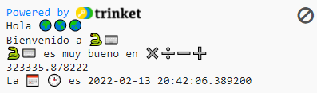
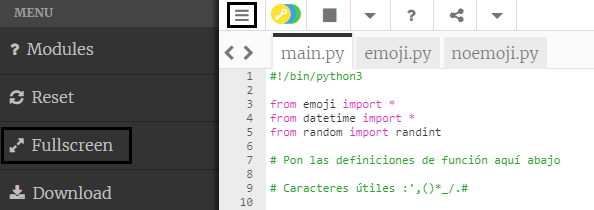

## Cálculos y fechas

Python es excelente para trabajar con números y fechas.

{:width="300px"}

En Python, puedes usar operadores matemáticos para hacer cálculos:

| + | suma |   
| - | resta |   
| * | multiplicación |   
| / | división |   
| ** | potencia |

--- task ---

Añade otras dos líneas de `print()` a tu código, incluyendo un cálculo para que Python lo resuelva:

--- code ---
---
language: python 
filename: main.py 
line_numbers: true 
line_number_start: 12
line_highlights: 14-15
---

print('Hola', world)   
print('Bienvenido a', python)   
print(python, 'es muy bueno en', sums)   
print(230 * 5782 ** 2 / 23781)

--- /code ---

--- /task ---

--- task ---

**Test:** Ejecuta tu código. ¿Python lo calculó correctamente? ¡Solo bromeo! Python se encarga de los cálculos difíciles, así que no necesitas resolverlos.

--- /task ---

La informática japonesa **Emma Haruka Iwao** usó una computadora para calcular el valor de Pi (*π*) a 31 billón de dígitos. ¡La respuesta es tan larga que tomaría por encima de 300,000 años decirlo! 

--- task ---

¡Intenta cambiar el cálculo que hace Python a uno que sea complicado!

También puedes usar paréntesis si quieres controlar el orden en el que Python calcula la ecuación: `print( (2 + 4) * (5 + 3) )`.

--- /task ---

--- task ---

**Test:** Ejecuta tu código y deja que Python calcule tu ecuación.

**Debug:** Asegúrate de que tu ecuación tenga los paréntesis de apertura y de cierre a los costados `( 2* 45 )`. Si usas paréntesis extra para controlar el orden, asegúrate de tener un paréntesis de cierre por cada paréntesis de apertura.

--- /task ---

--- task ---

Si le has pedido a Python que calcule una suma realmente grande, verás que la respuesta se mostrará en varias líneas en el área de salida.

**Tip:** Haz clic en **hamburger menu** (el ícono con tres líneas) al lado superior izquierdo del editor Trinket. Luego haz clic en el botón **Fullscreen** para ver tu proyecto en modo de pantalla completa.

Para salir de la pantalla completa, vuelve a hacer clic en el botón **Fullscreen** o presiona <kbd>Esc</kbd> en tu teclado.

--- /task ---

La línea `from datetime import *` en la parte superior de la pestaña **main.py** incluye una bibliotecla que contiene funciones útiles para obtener la fecha y hora actual.

Una de las ventajas de Python es la disponibilidad de **bibliotecas** de código que hay para usar. Una biblioteca de Python te permite usar fácilmente códigos que otras personas han escrito. Hay bibliotecas para dibujar tablas y gráficos, hacer arte, hacer cálculos y mucho más.

--- task ---

Añade otra línea a tu código para `print` más texto y las variables de emoji `calendar` y `clock`.

Obten la fecha y hora actual usando la función `now()` de la biblioteca `datetime`:

--- code ---
---
language: python 
filename: main.py 
line_numbers: true 
line_number_start: 14
line_highlights: 16-17
---

print(python, 'es muy bueno en', sums)    
print(230 * 5782 ** 2 / 23781) #Imprimir el resultado de la ecuación     
print('La', calendar, clock, 'es', datetime.now()) #Imprimir con emoji

--- /code ---

**Tip:** No necesitas tipear los comentarios, solo están ahí para ayudarte a entender el código. Solo tipea la parte antes de `#`.

--- /task ---

--- task ---

**Test:** Ejecuta tu código un par de veces para ver la fecha y hora actualizadas.

**Debug:** Verifica que haya un punto `.` entre `datetime` y `now`. Verifica cuidadosamente toda la puntuación.

--- /task ---

--- save ---
