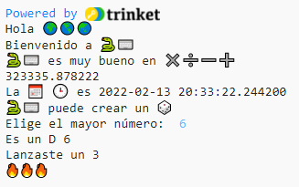

## Lanza un dado

Python puede generar números aleatorios para crear un dado digital.

{:width="300px"}

En Python, puedes **llamar** a una **función()** para realizar una acción. Ya usaste la función `print()` para generar texto.

Puedes **definir** una nueva **función** para agrupar un código con el fin de nombrarlo y volver a usarlo.

--- task ---

Necesitas definir las funciones antes de llamarlas. Busca el comentario cerca de la parte superior de la pestaña **main.py** que dice `#Pon la definición de función aquí abajo`.

Define una nueva función que se llame `roll_dice()` que use la función `randint()`, de la biblioteca `random`, para generar un 'entero' (número entero) aleatorio del 1 al 6 y generarlo en la pantalla.

--- code ---
---
language: python filename: main.py line_numbers: true line_number_start: 7
line_highlights: 9-12
---

# Pon las definiciones de función aquí abajo

def roll_dice(): #No olvides los dos puntos al final de esta línea   
print(python, 'puede crear un', dice)   
print('Lanzaste un', randint(1, 6))

--- /code ---

Las líneas debajo de `def roll_dice():` están **indentadas**. Para hacer esto, usa el caracter <kbd>Tab</kbd> de tu teclado (generalmente arriba de <kbd>CAPSLOCK</kbd> en el teclado). El código de identación le dice a Python que las líneas indentadas son parte de la función.

**Tip:** En Python, se usa el guion bajo `_` entre las palabras de los nombres de las variables y funciones para facilitar la lectura. No puedes usar un espacio.

--- collapse ---
---
title: Tipear caracteres especiales en un teclado del Reino Unido o de los Estados Unidos
---

En un teclado del Reino Unido o de los Estados Unidos, los dos puntos `:` están en la misma tecla que el punto y coma, al lado de la tecla <kbd>L</kbd>: mantén presionado <kbd>Shift</kbd> y presiona <kbd>;</kbd> para tipear `:`. El guion bajo `_` está en el mismo teclado que el `-`, al lado del <kbd>0</kbd>, mantén presionado <kbd>Shift</kbd> y presiona <kbd>-</kbd> para tipear `_`.

--- /collapse ---

--- /task ---

--- task ---

**Prueba:** Si tú 'Run' tu código ahora, no lanzará un dado. Esto es porque definiste la función `roll_dice()`, pero aún no la has llamado.

--- /task ---

--- task ---

Para usar una función, necesitas llamarla en el código. Ve al final de tu código y añade una nueva línea para llamar a la función `roll_dice()`:

--- code ---
---
language: python filename: main.py line_numbers: true line_number_start: 20
line_highlights: 22
---

print('La', calendar, clock, 'es', datetime.now())

roll_dice() # Llama a la función roll_dice

--- /code ---

--- /task ---

--- task ---

**Prueba:** Ejecuta tu proyecto varias veces para ver lanzar un dado aleatorio.

**Debug:** Asegúrate de tener un guion bajo `_` entre roll y dice para crear el nombre de la función. Asegúrate de tener dos puntos `:` al final de la línea.

**Debug:** Verifica que las líneas abajo de `def roll_dice()` estén indentadas. Es bastante común equivocarse en esto en Python, así que asegúrate de verificar.

--- /task ---

Los usos de los números aleatorios incluyen la criptografía, la ciencia de datos y la adición de diversidad en los juegos y el arte computacional. Las computadoras generan **números aleatorios** usando un algoritmo. Para los números realmente aleatorios, necesitas una entrada impredecible del mundo real.

--- task ---

La variable `fire` almacena un emoji 🔥. El código `print(fire * 3)` genera tres emojis de fuego '🔥🔥🔥'. Necesitas generar el número correcto de emojis para que encaje con el número obtenido.

--- collapse ---
---
title: 쯈ué pasaría si usaras `print(fire * randint(1, 6))`?
---

Obtendrías un nuevo número aleatorio que normalmente es distinto al primer número aleatorio.

--- /collapse ---

Mm... 쮺칩mo podrías asegurarte de usar el mismo número aleatorio?

Cambia tu código para guardar el valor devuelto por `randint()` en una variable llamada `roll` y luego usa esa variable para imprimir el número obtenido con el número que corresponde al emoji 🔥.

--- code ---
---
language: python filename: main.py line_numbers: true line_number_start: 7
line_highlights: 11 - 13
---

# Pon las definiciones de función aquí abajo

def roll_dice():    
print(python, 'puede crear un', dice)    
roll = randint(1, 6) #Generar un número aleatorio entre 1 y 6    
print('Lanzaste un', roll) #Imprimir el valor de la variable del tiro      
print(fire * roll) #Repite el emoji de fuego para que corresponda al resultado del dado lanzado

--- /code ---

Si prefieres, puedes usar `star` o `heart` en lugar de `fire`.

El símbolo `*` significa multiplicar, así que `fire * roll` multiplica el texto en la variable `fire` ('🔥') por el número que contiene la variable `roll`.

--- /task ---

--- task ---

**Prueba:** Prueba tu proyecto un par de veces. Asegúrate de entender cómo funciona el código.

**Tip:** Las variables son útiles cuando necesitas usar el mismo valor varias veces en tu código. Darle un nombre adecuado a las variables también hace que tu código sea más fácil de entender.

--- /task ---

Actualiza tu dado para que el usuario pueda elegir el número máximo.

Muchos juegos usan dados de muchas caras. En el mundo físico, los dados se hacen de formas geométricas regulares. Un dado común incluye D6, D12 y D20. En una computadora, puedes generar un número aleatorio para crear un dado equitativo con cualquier cantidad de caras.

--- task ---

La función `input()` le hace una pregunta al usuario y luego devuelve su respuesta.

Añade un código para pedirle al usuario el mayor número de su dado y guardar el resultado en una variable llamada `max` y `print` el número elegido en el área de salida:

--- code ---
---
language: python filename: main.py line_numbers: true line_number_start: 7
line_highlights: 11-12
---

# Pon las definiciones de función aquí abajo

def roll_dice():   
print(python, 'puede crear un', dice)   
max = input('쮺uántas caras?:') #Esperar la entrada del usuario    
print('Es un D', max) #Usar el número introducido por el usuario    
roll = randint(1, 6)    
print('Lanzaste un', roll)    
print(fire * roll)

--- /code ---

Para escribir un apostrofo `'` en una palabra como `That's`, pon una barra invertida `\` adelante para que Python sepa que es parte del texto.

--- /task ---

--- task ---

Cambia la variable `roll` en tu código para usar `max` como valor máximo para `randint` cuando genera un número aleatorio.

Cuando recives entrada del usuario, Python lo trata como texto. Pero `randint` necesita un 'entero' (un número entero positivo). La función `int` transforma la entrada del usuario en un entero.

--- code ---
---
language: python filename: main.py line_numbers: true line_number_start: 7
line_highlights: 13
---

# Pon las definiciones de función aquí abajo

def roll_dice():   
print(python, 'puede crear un', dice)   
max = input('쮺uántas caras?:') #Esperar la entrada del usuario   
print('Es un D', max) #Usar el número introducido por el usuario   
roll = randint(1, int(max)) #randint necesita un max para ser 'entero'   
print('Lanzaste un', roll)   
print(fire * roll)

--- /code ---

--- /task ---

--- task ---

**Prueba:** Ejecuta tu proyecto. Cuando el programa alcanza la línea `input`, esperará a que introduzcas una respueta antes de continuar. Intenta otra vez con un número diferente de `input`.

--- /task ---

--- save ---
