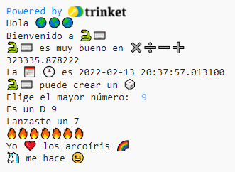

## Iniciador de frases

Genera más frases desde tu proyecto.

{:width="300px"} 

--- task ---

Añade más líneas `print` a tu código. Aquí hay algunos iniciadores de frases que puedes usar:

--- code ---
---
language: python filename: main.py line_numbers: true line_number_start: 29
line_highlights: 30-32
---

print('Yo', heart, '...')   
print('... me hace', happy)   
print('Me gustaría hacer ... con', python)

--- /code ---

**Tip:** `print` añade un espacio entre cada objeto que imprimes.

**Tip:** Si necesitas imprimir un apóstrofo `'`, necesitarás poner una barra invertida `\` adelante para que Python sepa que es parte del texto.

**Tip:** Add a `#` at the beginning of a line to turn it into a comment.

--- /task ---

El emoji de corazón amarillo se usa a menudo para mostrar amistad y felicidad.

--- task ---

¿Qué mensaje le enviarías a un amigo para animarlo? ¿Qué emoji elegirías?

Haz clic en la pestaña **emoji.py** en Trinket para ver las variables de emoji que puedes usar. Copy the ones you choose and save them to a variable or add them directly to your code.

Puedes añadir más variables de emoji a **emoji.py**. Usa esta [lista de emoji](https://unicode.org/emoji/charts/full-emoji-list.html){:target="_blank"} para encontrar los que quieras usar.

🎊 🙌 🙌🏼 🙌🏽 🙌🏾 🙌🏿 😃 🕒 🎨 🎮 🔬 🎉 🕶️ 🎲 😊 🦄 🚀 💯 ⭐ 💛 ❤️ 📚 ⚽ 🏏 🏀 🥋 🏆 ✨ 🥺 🌈 🔥 ♻️ 🌳 👩‍🦽👩🏼‍🦽👩🏽‍🦽👩🏾‍🦽👩🏿‍🦽🧘 🧘🏼 🧘🏽 🧘🏾 🧘🏿 🙋 🙋🏼 🙋🏽 🙋🏾 🙋🏿

[[[choose-an-emoji]]]

--- /task ---

--- save ---
