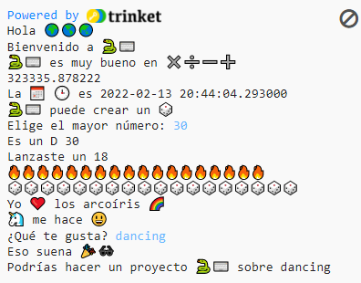

## Mejora tu proyecto

Añade más cosas a tu proyecto. Hay más emojis que puedes elegir.
  

{:width="300px"}

Tú podrías:
+ Usar `print` con texto y emojis diferentes
+ Usar `input` para obtener valores del usuario y almacenarlos como variables, luego crear cálculos con las variables
+ Escribir más funciones para organizar tu código
+ Usar `#` para añadir más comentarios a tu código

Haz clic en **emoji.py** para ver las variables de emoji que puedes usar. Vuelve a hacer clic en **main.py** para añadirlo tu código.

Aquí tenemos un ejemplo de función que pregunta sobre pasatiempos:

--- code ---
---
language: python
filename: main.py
---

# Pon el código a ejecutar aquí abajo
def hobbies():   
hobby = input('¿Qué te gusta?')   
print('Eso suena', fun)   
print('Podrías hacer un proyecto', python, 'sobre', hobby)

--- /code ---

**Tip:** No olvides que necesitarás llamar a tu función y definirla.

Puedes usar `input` para hacer que tu proyecto espere a que el usuario presione <kbd>Enter</kbd> en cualquier momento en este proyecto.

--- code ---
---
language: python
filename: main.py
---

roll_dice()

input() #Esperar a que el usuario presione Enter

hobbies()

--- /code ---

--- collapse ---
---
title: Proyecto terminado
---

Puedes ver el [proyecto terminado aquí](https://trinket.io/embed/python/a54e164ac2){:target="_blank"}.

--- /collapse ---

--- save ---
