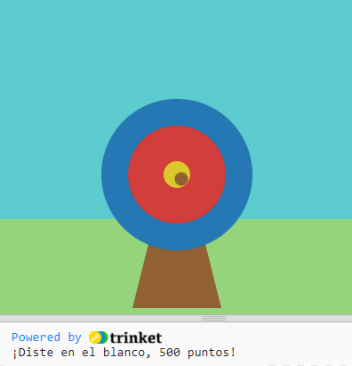

## ¿Qué sigue?

Si estás siguiendo la ruta [Introducción a Python](https://projects.raspberrypi.org/en/raspberrypi/python-intro), puedes pasar al proyecto [Tiro con arco](https://projects.raspberrypi.org/en/projects/target-practice). En este proyecto, dibujarás un objetivo y luego crearás un juego de tiro con arco que lanza flechas para ganar puntos.

--- print-only ---

--- /print-only ---

--- no-print ---

<iframe src="https://trinket.io/embed/python/f686c82d8a?outputOnly=true&start=result" width="600" height="500" frameborder="0" marginwidth="0" marginheight="0" allowfullscreen>
</iframe>

--- /no-print ---

Si quieres divertirte más explorando Python, puedes probar cualquiera de [estos proyectos](https://projects.raspberrypi.org/en/projects?software%5B%5D=python).
