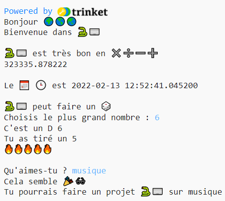

  <a class="c-survey-banner__link" href="https://form.raspberrypi.org/f/code-editor-feedback" target="_blank">Réponds à notre enquête</a> pour nous aider à améliorer notre Code Editor !

## What you will make

Write an interactive program that uses emojis 🙌 🙌🏼 🙌🏽 🙌🏾 🙌🏿.

--- no-print ---

  

Click on the **Run** button

<iframe src="https://editor.raspberrypi.org/en/embed/viewer/hello-world-solution" width="600" height="600" frameborder="0" marginwidth="0" marginheight="0" allowfullscreen>
</iframe>

--- /no-print ---

--- print-only ---

{:width="640px"}

--- /print-only ---

