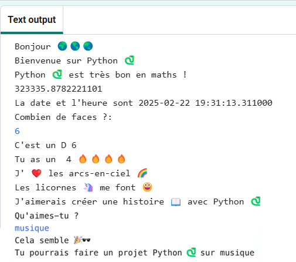

  <a class="c-survey-banner__link" href="https://form.raspberrypi.org/f/code-editor-feedback" target="_blank">Réponds à notre enquête</a> pour nous aider à améliorer notre Code Editor !

## Ce que tu vas faire

Découvre ce que le langage de programmation Python peut faire en écrivant un projet interactif qui utilise des emojis.

**Emojis** sont de petites images colorées utilisées pour ajouter une signification supplémentaire aux messages. Emoji signifie « mot image » en japonais.

Tu vas devoir :

+ `print()` du texte, y compris des emojis, et obtenir des `input()` de l'utilisateur
+ Stocker du texte et des nombres dans des **variables**
+ Utiliser des **fonctions** pour organiser ton code

--- no-print ---

### Joue ▶️

--- task ---

  

Clique sur le bouton **Run** et lis le résultat.

  Lorsque tu y es invité, saisis un numéro et appuie sur <kbd>Entrer</kbd>. 

Peux-tu voir comment tes réponses sont utilisées ?

<iframe src="https://editor.raspberrypi.org/fr-FR/embed/viewer/hello-world-solution" width="600" height="600" frameborder="0" marginwidth="0" marginheight="0" allowfullscreen>
</iframe>

--- /task ---

--- /no-print ---

--- print-only ---

{:width="640px"}

--- /print-only ---
