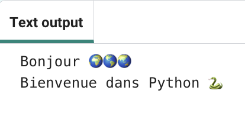
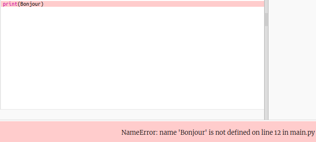
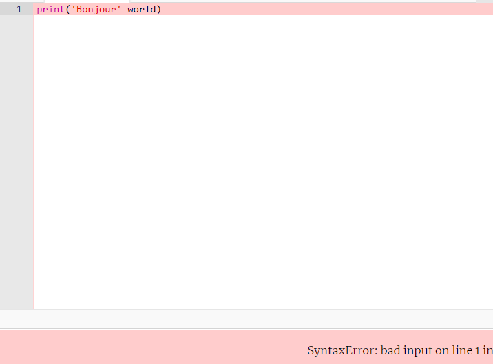

## Dire bonjour

<div style="display: flex; flex-wrap: wrap">
<div style="flex-basis: 200px; flex-grow: 1; margin-right: 15px;">
Il est de coutume d'écrire un programme pour afficher « Bonjour le monde ! » lorsque tu apprends un nouveau langage de programmation.
</div>
<div>

{:width="200px"}

</div>
</div>

--- task ---

Ouvre le projet de démarrage [Bonjour 🌍🌎🌏](https://trinket.io/python/96adf5c600){:target="_blank"}. Trinket s'ouvrira dans un autre onglet du navigateur.


If you have a Raspberry Pi account, you can click on the **Save** button to save a copy to your **Projects**.

--- /task ---

--- collapse ---

---
title: Working on a Raspberry Pi?
---

La plupart des ordinateurs te permettent d'utiliser des emoji de couleur. You need to install a font that supports them.

Open a terminal and then type:

```bash
sudo apt install fonts-noto-color-emoji
```

Restart Chromium and you should see the colour emojis.

--- /collapse ---

### from noemoji import *

<p style="border-left: solid; border-width:10px; border-color: #0faeb0; background-color: aliceblue; padding: 10px;">
Lines beginning with a `#` are <span style="color: #0faeb0">**comments**</span>. They explain what the code will do. Comments are ignored by Python.
</p>

Les lignes commençant par `#` sont des commentaires, elles expliquent le code aux humains et sont ignorées par Python.

En Python, `print()` affiche du texte (mots ou nombres) à l'écran.

--- task ---

Trouve la ligne `# Mettre le code à exécuter ci-dessous`.

Clique sous cette ligne. Le `|` qui clignote est le curseur et indique où tu taperas.

--- /task ---

--- task ---

Tape le code `print()` bonjour :

Clique sur l'onglet **main.py** pour revenir à ton code `print()`.

--- code ---
---
language: python filename: main.py line_numbers: true line_number_start: 11
line_highlights: 12
---

# Mettre le code à exécuter ci-dessous
print('Bonjour')

--- /code ---

--- collapse ---
---
title: Saisie de caractères spéciaux sur un clavier français
---

Sur un clavier français, la parenthèse gauche `(` et droite `)` se trouvent sur les touches <kbd>5</kbd> et <kbd>°</kbd>. To type a left round bracket, hold down the <kbd>Shift</kbd> key (next to <kbd>Z</kbd>) and then tap <kbd>9</kbd>. The single quote `'` is on the same row as the <kbd>L</kbd> key, just before the <kbd>Enter</kbd> key. La virgule `,` est à côté du <kbd>N</kbd>.

--- /collapse ---

--- /task ---

--- task ---

**Test :** Clique sur le bouton **Run** pour exécuter ton code. Dans Trinket, la sortie apparaîtra à droite :


**Débogage :** Si tu obtiens une erreur, vérifie ton code très attentivement. Dans cet exemple, les guillemets simples autour de `Bonjour` manquent donc Python ne sait pas qu'il est censé être du texte.



--- /task ---

## Print 🌍🌎🌏

En Python, une **variable** est utilisée pour stocker du texte ou des nombres. Les variables facilitent la lecture du code par les humains. Tu peux utiliser la même variable à de nombreux endroits dans ton code. Choosing a sensible name for a variable makes it easier for you to remember what it is for.

Nous avons inclus quelques variables qui stockent les caractères emoji.

--- task ---

Dans ton Trinket, clique sur l'onglet **emoji.py**. Trouve la variable `world`, qui stocke le texte '🌍🌍🌍'.

--- /task ---

--- task ---

Tu peux `print()` plusieurs éléments à la fois en incluant une virgule `,` entre les éléments. `print()` ajoutera un espace entre chaque élément.

Change ton code pour aussi `print()` le contenu de la variable `world` :

--- code ---
---
language: python filename: main.py line_numbers: true line_number_start: 11
line_highlights: 3
---

# Mettre le code à exécuter ci-dessous
print('Bonjour', world)

--- /code ---

**Astuce :** `'Bonjour'` est une chaîne de texte car elle est entourée de guillemets simples, tandis que `world` est une variable de sorte que la valeur qui y est stockée sera imprimée.

--- /task ---

--- task ---

**Test :** Exécute ton code pour voir le résultat :


Les emoji peuvent avoir un aspect différent sur différents ordinateurs, de sorte que le tien peut ne pas être exactement le même.

**Débogage :** Assure-toi que tu as ajouté une virgule entre les éléments dans `print()` et que tu as correctement orthographié `world`.

Il manque la virgule `,` dans cet exemple. C'est petit mais très important !



--- /task ---

--- task ---

Ajoute une autre ligne à votre code pour `print()` plus de texte et d'emoji :

--- code ---
---
language: python filename: main.py line_numbers: true line_number_start: 12
line_highlights: 13
---

print('Bonjour', monde)    
print('Bienvenue dans', python)

--- /code ---

**Astuce :** Le code que tu dois saisir est mis en surbrillance dans une couleur plus claire. Le code qui n'est pas en surbrillance t'aide à trouver où tu dois ajouter le nouveau code.

--- /task ---

--- task ---

**Test :** Clique sur **Run**.


**Astuce :** Il est conseillé d'exécuter ton code après chaque modification afin de pouvoir résoudre rapidement les problèmes.

**Débogage :** Vérifie attentivement les parenthèses, les guillemets, les virgules et l'orthographe correcte. Python a besoin que tu sois vraiment précis.

--- /task ---

Si tu as un compte Trinket, tu peux cliquer sur le bouton **Remix** pour enregistrer une copie dans ta bibliothèque `My Trinkets`.

--- save ---
