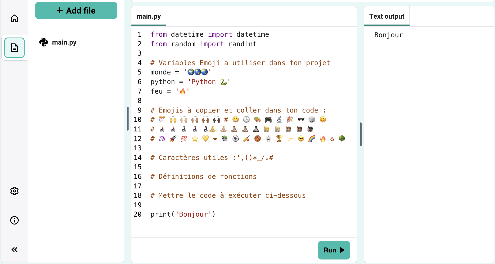

## Print Bonjour

In Python, `print()`{:.language-python} outputs strings (words or numbers) to the screen.

--- task ---

Ouvre le projet de démarrage [Bonjour 🌍🌎🌏](https://editor.raspberrypi.org/en/projects/hello-world-starter){:target="_blank"}. Le Code Editor s'ouvrira dans un autre onglet du navigateur.

 --- /task ---

--- task ---

Find the `# Put code to run below here`{:.language-python} line.

Clique sous cette ligne. Le `|` qui clignote est le curseur et indique où tu taperas.

--- /task ---

--- task ---

Type the code to `print()`{:.language-python} Hello to the screen:

--- code ---
---
language: python line_numbers: true line_number_start: 17
line_highlights: 18
---
# Put code to run under here.
print(f'Hello') --- /code ---

--- /task ---

--- task ---

**Test :** clique sur le bouton **Run** pour exécuter ton code. This is what you should see when you run your code:

--- /task ---

A **variable** is used to store values such as text or numbers. Nous avons inclus quelques variables qui stockent les caractères emoji.

--- task ---

Change your code to also `print()`{:.language-python} the contents of the `world`{:.language-python} variable. You can do this by adding the variable name in curly brackets `{}`{:.language-python}

--- code ---
---
language: python line_numbers: true
line_number_start: 17
---
# Mettre le code à exécuter ci-dessous
print(f'Hello {world}') --- /code ---

The `f`{:.language-python} character inside the print lets you easily print variables along with strings of text.

--- /task ---

--- task ---

**Test :** exécute ton code pour voir le résultat :

--- /task ---

--- task ---

**Add** another line to your code to `print()`{:.language-python} more text and emojis:

--- code ---
---
language: python line_numbers: true line_number_start: 17
line_highlights: 19
---
# Put code to run under here
print(f'Hello {world}') print(f'Welcome to {python}') --- /code ---

--- /task ---

--- task ---

**Test :** clique sur **Run**.

**Astuce :** il est conseillé d'exécuter ton code après chaque modification afin de pouvoir résoudre rapidement les problèmes.

--- /task ---

