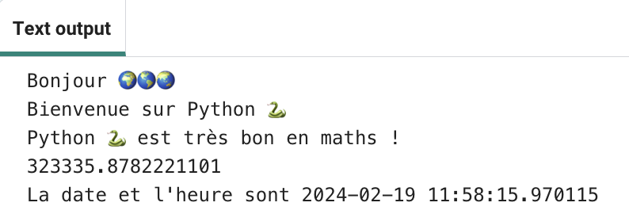
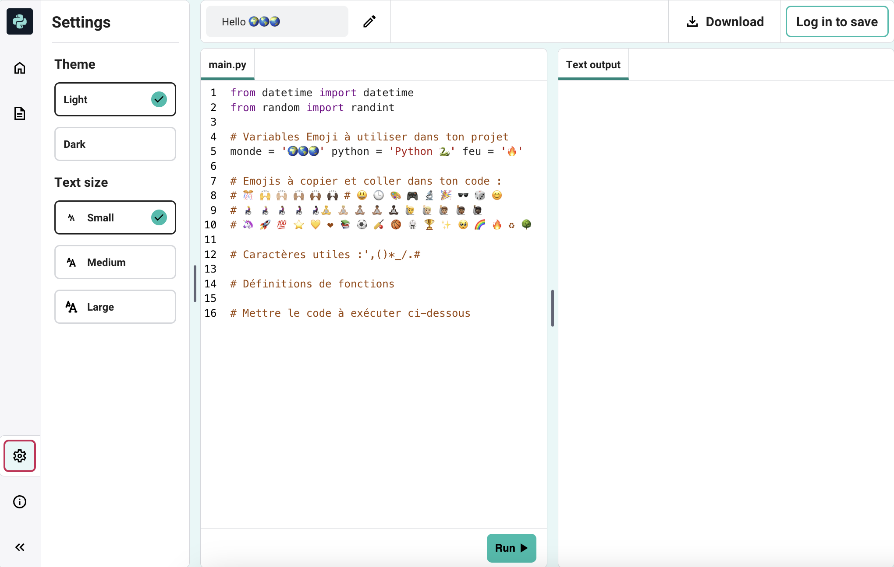

## Sommes et dates

Python est excellent pour travailler avec des nombres et des dates.

{:width="300px"}

En Python, tu peux utiliser des opérateurs mathématiques pour faire des sommes :

| + | addition |   
| - | soustraction |   
| * | multiplication |   
| / | division |   
| ** | puissance |

--- task ---

Ajoute deux autres lignes `print()` à ton code, incluant une somme à calculer par Python :

--- code ---
---
language: python filename: main.py line_numbers: true line_number_start: 12
line_highlights: 14-15
---

print('Bonjour', monde)   
print('Bienvenue dans, python)   
print(python, 'est très bon en', sums)   
print(230 * 5782 ** 2 / 23781)

--- /code ---

--- /task ---

--- task ---

**Test :** Exécute ton code. Python a-t-il calculé la somme correctement ? Je plaisante ! Python fait les calculs difficiles pour toi, tu n'as donc pas besoin de le résoudre.

--- /task ---

L'informaticienne japonaise **Emma Haruka Iwao** a utilisé un ordinateur pour calculer la valeur de Pi (*π*) à 31 000 milliards de chiffres. Cette réponse est si longue qu'il faudrait plus de 300 000 ans rien que pour la dire ! 

--- task ---

Essaie de changer l'addition que Python fait en une addition compliquée !

Tu peux également utiliser des parenthèses si tu souhaites contrôler l'ordre dans lequel Python calcule la somme : `print( (2 + 4) * (5 + 3) )`.

--- /task ---

--- task ---

**Test :** Exécute ton code et demande à Python de calculer ta somme.

**Débogage :** Assure-toi que ta somme est entourée d'une parenthèse gauche et droite `( 2 * 45 )`. Si tu utilises des parenthèses supplémentaires pour contrôler l'ordre, assure-toi d'avoir une parenthèse droite pour correspondre à chaque parenthèse gauche.

--- /task ---

--- task ---

Si tu as demandé à Python de calculer une très grosse somme, tu constateras peut-être que la réponse s'étend sur plusieurs lignes dans la zone de sortie.

**Astuce :** Clique sur le **menu hamburger** (l'icône avec trois lignes) en haut à gauche de ton éditeur Trinket. Clique ensuite sur le bouton **Fullscreen** pour afficher ton projet en mode plein écran.

Pour quitter le mode plein écran, clique à nouveau sur le bouton **Fullscreen** ou appuie sur <kbd>Échap</kbd> (Esc) sur ton clavier.

--- /task ---

La ligne `from datetime import *` en haut de l'onglet **main.py** inclut une bibliothèque avec des fonctions utiles pour obtenir la date et l'heure actuelles.

L'un des avantages de Python est l'ensemble des **bibliothèques** de code disponibles. Une bibliothèque Python te permet d'utiliser facilement du code que d'autres personnes ont écrit. Il existe des bibliothèques pour dessiner des tableaux et des graphiques, faire de l'art, faire des calculs et bien plus encore.

--- task ---

Ajoute une autre ligne à ton code pour `print` du texte supplémentaire et les variables emoji `calendar` et `clock`.

Obtiens la date et l'heure actuelles en utilisant la fonction `now()` de la bibliothèque `datetime` :

--- code ---
---
language: python filename: main.py line_numbers: true line_number_start: 14
line_highlights: 16-17
---

print(python, 'est très bon en', sums)    
print(230 * 5782 ** 2 / 23781) #Affiche le résultat de la somme     
print('Le', calendar, clock, 'est', datetime .now()) #Affiche avec l'emoji

--- /code ---

**Astuce :** Tu n'as pas besoin de taper les commentaires, ils sont juste là pour t'aider à comprendre le code. Tape simplement la partie avant le `#`.

--- /task ---

--- task ---

**Test :** Exécute ton code plusieurs fois pour voir la mise à jour de la date et de l'heure.

**Debogage :** Vérifie que tu as bien un point `.` entre `datetime` et `now`. Vérifie soigneusement toute la ponctuation.

--- /task ---

--- save ---
